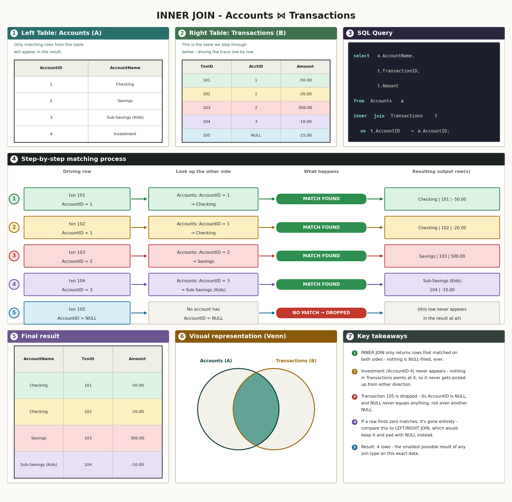
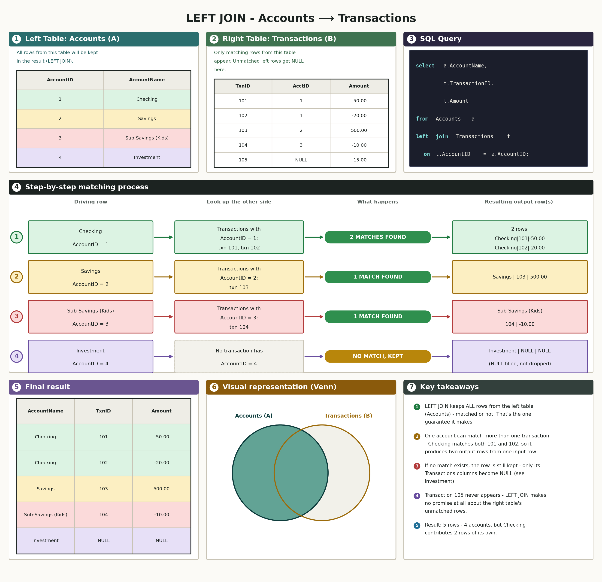
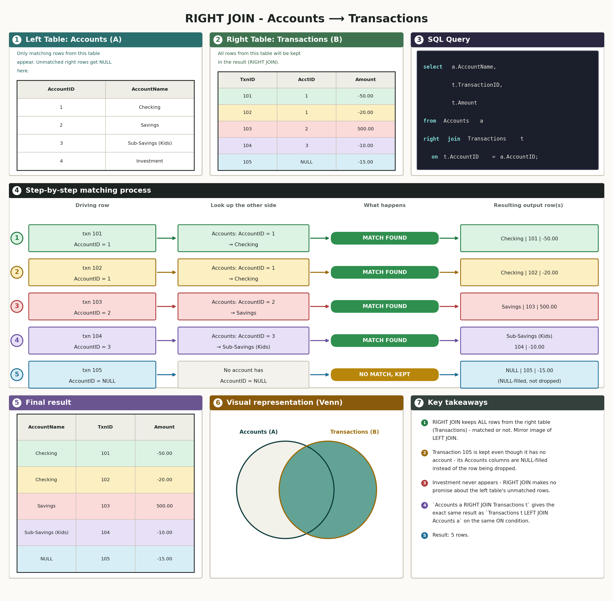
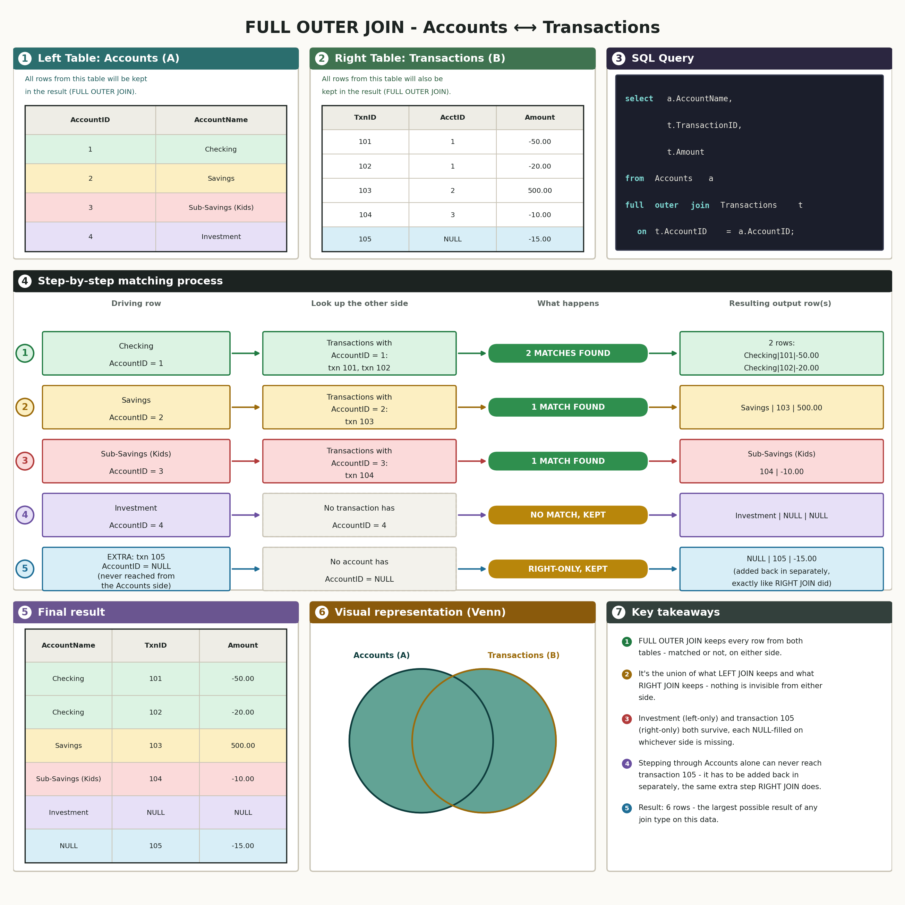
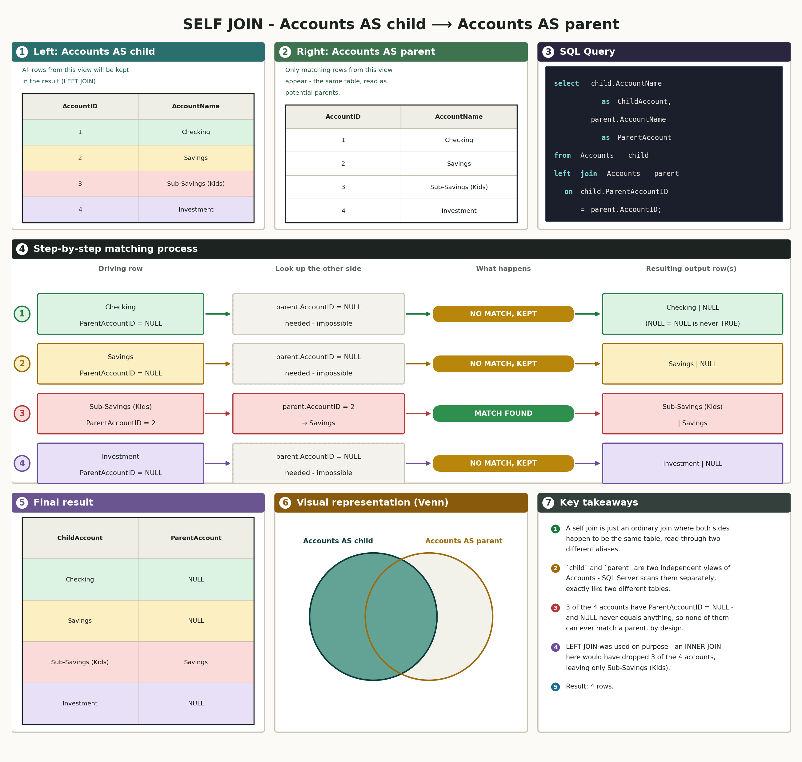
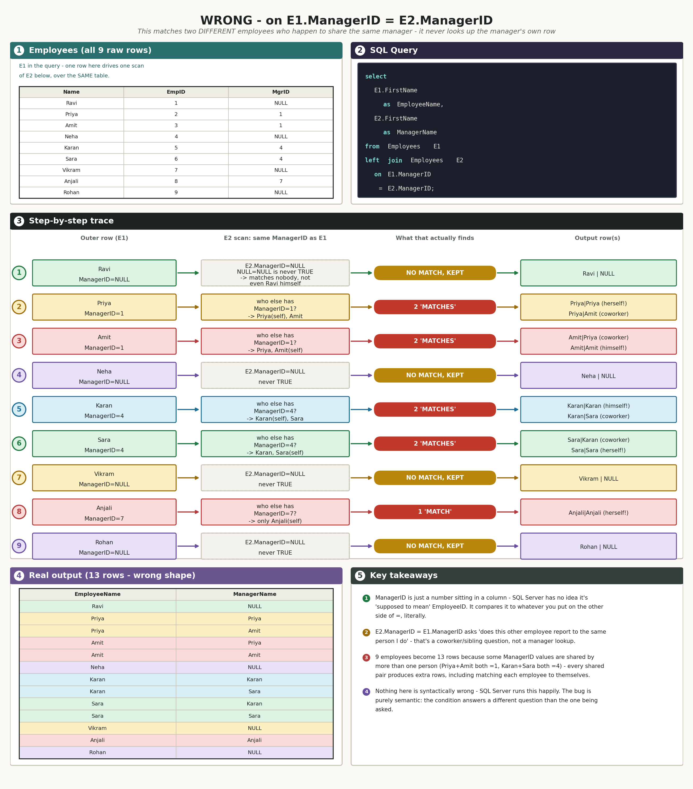
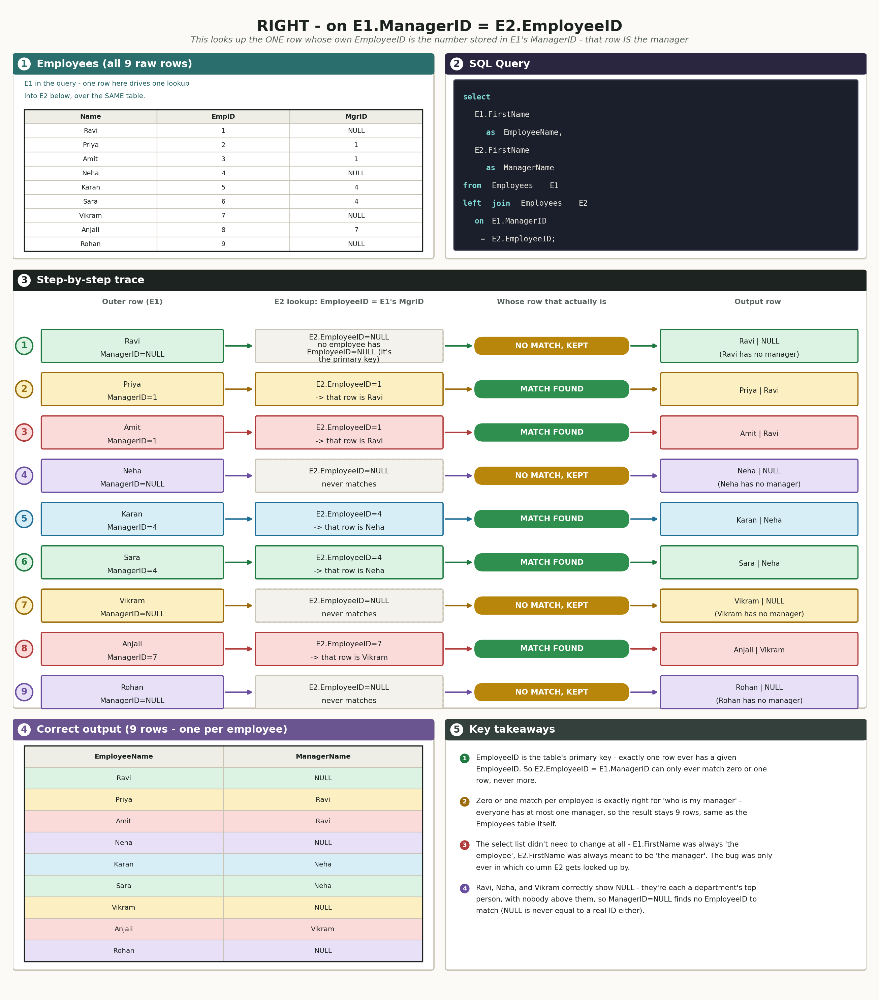

# 02 · SQL Joins (SQL Server / T-SQL)

## The schema we're using

Same three tables as `01 sql fundamentals.md` - `Accounts`, `Categories`, `Transactions` - in `InterviewPrepSQL`. Nothing new was created for this doc; joins work *across* tables that already exist, so the same schema and the same two deliberate gaps from doc 01 do all the work here too:

- **Account 4 (Investment) has zero transactions.** This is what makes a left/right/full join actually show something different from an inner join - an account with nothing to match against.
- **Transaction 105 has `AccountID = NULL`.** This is the other side of the same coin - a transaction with nothing to match against.
- **`Accounts.ParentAccountID`** is self-referencing (`Sub-Savings (Kids)` → `ParentAccountID = 2`, pointing back at `Savings`). This is what makes a self join demonstrable - a table joined to itself through its own foreign key.

Here's the actual data every join below runs against, straight from doc 01's real SSMS output:

| AccountID | AccountName | AccountType | ParentAccountID |
|---|---|---|---|
| 1 | Checking | Checking | NULL |
| 2 | Savings | Savings | NULL |
| 3 | Sub-Savings (Kids) | Savings | 2 |
| 4 | Investment | Investment | NULL |

| TransactionID | AccountID | CategoryID | TransactionDate | Amount |
|---|---|---|---|---|
| 101 | 1 | 1 | 2026-01-05 | -50.00 |
| 102 | 1 | 2 | 2026-01-10 | -20.00 |
| 103 | 2 | 1 | 2026-01-12 | 500.00 |
| 104 | 3 | 1 | 2026-01-15 | -10.00 |
| 105 | NULL | 2 | 2026-01-20 | -15.00 |

Every join below is run against this same five-transaction, four-account dataset, so the same two gaps keep showing up in a new shape each time.

---

## How the diagrams in this doc work

Every join below gets a full infographic, applied to this doc's own real Accounts/Transactions data (and, for the self join, Accounts against itself). It's laid out in three rows, seven panels total:

- **Row 1 - the two input tables plus the SQL.** Left table and right table, each shown as real data with every row color-coded, plus the actual query being run (with `select`/`from`/`join`/`on` syntax-highlighted).
- **Row 2 - the step-by-step trace.** One driving table is picked (the one the join's own rules guarantee will survive completely - the left table for `left join`, the right table for `right join`, etc.), and every single row from it is walked through by hand: here's the row → here's what it's compared against → here's whether a match was found → here's what ends up in the result because of that. A green "MATCH FOUND" pill means the row paired up with something; an amber "NO MATCH, KEPT" pill means it didn't match anything but the join kept it anyway (padded with `NULL`); a red "NO MATCH → DROPPED" pill means it didn't match and the join throws it away entirely. This is the exact same logic as a manual row-by-row trace in plain text - just laid out so the flow (row → comparison → verdict → result) is visual instead of something you have to read line by line.
- **Row 3 - the final result, a mini Venn, and the key takeaways.** The actual output table, color-matched back to the rows that produced each line; a small Venn diagram (same shaded-overlap idea as before, just smaller) as a quick visual summary of which regions survive; and a numbered list of the two or three things worth remembering about that join type.

Color is threaded through the whole picture on purpose: a given row keeps the same color from the input table, through the step-by-step trace, to the final result row it produced - so you can visually follow one row's journey through the whole join without reading a word of text.

---

## 1. `inner join` - only the rows that match on both sides

### What `inner join` actually does

In plain language: an inner join only keeps a row when *both* tables have something that matches - if either side is missing its half of the pair, that row just doesn't show up in the result at all.

Real-life example: matching wedding invitations to RSVP cards. If you line up invitations against RSVPs, you only see guests who both got invited *and* sent a card back. Someone invited who never replied vanishes from that list - and so does a stray RSVP card from someone who was never invited in the first place.

Real-world use case: reporting that only makes sense when the relationship is actually real. "Every transaction with its account's name" should only ever show a transaction that has a real account to borrow a name from - an account-less transaction has nothing to put in that column anyway, so dropping it is correct, not a bug.

Technical deep dive: SQL Server conceptually evaluates `from A inner join B on <condition>` as if it first built every possible pairing of one row from `A` with one row from `B` - the full cross product, `rows(A) × rows(B)` pairs - then kept only the pairings where `<condition>` evaluates to `TRUE`. It doesn't actually materialize that full cross product physically (the query optimizer picks a nested-loop, hash, or merge join operator instead, depending on indexes and row counts), but the *logical* result is identical either way - which is exactly why the row-by-row trace below works: you can always reason about an inner join by checking the condition against every possible `(A row, B row)` pair.

Connecting back: "only the overlap" is the simple version of "cross product, filtered down by the `on` condition" - same idea, two levels of precision.

**Find every transaction together with the name of the account it belongs to.**  
so this question is asking us to find every transaction paired with its account's name - but only for transactions that actually have a matching account.

```sql
select
    a.AccountName,
    t.TransactionID,
    t.Amount
from Accounts a
inner join Transactions t on t.AccountID = a.AccountID
```

Real output:

| AccountName | TransactionID | Amount |
|---|---|---|
| Checking | 101 | -50.00 |
| Checking | 102 | -20.00 |
| Savings | 103 | 500.00 |
| Sub-Savings (Kids) | 104 | -10.00 |

*(4 rows affected)*

Here's the full picture for `inner join` - Transactions is the driving table (every transaction gets checked against Accounts), only matched pairs survive into the result, and the mini Venn shows that as "only the overlap":



Two different kinds of row vanished here, for two different reasons that happen to produce the same result: **Investment never appears** because nothing in `Transactions` points at it, and **transaction 105 never appears** because its `AccountID` is `NULL`, and `NULL = 4` (or `NULL` = any account ID) is never `TRUE` - this is the exact same three-valued-logic rule from doc 01's `where`/`group by` sections, just now deciding whether a *join* match happens instead of whether a row survives a filter. `inner join` only ever shows you the overlap - both gaps built into this schema are invisible here, on purpose.

---

## 2. `left join` - every row from the left table, matched or not

### What `left join` actually does

In plain language: a left join keeps every row from the first (left) table no matter what, and only adds information from the second table when it actually has something to offer - if not, it fills those columns with `NULL` instead of dropping the row.

Real-life example: a class roster left-joined to a field-trip sign-up sheet. Every student should appear on the combined list, whether or not they signed up - the ones who didn't just show a blank in the "field trip" column instead of disappearing from the roster entirely.

Real-world use case: any time one table is the "main" list you never want to shrink (every account, every customer, every product) and the second table is optional detail that may or may not exist yet for a given row.

Technical deep dive: logically, a left join is an inner join *plus a top-up step*. SQL Server conceptually runs the inner join first, then takes every left-table row that didn't survive it (because nothing on the right matched) and adds it back in exactly once, with every column that would have come from the right table set to `NULL`. It's never duplicated and never dropped during that top-up - a row with zero matches in the cross product gets exactly one row back, fully `NULL`-padded on the right side.

Connecting back: "keep everything on the left, pad the rest with `NULL`" is the plain version of "inner join, plus a one-time top-up of the left table's unmatched rows."

**Find every account together with its transactions, including accounts that don't have any.**  
so this question is asking us to find every account, whether or not it has a matching transaction - account information should never disappear just because there's nothing to join it to.

```sql
select
    a.AccountName,
    t.TransactionID,
    t.Amount
from Accounts a
left join Transactions t on t.AccountID = a.AccountID
```

Real output:

| AccountName | TransactionID | Amount |
|---|---|---|
| Checking | 101 | -50.00 |
| Checking | 102 | -20.00 |
| Savings | 103 | 500.00 |
| Sub-Savings (Kids) | 104 | -10.00 |
| Investment | NULL | NULL |

*(5 rows affected)*

Here's the full picture for `left join` - Accounts is the driving table this time, every single one of its rows gets kept (Checking even fans out into two result rows, since it has two transactions), and the mini Venn shows the entire left circle shaded:



Same four matched rows as the inner join, plus one more: **Investment now appears**, with `NULL` standing in for every column that would have come from `Transactions`. `left join` means "keep every row from the table on the left (`Accounts`) no matter what - if nothing on the right matches, fill the right side's columns with `NULL` instead of dropping the row." Investment is the left table's only unmatched row, so it's the only one that gets this treatment.

**Transaction 105 is still missing here** - and that's correct, not a bug. `left join` only guarantees every row from the *left* table survives; it says nothing about the right table. Transaction 105 is a row in `Transactions` (the right table) with no match, so it's dropped exactly like it was in the inner join. Left and right are not interchangeable - which table you put on which side decides which gap this query is capable of showing you.

---

## 3. `right join` - every row from the right table, matched or not

### What `right join` actually does

In plain language: the mirror image of a left join - keeps every row from the second (right) table no matter what, and pads the left table's columns with `NULL` when there's nothing on that side to match.

Real-life example: the same field-trip sign-up sheet, read from the other direction. Every signed-up name appears even if, say, someone typo'd a student ID on the form that doesn't match anyone on the actual roster - that orphaned sign-up still shows up, just with a blank student name next to it.

Real-world use case: genuinely rare on its own in practice - almost every real `right join` gets rewritten as a `left join` with the table order swapped, since the two produce identical results. It mostly shows up when a query is built up incrementally and swapping the `from`/`join` order mid-edit would be more disruptive than just changing the keyword.

Technical deep dive: `A right join B on <condition>` is *defined* to produce exactly the same result as `B left join A on <condition>` - the same top-up logic as a left join, just applied to whichever table is written after `right join` instead of before it.

Connecting back: same mechanism as a left join, just pointed at the other table - which is exactly why interview question 4 below ("why does SQL even have `right join`?") is worth having a real answer for, not just "it's symmetric."

**Find every transaction together with its account, including transactions that don't have one.**  
so this question is asking us to find every transaction, whether or not it has a matching account - transaction information should never disappear just because the account link is missing.

```sql
select
    a.AccountName,
    t.TransactionID,
    t.Amount
from Accounts a
right join Transactions t on t.AccountID = a.AccountID
```

Real output:

| AccountName | TransactionID | Amount |
|---|---|---|
| Checking | 101 | -50.00 |
| Checking | 102 | -20.00 |
| Savings | 103 | 500.00 |
| Sub-Savings (Kids) | 104 | -10.00 |
| NULL | 105 | -15.00 |

*(5 rows affected)*

Here's the full picture for `right join` - Transactions is the driving table again, every one of its rows gets kept including transaction 105, and the mini Venn shows the entire right circle shaded:



This is the mirror image of the left join: the same four matched rows, plus **transaction 105**, now kept with `AccountName = NULL` because nothing in `Accounts` has `AccountID = NULL` to match it against. `right join` keeps every row from the table on the right (`Transactions`) no matter what, and fills in `NULL` on the left (`Accounts`) side when there's no match.

**Investment is missing here**, for the same reason transaction 105 was missing from the left join - `right join` makes no promise about the left table, and Investment is an unmatched row in the left table. `Accounts a right join Transactions t` is written the exact same syntactic shape as the left join above, just with the guarantee pointed at the other table - which is exactly why `a left join b` and `b right join a` give you the same result: they're the same join, described from opposite ends.

---

## 4. `full outer join` - every row from both sides, matched or not

### What `full outer join` actually does

In plain language: keeps every row from both tables, no matter what - matched rows get combined normally, and any row from either side with no partner still shows up, padded with `NULL` on whichever side it's missing from.

Real-life example: reconciling your own checkbook against your bank's statement. You want to see every transaction that appears on both (matched), every transaction you recorded that the bank hasn't posted yet (left-only), and every transaction the bank shows that you forgot to record (right-only). A full outer join is the only one of the four join types that shows you all three groups in a single result.

Real-world use case: data reconciliation between two systems that are supposed to agree but might not - exactly the "nothing invisible from either side" guarantee that a plain left or right join alone can't give you.

Technical deep dive: logically, a full outer join is a left join and a right join combined: matched rows appear once, left-only rows appear once (right side `NULL`-padded), right-only rows appear once (left side `NULL`-padded) - the two outer joins' results unioned together with no duplication of the matched middle.

Connecting back: "everything from both sides" is the plain version of "a left join's result and a right join's result, unioned into one."

**Find every account and every transaction together, matched up wherever possible, with nothing dropped from either side.**  
so this question is asking us to find the complete picture - every account (even with no transactions) and every transaction (even with no account) in one result, not just the rows that happen to line up.

```sql
select
    a.AccountName,
    t.TransactionID,
    t.Amount
from Accounts a
full outer join Transactions t on t.AccountID = a.AccountID
```

Real output:

| AccountName | TransactionID | Amount |
|---|---|---|
| Checking | 101 | -50.00 |
| Checking | 102 | -20.00 |
| Savings | 103 | 500.00 |
| Sub-Savings (Kids) | 104 | -10.00 |
| Investment | NULL | NULL |
| NULL | 105 | -15.00 |

*(6 rows affected)*

Here's the full picture for `full outer join` - Accounts drives the first four steps (exactly like the left join), then an extra fifth step adds transaction 105 back in from the right side (exactly like the right join would have surfaced it), and the mini Venn shows both circles shaded completely:



This is the one join that shows **both gaps at once**: the 4 matched rows, plus Investment (unmatched on the left, same as the left join surfaced), plus transaction 105 (unmatched on the right, same as the right join surfaced). `full outer join` is literally "do a left join's job and a right join's job at the same time, then combine the results" - nothing from either table is ever silently dropped just because the other side has nothing to offer it. 6 rows is the largest result of any join type here, because it's the only one not willing to lose a row from either table.

---

## 5. Self join - a table joined to its own rows

### What a self join actually is

In plain language: a self join isn't a different *kind* of join at all - it's any ordinary join (inner, left, whichever) where both "tables" happen to be the same table, referenced twice under two different names so a row can be compared against another row in that same table.

Real-life example: a company org chart stored as one `Employees` table, where each row has a `ManagerID` column pointing at another row's `EmployeeID`. To print "employee name next to manager name," you have to look up a row in the exact same table you started from.

Real-world use case: any hierarchy stored with a parent-pointer column inside a single table - employees and their managers, categories and their parent categories, accounts and their parent accounts (exactly this doc's example, via `Accounts.ParentAccountID`).

Technical deep dive: SQL Server has no idea two aliases secretly point at the same physical table. `from Accounts child left join Accounts parent on child.ParentAccountID = parent.AccountID` is executed with the exact same join machinery as `from Accounts a left join Transactions t on ...` above - `child` and `parent` are just two independently-scanned row-sources that happen to be reading the same underlying data.

Connecting back: "same join, same rules, just both sides are the same table" is the whole concept - there's no new syntax or new matching rule to learn here, which is exactly why doc 01's schema already had `ParentAccountID` built in, specifically for this.

**For every account, show its own name next to the name of its parent account, if it has one.**  
so this question is asking us to find each account's parent account by name, not just the raw `ParentAccountID` number - and accounts with no parent should still show up, just with a blank parent.

```sql
select
    child.AccountName as ChildAccount,
    parent.AccountName as ParentAccount
from Accounts child
left join Accounts parent on child.ParentAccountID = parent.AccountID
```

Real output:

| ChildAccount | ParentAccount |
|---|---|
| Checking | NULL |
| Savings | NULL |
| Sub-Savings (Kids) | Savings |
| Investment | NULL |

*(4 rows affected)*

Here's the full picture for the self join - same infographic format, except both the "left table" and "right table" panels are `Accounts`, read through two different aliases (`child` and `parent`), and the matching column is `child.ParentAccountID` against `parent.AccountID` instead of a foreign key between two different tables. `child` drives the trace, one row at a time:



`left join` was used deliberately here, not `inner join` - three of the four accounts have no parent at all (`ParentAccountID = NULL`), and an `inner join` would have thrown all three of them away, leaving only `Sub-Savings (Kids)` in the result. `left join` keeps every child account regardless of whether a parent match exists, which is almost always what you actually want from a self join over a hierarchy (employees and their managers, categories and their parent categories, accounts and their parent accounts) - most rows at the top of a hierarchy have no parent, and losing them from the result would be wrong, not just incomplete.

---

## 6. Chaining multiple joins across more than two tables

Every join so far has only ever involved two tables at once. That's not a limitation of `join` itself - a single query can chain as many `join`s as there are relationships to walk, and `InterviewPrepSQL` actually has a third table, `Categories`, that none of the five join types above ever touched.

In plain language: a query with two `join`s isn't doing anything new - it's just the same "match rows by a shared ID" logic, run twice in a row. The first `join` produces an intermediate result (as if it were its own temporary table), and the second `join` matches *that* against a third table, using whatever column it has access to.

Real-life example: tracing a package from warehouse to doorstep through a shipping tracker. Order → which warehouse it shipped from → which carrier picked it up from that warehouse - three separate tables (orders, warehouses, carriers), chained together one relationship at a time, not one giant lookup.

Real-world use case: almost every real reporting query needs this. "Every transaction, with its account's name *and* its category's name" can't be answered by joining `Transactions` to just one other table - the account name lives in `Accounts`, the category name lives in `Categories`, and `Transactions` is the only table that has a foreign key pointing at both.

Technical deep dive: SQL Server evaluates `from A join B on ... join C on ...` left to right, conceptually - `A join B` is computed first (as if producing a temporary result set with every column from both `A` and `B`), and then that entire intermediate result is joined against `C`. This is why a third table's `on` clause can reference columns from *either* of the first two tables, not just the one immediately before it - by the time the second `join` runs, the first join's result already has every column from both `A` and `B` available.

**Find every transaction together with its account's name and its category's name, in one query.**  
so this question is asking us to find every transaction with both its account's name and its category's name attached - two separate lookups chained onto the same base query, not two separate queries.

```sql
select
    a.AccountName,
    t.TransactionID,
    t.Amount,
    c.CategoryName
from Transactions t
inner join Accounts a on a.AccountID = t.AccountID
inner join Categories c on c.CategoryID = t.CategoryID
```

**This one hasn't been run yet - run it for real in SSMS against `InterviewPrepSQL` and paste back the actual output.** `Categories`' real row data has never actually been captured in either SQL doc so far (only `CategoryID` values show up inside `Transactions`), so unlike every other query in this doc, this one can't be traced or diagrammed from data already on hand - once you paste the real output, this section gets the same row-by-row trace and infographic treatment as the five joins above, built from what SSMS actually returns.

---

## Quick reference: what each join keeps

| Join type | Guarantees every row from... | Unmatched side filled with |
|---|---|---|
| `inner join` | neither table | nothing - unmatched rows from either side are dropped entirely |
| `left join` | the left table | `NULL` on every column from the right table |
| `right join` | the right table | `NULL` on every column from the left table |
| `full outer join` | both tables | `NULL` on whichever side didn't have a match |
| self join | depends on `inner`/`left`/etc. used | a self join isn't its own join type - it's any of the above, run with both sides pointing at the same table |

---

## Interview questions

1. What's the difference between an inner join and a left join, in terms of what can get dropped from the result?
2. Why did the Investment account disappear from the inner join's result, but reappear in the left join's result?
3. Why did transaction 105 disappear from both the inner join and the left join, but reappear in the right join and the full outer join?
4. If `a left join b` and `b right join a` (same `on` condition) always produce the same result, why does SQL even have a `right join` keyword?
5. What does a full outer join actually combine - what are the two things being unioned together?
6. What is a self join, mechanically? Is there a dedicated SQL keyword for it, or is it just a regular join with a twist?
7. In the self-join example, why does `Checking` show `NULL` as its parent account instead of being dropped from the result entirely?
8. If the self-join query used `inner join` instead of `left join`, which accounts would disappear from the result, and why?
9. What's the actual difference between putting a condition in the `on` clause versus the `where` clause of a join - does it matter for every join type, or only some?
10. Can a single query join more than two tables? What does the second join's `on` clause actually refer to?
11. What's a cross join, and how is it fundamentally different from every join type covered above?
12. If two tables have no matching rows at all, what does an inner join between them return? What about a full outer join?

---

## Practice database

Same `InterviewPrepSQLPractice` database from doc 01 - `Departments` and `Employees`, with real foreign key constraints this time, including the self-referencing `ManagerID`. No new setup needed; it already exists from the fundamentals doc, and it's a better fit for practicing joins than `InterviewPrepSQL` since `Employees.ManagerID` gives a second, independent self-join to practice on top of the `Departments`/`Employees` relationship.

## Practice questions

Write each of these yourself in SSMS against `InterviewPrepSQLPractice` - type it, run it, and paste back both your query and the real output.

1. List every employee's first name, last name, and department name, using an inner join. (Think about who this leaves out before you run it.)
2. Repeat question 1, but make sure every employee shows up even if they have no department at all.
3. List every department's name together with the first and last names of its employees, making sure every department shows up even if it has no employees at all.
4. For every employee, show their own name next to their manager's name, using a self join on `Employees`. Employees with no manager should still appear, with a blank manager name.
5. List every employee's first name, department name, and manager's name, all in one query, using two joins at once.

Once you've run all five and have real output, paste it back and I'll grade it against a hand-verified answer key.

---

## Worked example: the Q4/Q5 self-join bug, traced in full

Your own submission in `02 sql joins.sql` for Q4 and Q5 used `on E1.ManagerID = E2.ManagerID` for the self join. It runs without error and returns plausible-looking rows, but it isn't actually answering "who is this employee's manager" - it's worth a full worked example because it's one of the most common bugs in hierarchy queries (employees/managers, categories/parent categories, comment replies/parent comments), and a favorite interview trick question for exactly that reason.

In plain language: `ManagerID` is just a number sitting in a column - SQL Server doesn't know it's "supposed to mean" another employee's ID. It only knows how to compare it to whatever you put on the other side of `=`. Compare it to `E2.ManagerID` and you're asking "does this other employee report to the same boss I do" (a coworker question). Compare it to `E2.EmployeeID` and you're asking "who actually has the ID number stored in my ManagerID column" (a manager lookup).

Real-life example: imagine every employee badge has a field called "Reports to" containing a number. If you hold two badges side by side and check "do our 'Reports to' numbers match," you're finding two people with the same boss - coworkers. If instead you take one badge's "Reports to" number and go search the badge drawer for whichever badge has that exact number as its own ID, you've found the boss himself. Same number, two completely different searches.

Real-world use case: this is one of the most common bugs in hierarchy queries, and a favorite interview trick question for exactly this reason - it runs cleanly, returns rows that look reasonable at a glance, and is wrong.

Technical deep dive: with `E2.ManagerID = E1.ManagerID`, SQL Server finds every row (including the employee itself) that happens to share the same `ManagerID` value - so Priya and Amit, who both report to Ravi, get matched to each other, and each also matches themselves, which is why the result has 13 rows instead of 9, and why some employees show up paired with their own name as "manager." With `E2.EmployeeID = E1.ManagerID`, SQL Server instead does a primary-key lookup: since `EmployeeID` is the table's PK, at most one row can ever have a given `EmployeeID`, so this can only ever find zero or one row - exactly the "who is my one manager" question, which is why the result lands back at a clean 9 rows, one per employee.

Connecting back: "compare ManagerID to ManagerID" finds siblings; "compare ManagerID to EmployeeID" finds the one row that *is* the manager, because EmployeeID is the unique identifier that ManagerID is actually referencing.

```sql
-- WRONG (what Q4/Q5 submitted):
select E1.FirstName as EmployeeName, E2.FirstName as ManagerName
from Employees E1
left join Employees E2 on E1.ManagerID = E2.ManagerID

-- RIGHT (the fix):
select E1.FirstName as EmployeeName, E2.FirstName as ManagerName
from Employees E1
left join Employees E2 on E1.ManagerID = E2.EmployeeID
```

Tracing all 9 employees both ways:





One thing worth noting explicitly: the `select` list never needed to change. `E1.FirstName as EmployeeName` and `E2.FirstName as ManagerName` were always conceptually correct - `E1` was always meant to be "the employee," `E2` was always meant to be "the manager's row." The bug was entirely in which column `E2` gets looked up by in the `on` clause, not in what the columns are named. Once `E2` is looked up by `EmployeeID` instead of `ManagerID`, `E2.FirstName` genuinely becomes the manager's first name, and the existing aliases become accurate as-is.
