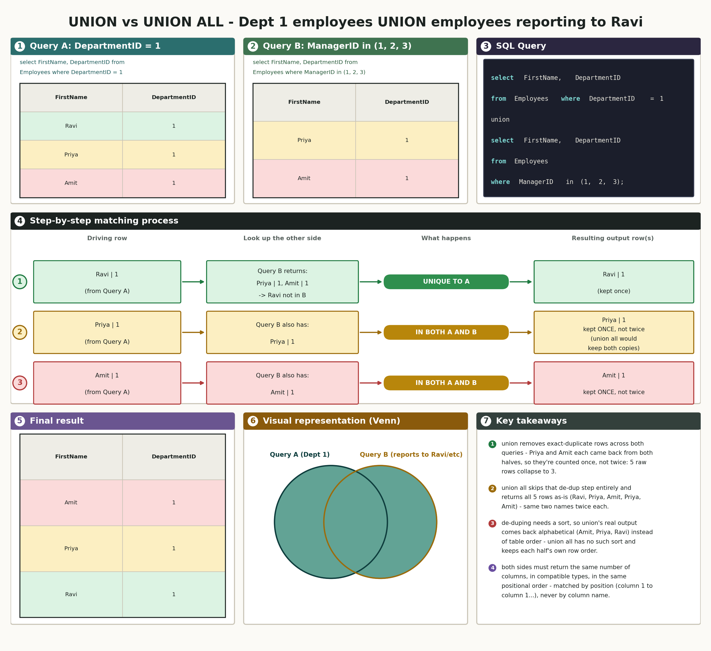
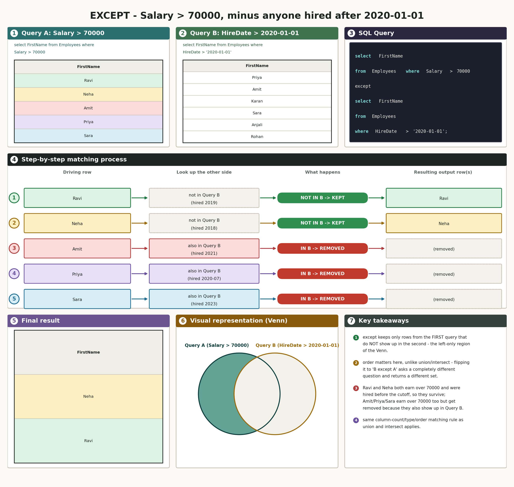

# 03 · SQL Set Operators (SQL Server / T-SQL)

## The schema we're using

No new setup for this doc - set operators just stack the results of two (or more) `select` statements, so they run on tables that already exist. Everything below uses `InterviewPrepSQLPractice.Employees` and `InterviewPrepSQLPractice.Departments`, same tables from docs 01 and 02:

| EmployeeID | FirstName | LastName | DepartmentID | ManagerID | Salary | HireDate |
|---|---|---|---|---|---|---|
| 1 | Ravi | Kumar | 1 | NULL | 95000.00 | 2019-03-01 |
| 2 | Priya | Shah | 1 | 1 | 78000.00 | 2020-07-15 |
| 3 | Amit | Verma | 1 | 1 | 82000.00 | 2021-01-10 |
| 4 | Neha | Singh | 2 | NULL | 88000.00 | 2018-11-20 |
| 5 | Karan | Mehta | 2 | 4 | 65000.00 | 2022-05-05 |
| 6 | Sara | Iyer | 2 | 4 | 71000.00 | 2023-09-12 |
| 7 | Vikram | Rao | 3 | NULL | 60000.00 | 2017-02-14 |
| 8 | Anjali | Nair | 3 | 7 | 55000.00 | 2023-12-01 |
| 9 | Rohan | Gupta | NULL | NULL | 50000.00 | 2024-03-18 |

| DepartmentID | DepartmentName |
|---|---|
| 1 | Engineering |
| 2 | Sales |
| 3 | HR |
| 4 | Finance |

---

## How the diagrams in this doc work

Set operators turn out to reuse the exact same seven-panel layout as the join diagrams in doc 02 - which makes sense once you see why: a join combines two tables by matching *keys*, but a set operator combines two **result sets** by matching *whole rows*. Same shape of problem, same picture:

- **Row 1 - the two queries' own result sets, plus the SQL.** "Query A" and "Query B" are shown as real data, each row color-coded, next to the actual combined query (syntax-highlighted).
- **Row 2 - the step-by-step trace.** Every row from Query A is walked through: here's the row → here's whether Query B also produced it → here's what that means for this operator → here's what ends up in the final result because of it.
- **Row 3 - the final result, a mini Venn, and the key takeaways.** The Venn here isn't decorative - it's the literal mechanism. `union` keeps the whole picture (both circles, overlap included). `intersect` keeps only the overlap. `except` keeps only the left circle's non-overlapping sliver. Once that clicks, all three operators are really just "which region of this same Venn do I want back."

---

## 1. `union` and `union all` - stacking two result sets together

### What `union`/`union all` actually do

In plain language: both operators take two queries that return the same *shape* of result (same number of columns) and stack their rows into one combined result. The only difference is what happens to rows that show up in both queries - `union` keeps one copy, `union all` keeps every copy.

Real-life example: imagine two people each hand you a guest list for the same party - one list is "everyone who RSVP'd yes," the other is "everyone who showed up without RSVPing." `union` gives you back one combined guest list with no one counted twice, even if someone appears on both lists. `union all` just staples both lists together exactly as handed to you - if someone's on both, they show up twice on the combined sheet.

Real-world use case: combining "customers who bought online" and "customers who bought in-store" into one mailing list (`union` - you don't want to mail the same person twice); combining a month's worth of daily sales-log files into one report where a transaction genuinely could appear in two different source files on purpose and you want every occurrence counted (`union all` - here, "duplicates" are real, separate events, not the same row restated).

Technical deep dive: `union` is really `union` + an implicit `distinct` pass over the combined rows - which is also why it needs to compare every column of every row against every other row, an operation SQL Server implements with a sort (or a hash). `union all` skips that comparison step entirely and just concatenates the two row sets in sequence, which is why it's cheaper to run and preserves each half's own original row order, while `union`'s output tends to come back in some sorted order instead of the order either query produced on its own.

Connecting back: "stack two lists, maybe remove exact repeats" is the plain version of "concatenate two compatible result sets, then optionally run a distinct pass over the combined rows depending on which keyword you used."

### The basic mechanic, worked through for real

**List every Engineering employee's first name together with every Sales employee's first name, as one combined list.**  
so this question is asking us to find the union of two separate department filters - everyone in Engineering plus everyone in Sales, in one result.

```sql
select FirstName, DepartmentID from Employees where DepartmentID = 1
union
select FirstName, DepartmentID from Employees where DepartmentID = 2
```

Real output:

| FirstName | DepartmentID |
|---|---|
| Amit | 1 |
| Karan | 2 |
| Neha | 2 |
| Priya | 1 |
| Ravi | 1 |
| Sara | 2 |

*(6 rows affected)*

The exact same query with `union all` instead:

```sql
select FirstName, DepartmentID from Employees where DepartmentID = 1
union all
select FirstName, DepartmentID from Employees where DepartmentID = 2
```

Real output:

| FirstName | DepartmentID |
|---|---|
| Ravi | 1 |
| Priya | 1 |
| Amit | 1 |
| Neha | 2 |
| Karan | 2 |
| Sara | 2 |

*(6 rows affected)*

Both come back with 6 rows here - Engineering and Sales don't overlap at all, so there's nothing for `union` to actually deduplicate in this particular example. But look closely at the row *order*: `union`'s result comes back alphabetical (Amit, Karan, Neha, Priya, Ravi, Sara), while `union all`'s comes back in each half's own table order (Ravi, Priya, Amit, then Neha, Karan, Sara). That ordering difference is real evidence of the distinct-pass `union` runs internally, even when there's no actual duplicate for it to remove.

### `union`'s real duplicate-removal effect

To see `union` actually *remove* something, the two queries need to genuinely overlap - the same row has to be a real, possible answer to both halves at once.

**List every Dept 1 employee's first name together with every employee who reports to someone with EmployeeID 1, 2, or 3.**  
so this question is asking us to find the union of two filters that aren't disjoint this time - Dept 1 includes Priya and Amit, and Priya/Amit also happen to report to Ravi (EmployeeID 1), so the same two people are genuine candidates from both halves.

```sql
select FirstName, DepartmentID from Employees where DepartmentID = 1
union
select FirstName, DepartmentID from Employees where ManagerID in (1, 2, 3)
```

Real output:

| FirstName | DepartmentID |
|---|---|
| Amit | 1 |
| Priya | 1 |
| Ravi | 1 |

*(3 rows affected)*

The same two queries with `union all`:

```sql
select FirstName, DepartmentID from Employees where DepartmentID = 1
union all
select FirstName, DepartmentID from Employees where ManagerID in (1, 2, 3)
```

Real output:

| FirstName | DepartmentID |
|---|---|
| Ravi | 1 |
| Priya | 1 |
| Amit | 1 |
| Priya | 1 |
| Amit | 1 |

*(5 rows affected)*

This is the real effect: 5 raw rows going in, 3 coming out of `union` - Priya and Amit each got produced by both halves of the query (Dept 1, and "reports to 1/2/3"), so `union` keeps one copy of each instead of two. `union all` has no opinion about any of that - it just reports exactly what each half produced, duplicates included.



### The column-matching rule, and a sharp edge worth knowing

All three set operators in this doc share the same hard requirement: both queries need to return the same number of columns, in compatible data types, lined up by **position** - never by column name. SQL Server matches column 1 to column 1, column 2 to column 2, and so on; it will happily combine a column called `FirstName` on one side with a column called `Salary` on the other if they're both just "the second column," so getting the column order right in both halves matters just as much as getting the count right.

Break the column *count* rule, though, and SQL Server refuses to run at all - cleanly, before anything executes:

```
Msg 205, Level 16, State 1, Line ...
All queries combined using a UNION, INTERSECT or EXCEPT operator must have an equal number of expressions in their target lists.
```

That's a compile-time check, not a runtime one - SQL Server works out the column shape of a statement before running any part of it. That has a real, slightly surprising consequence if several unrelated queries are stacked together in one script: a compile-time error anywhere in a batch blocks the *entire* batch from running, not just the one broken statement. Stack five queries together with only blank lines between them (no `go` separators), and if the fourth one has a column mismatch, none of the five actually execute - not even the three that were perfectly fine on their own. That's why every set-operator example in this doc, and every practice question below, gets its own `go` right after it: each `go` closes off a separate batch, so one broken query can never take the rest of the script down with it.

---

## 2. `intersect` - only rows that come back from both

### What `intersect` actually does

In plain language: `intersect` runs two queries and keeps only the rows that genuinely show up in *both* of their results - nothing unique to either side survives.

Real-life example: two friends each write down their top-5 favorite movies, independently. `intersect` is the handful of movies that landed on *both* lists - everything either person picked that the other didn't gets left off entirely.

Real-world use case: "which customers both placed an order this month AND opened at least one marketing email" (two independent filters, you only want people who satisfy both); "which products are in stock in the warehouse AND currently listed as active on the website."

Technical deep dive: like `union`, `intersect` always returns distinct rows - even if a row appears multiple times in one or both source queries, it shows up once in the result. Mechanically, SQL Server compares the two row sets (again via a sort or hash, the same reason `intersect`'s output tends to come back in a different order than either source query) and keeps only rows present in both.

Connecting back: "only keep what both lists agree on" is the plain version of "return the distinct rows common to both result sets" - the overlap region of the Venn, nothing more.

### Worked through for real

**Find every employee who both earns over 70000 AND was hired after 2020-01-01.**  
so this question is asking us to find employees who satisfy two separate conditions at once, using `intersect` instead of combining both conditions with `and` in a single `where` clause.

```sql
select FirstName from Employees where Salary > 70000
intersect
select FirstName from Employees where HireDate > '2020-01-01'
```

Real output:

| FirstName |
|---|
| Amit |
| Priya |
| Sara |

*(3 rows affected)*


Ravi and Neha both earn over 70000, but both were hired before the 2020-01-01 cutoff - high salary alone doesn't get them into an `intersect` result, they need to satisfy *both* queries. This same result could have been written as one query with `where Salary > 70000 and HireDate > '2020-01-01'` - and for a simple case like this, that's genuinely the more common way to write it. `intersect` earns its keep when the two conditions are harder to express as one `where` clause - for example, if they came from two different tables or two differently-shaped subqueries that aren't easy to combine with a plain `and`.

---

## 3. `except` - rows in the first query that never show up in the second

### What `except` actually does

In plain language: `except` runs two queries and keeps only the rows from the *first* one that don't also appear in the second - it's subtraction, not addition.

Real-life example: a class roster, minus everyone who's already graduated - `except` is "give me the roster, then take away anyone who shows up on the graduated list." Swap the two lists around and you'd get a completely different, nonsensical answer (graduated students minus the current roster), which is exactly why order matters here in a way it doesn't for `union` or `intersect`.

Real-world use case: "which customers have an account but have never placed an order" (all customers, except the ones who show up in the orders table); "which products exist in the catalog but were never sold this quarter."

Technical deep dive: `except` is directional - `A except B` keeps rows from `A` not present in `B`, while `B except A` asks the opposite question and returns a different set entirely (unlike `union`/`intersect`, which give the same result regardless of which query is written first). Like the other two operators, `except` always returns distinct rows, and the same column-count/type/order rule from section 1 applies.

Connecting back: "take the first list, remove anything that's also on the second list" is the plain version of "return the distinct rows in the first query's result that are absent from the second query's result" - the left-only sliver of the Venn, nothing else.

### Worked through for real

**Find every employee who earns over 70000, but was NOT hired after 2020-01-01.**  
so this question is asking us to find who's in the "earns over 70000" result, with everyone who's also in the "hired after 2020-01-01" result subtracted out.

```sql
select FirstName from Employees where Salary > 70000
except
select FirstName from Employees where HireDate > '2020-01-01'
```

Real output:

| FirstName |
|---|
| Neha |
| Ravi |

*(2 rows affected)*



Neha and Ravi both earn over 70000 and were hired *before* the cutoff, so they're absent from the second query and survive. Amit, Priya, and Sara also earn over 70000, but all three were hired after the cutoff too - they show up in the second query, so `except` strips them straight back out. Flip the two queries around (`hired after 2020-01-01 except Salary > 70000`) and the answer changes completely - it would ask for everyone hired recently who *doesn't* earn over 70000 instead, a different question with a different, unrelated answer.

---

## Quick reference: `union` / `union all` / `intersect` / `except`

| Operator | Keeps | Duplicates | Order of the two queries |
|---|---|---|---|
| `union` | every row from either query | removed - one copy of each distinct row | doesn't matter, same result either way |
| `union all` | every row from either query | kept - every occurrence from both sides | doesn't matter, same result either way |
| `intersect` | only rows present in *both* queries | removed - always returns distinct rows | doesn't matter, same result either way |
| `except` | only rows in the *first* query, absent from the second | removed - always returns distinct rows | **matters** - `A except B` ≠ `B except A` |

All four require the same number of columns in both queries, in compatible types, matched by position (not by column name).

---

## Interview questions

1. What's the practical difference between `union` and `union all` - what does SQL Server actually have to do differently to produce each one?
2. Why does `union`'s output usually come back in a different order than the two source queries, while `union all`'s doesn't?
3. If two queries combined with `union` return a different number of columns, what happens - does SQL Server pad the shorter one with NULLs, or refuse to run?
4. Does `union` match columns by name or by position? What does that mean if the two halves alias a column differently?
5. What does `intersect` actually return, in terms of the two input sets - and how is that different from an inner join between the same two queries?
6. Does `except` care which order the two queries are written in? What happens if you swap `A except B` to `B except A`?
7. If a row appears twice in the first query of an `except` and zero times in the second query, how many times does it show up in the final result?
8. Could a simple `union` of two filtered queries on the same table be rewritten using `or` in one query instead? When would that stop being possible?
9. Could `intersect` be rewritten using `where ... in (subquery)`? Could `except` be rewritten using `where ... not in` - and what's the real risk there, specifically if the subquery's column can contain `NULL`?
10. If several `union`/`intersect`/`except` statements run back to back in one script with no `go` between them, and one of them has a column-count mismatch, what happens to the statements before and after it?
11. Of `union`, `intersect`, and `except`, which ones always return distinct rows, even without `distinct` written anywhere?
12. How would three queries be combined with `union` at once - is there a three-way syntax, or is it chained two at a time?

---

## Practice database

Same `InterviewPrepSQLPractice` database as docs 01 and 02 - `Departments` and `Employees`. No new setup needed.

## Practice questions

Write each of these yourself in SSMS against `InterviewPrepSQLPractice` - type it, run it, and paste back both your query and the real output. Remember to separate each one with its own `go`.

1. Using `union`, combine employees earning over 80000 with employees hired before 2020-01-01 into one deduplicated list of first names. Think about whether anyone could land in both halves before you run it.
2. Run the exact same two queries from Q1 with `union all` instead, and compare the row count against Q1's result - in a comment, explain in your own words why they match or don't.
3. Using `intersect`, find employees who are both earning over 80000 AND were hired before 2020-01-01.
4. Using `except`, find every department that has zero employees. Think carefully about which table needs to come first in the `except`, and which column from each side actually makes the comparison meaningful.

Once you've run all four and have real output, paste it back and I'll grade it against a hand-verified answer key.
