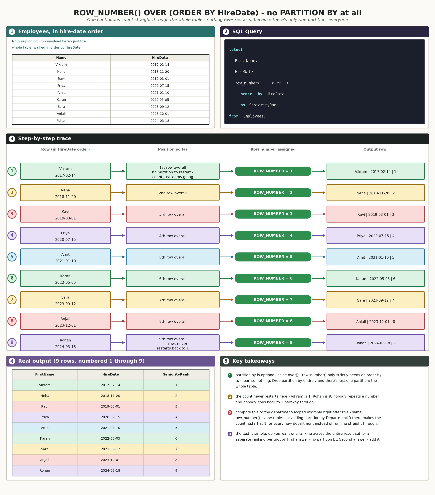
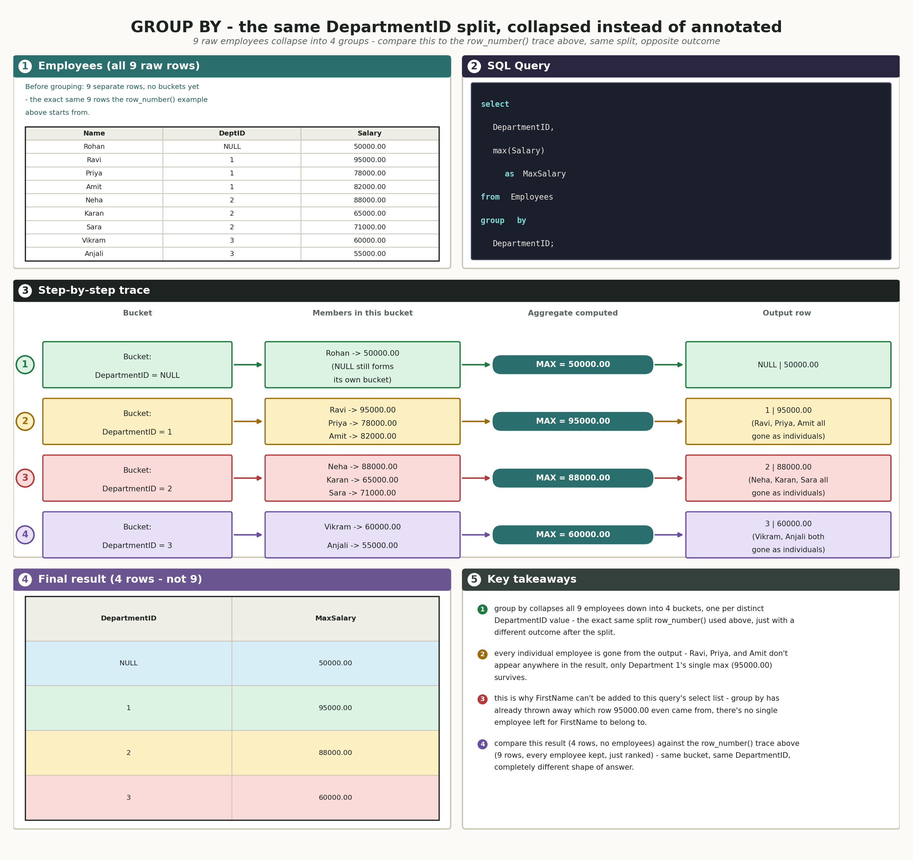
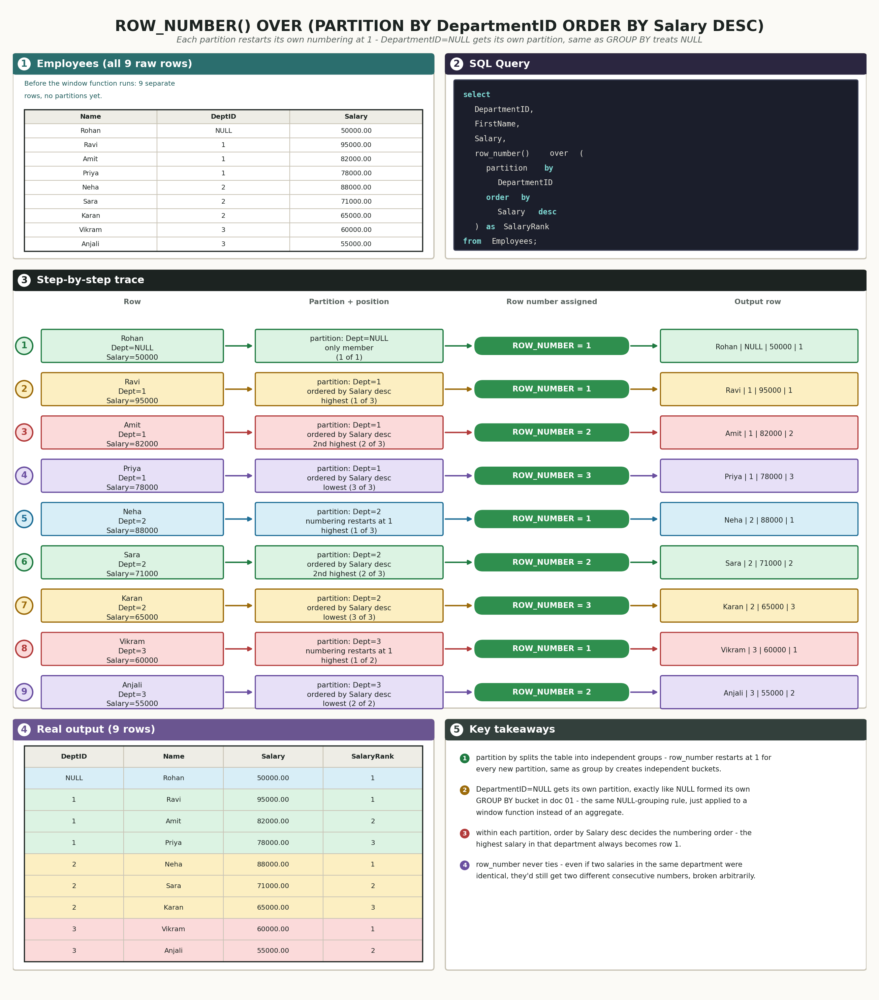
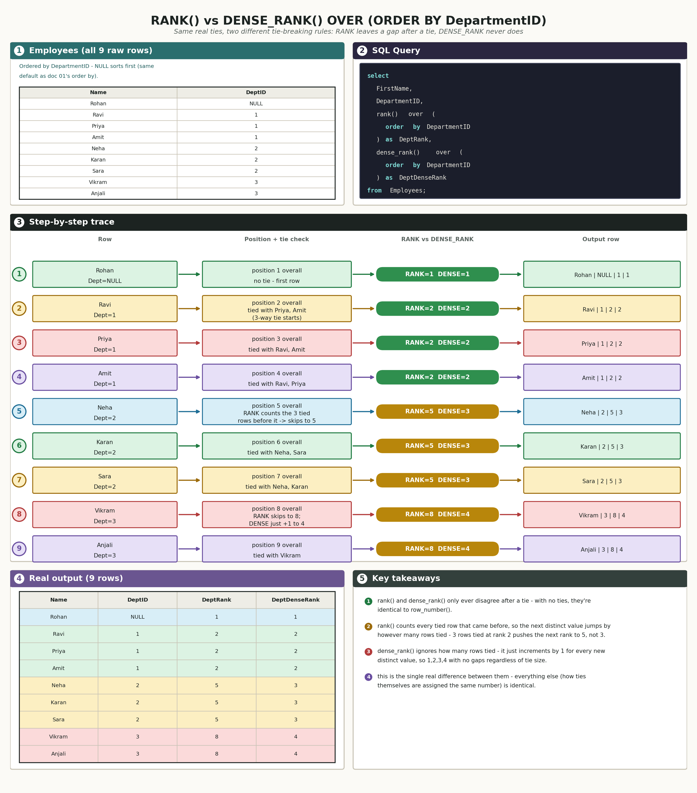
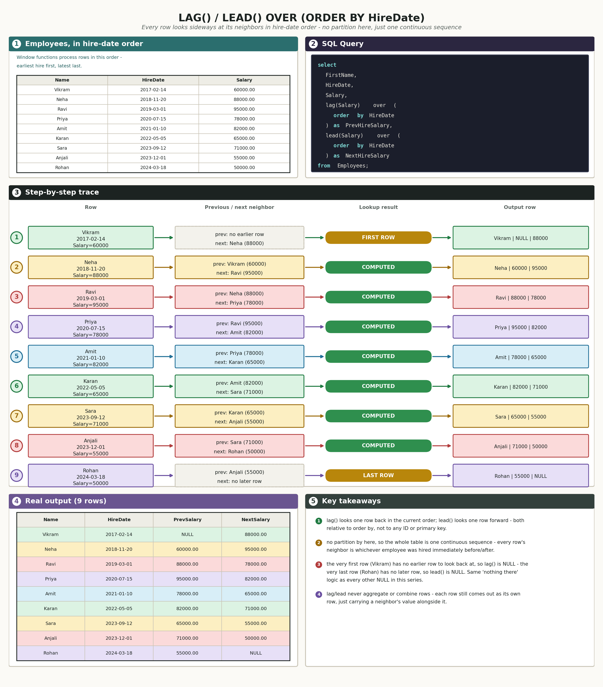
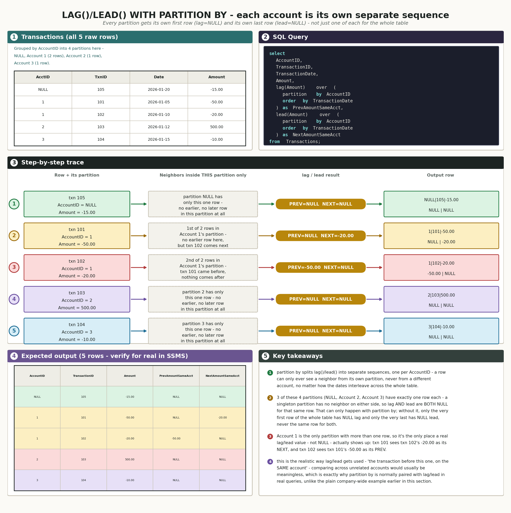
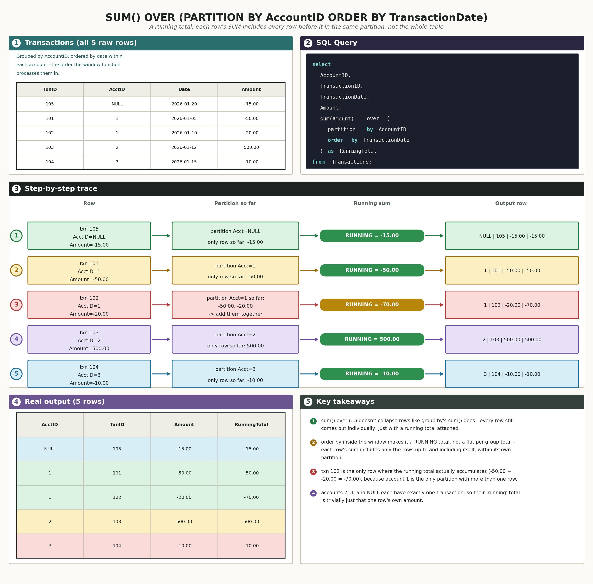

# 04 · SQL Window Functions (SQL Server / T-SQL)

## The schema we're using

No new setup for this doc - window functions get layered on top of tables that already exist. Two tables do all the work below:

`InterviewPrepSQLPractice.Employees` (same table from docs 01 and 02, including the `DepartmentID` and `ManagerID` gaps):

| EmployeeID | FirstName | LastName | DepartmentID | ManagerID | Salary | HireDate |
|---|---|---|---|---|---|---|
| 1 | Ravi | Kumar | 1 | NULL | 95000.00 | 2019-03-01 |
| 2 | Priya | Shah | 1 | 1 | 78000.00 | 2020-07-15 |
| 3 | Amit | Verma | 1 | 1 | 82000.00 | 2021-01-10 |
| 4 | Neha | Singh | 2 | NULL | 88000.00 | 2018-11-20 |
| 5 | Karan | Mehta | 2 | 4 | 65000.00 | 2022-05-05 |
| 6 | Sara | Iyer | 2 | 4 | 71000.00 | 2023-09-12 |
| 7 | Vikram | Rao | 3 | NULL | 60000.00 | 2017-02-14 |
| 8 | Anjali | Nair | 3 | 7 | 55000.00 | 2023-12-01 |
| 9 | Rohan | Gupta | NULL | NULL | 50000.00 | 2024-03-18 |

`InterviewPrepSQL.Transactions` (same table from docs 01 and 02):

| TransactionID | AccountID | CategoryID | TransactionDate | Amount |
|---|---|---|---|---|
| 101 | 1 | 1 | 2026-01-05 | -50.00 |
| 102 | 1 | 2 | 2026-01-10 | -20.00 |
| 103 | 2 | 1 | 2026-01-12 | 500.00 |
| 104 | 3 | 1 | 2026-01-15 | -10.00 |
| 105 | NULL | 2 | 2026-01-20 | -15.00 |

One thing worth flagging up front: `Employees.Salary` has no duplicate values across all 9 rows, so it can't demonstrate what happens when `rank()`/`dense_rank()` hit a genuine tie. `Employees.DepartmentID` does have real ties (three employees in Department 1, three in Department 2, two in Department 3, one NULL), so that's the column used for the rank/dense_rank example below instead of salary.

---

## How the diagrams in this doc work

These aren't join diagrams - there's only one source table involved, not two being matched against each other, so the layout is simpler: five panels instead of seven, and no mini Venn, since a window function doesn't have a "kept region" vs. "dropped region" shape the way a join does - every input row always survives into the output, just with an extra computed column attached.

- **Row 1 - the source table plus the SQL.** The real data the window function runs over, color-coded by row, next to the actual query (syntax-highlighted).
- **Row 2 - the step-by-step trace.** Every row is walked through in the order the window function actually processes it in (its `partition by` grouping, then its `order by` sequence within that group) - here's the row → here's what it's being compared against or positioned relative to → here's the value the window function assigns → here's the output row that produces.
- **Row 3 - the real output and the key takeaways.** The actual result table, color-matched back to the rows that produced each line, and a numbered list of the two to four things worth remembering about that function.

Same color-threading rule as the join diagrams: a row keeps its color from the source table, through the trace, into its output row.

---

## 1. `row_number()` - numbering rows within a partition

### What `row_number()` actually does

In plain language: `row_number()` hands out a running count - 1, 2, 3, ... - to every row, in whatever order you tell it to look at them. Add a `partition by` and that counting restarts from 1 every time the partition value changes, so each group gets its own independent 1, 2, 3 sequence instead of one long count across the whole table.

Real-life example: handing out raffle ticket numbers at a company picnic, but doing it table by table instead of all at once - table 1 gets tickets 1, 2, 3, ... and when you move to table 2, you start back at 1 instead of continuing from where table 1 left off. `partition by` is "start a new table"; `order by` is the order you walk around each table handing out tickets.

Real-world use case: "the top 3 highest earners per department," "the most recent order per customer," "the first login per user per day" - any time you need a per-group ranking rather than one ranking across the entire result set, `row_number()` with `partition by` is the tool, usually followed by filtering down to `= 1` or `<= 3`.

Technical deep dive: SQL Server evaluates `partition by` first - it logically splits the table into independent groups, one per distinct value of the partition column(s) (and `NULL` gets its own group, same NULL-grouping rule as `group by` from doc 01). Within each group, it then applies the `order by` inside the `over()` clause to decide the sequence, and assigns 1, 2, 3, ... down that sequence. Unlike `group by`, nothing is collapsed - every one of the original rows comes back out, just with this new number attached as an extra column.

Connecting back: "numbered within its own group" is the plain version of "partition splits the table into buckets, order by decides the counting sequence inside each bucket, and row_number assigns 1, 2, 3... down that sequence with no collapsing."

### `row_number()` without `partition by` - is `partition by` even required?

No — `partition by` is optional inside `row_number() over()`. It's only there when you want the numbering to restart per group. Without it, `row_number()` just treats the entire table as one giant partition and numbers straight through, 1 to N, no restarts.

In plain language: `partition by` is the "start over for each group" switch. Leave it out, and there's only one group — the whole table — so you get one continuous count.

Real-life example: handing out raffle ticket numbers at the picnic again — with `partition by`, you reset to 1 at every new table; without it, you just walk through the entire picnic handing out 1, 2, 3... to everyone, regardless of which table they're sitting at.

Real-world use case: "rank every employee's salary within their own department" needs `partition by DepartmentID`. "Rank every employee's salary across the whole company, nobody grouped" doesn't — you'd just drop the `partition by` clause entirely and keep `order by`.

Technical deep dive: `over()` only strictly requires an `order by` for `row_number()` to mean anything (without any order, SQL Server will still run it, but which row gets 1 vs. 2 becomes arbitrary/undefined). `partition by` is a separate, optional piece of the same `over()` clause — `over (order by Salary desc)` with no partition is perfectly legal syntax, it just means "one partition: everything."

Connecting back: `partition by` isn't part of what makes `row_number()` work — it's an optional scope on top of it. The question to ask is "should the numbering restart for different groups, or run straight through the whole result set?" If restart → add `partition by`. If straight through → leave it out.

Here's that baseline case, worked through for real - `row_number()` with no `partition by` at all:

**Rank every employee by seniority, earliest hire date first, across the whole company.**  
so this question is asking us to find a single company-wide ranking, with no department grouping at all - where every employee falls in hire order relative to literally everyone else, not just the people in their own department.

```sql
select
    FirstName,
    HireDate,
    row_number() over (
        order by HireDate
    ) as SeniorityRank
from Employees;
```

Real output:

| FirstName | HireDate | SeniorityRank |
|---|---|---|
| Vikram | 2017-02-14 | 1 |
| Neha | 2018-11-20 | 2 |
| Ravi | 2019-03-01 | 3 |
| Priya | 2020-07-15 | 4 |
| Amit | 2021-01-10 | 5 |
| Karan | 2022-05-05 | 6 |
| Sara | 2023-09-12 | 7 |
| Anjali | 2023-12-01 | 8 |
| Rohan | 2024-03-18 | 9 |

*(9 rows affected)*



No `partition by` clause appears anywhere in this query, and nothing restarts - Vikram (earliest hire) is `1`, Rohan (most recent hire) is `9`, and every number in between is used exactly once, straight across every department. Compare this against the department-scoped example right below: same `row_number()`, same `Employees` table, but adding `partition by DepartmentID` there makes the count restart at 1 for every new department instead of running straight through like it does here. That's the entire effect `partition by` has - it's an optional scope on top of `row_number()`, not a requirement for it to run.

### `group by` vs. `partition by` - the same bucket, two different outputs

Group by and partition by both start the same way — split the table into buckets based on a column's value — but what happens after that split is completely different, and that's the whole distinction.

In plain language: `group by` throws away the individual rows and gives you back one summary row per bucket. `partition by` (used inside a window function's `over()`) keeps every original row exactly as it was, and just lets each row peek at a number computed from its own bucket.

Real-life example: imagine 9 exam papers from 3 classes. `group by` is sorting them into 3 piles and handing back one summary sheet per class — "Class 1 average: 85, Class 2 average: 74." You no longer have the 9 individual papers in your hands, just 3 numbers. `partition by` is handing back all 9 original papers, but writing each student's rank-within-their-class in the corner of their own paper. You still walk away with 9 papers — just annotated using information from their class.

Real-world use case: "What's the average salary per department" (you want 4 numbers, one per department, you don't care about individual employees anymore) is a `group by` question. "What's each employee's salary rank within their own department" (you want all 9 employees back, each one just knows where they stand) is a `partition by` question - which is exactly the question this section is answering.

Technical deep dive: `group by` physically collapses the row count down to one row per distinct value of the grouped column(s) — and that's also why a plain (non-aggregated) column that isn't in the `group by` list can't appear in the `select` list, there's no longer a single row for it to belong to. `partition by` inside `over()` never collapses anything — SQL Server computes the window function's value per partition, but still returns exactly as many rows as the table had going in, so you can freely mix a window function with every other ungrouped column in the same `select`.

Connecting back: both are "split the rows into buckets by a column's value" underneath — the only question that decides which one you need is how many rows do you want back: one per bucket, or every original row, just annotated?

Here's the same table, split the same way (`DepartmentID`), answered both ways:

The question from doc 04 (`partition by`) — every employee comes back, annotated:

**Find each employee's salary rank within their own department, highest salary first.**  
so this question is asking us to find, for every employee, "where does my salary rank compared only to my own department's other employees" - not compared to the whole company.

```sql
select
    DepartmentID,
    FirstName,
    Salary,
    row_number() over (
        partition by DepartmentID
        order by Salary desc
    ) as SalaryRank
from Employees;
```

→ 9 rows back (one per employee). Full real output and the step-by-step trace are right below this subsection.

The `group by` version of "the same bucket" — only the department summary comes back, employees disappear:

**Find the highest salary paid in each department.**  
so this question is asking us to find a single summary number per department - just each department's own top salary, not tied to any individual employee anymore.

```sql
select
    DepartmentID,
    max(Salary) as MaxSalary
from Employees
group by DepartmentID;
```

| DepartmentID | MaxSalary |
|---|---|
| NULL | 50000.00 |
| 1 | 95000.00 |
| 2 | 88000.00 |
| 3 | 60000.00 |

*(4 rows affected)* — individual employees like Ravi, Priya, Amit are gone entirely, folded into Department 1's single `95000.00`. These are the same per-department maximum values already verified for real back in `01 sql fundamentals.md`'s Q7 worked example (Ravi/Priya/Amit's department tops out at 95000, Neha/Karan/Sara's at 88000, Vikram/Anjali's at 60000, Rohan's NULL department has only himself at 50000) - just shown here collapsed down to one row per department instead of attached to every individual employee.

Here's that collapse traced step by step, bucket by bucket - the exact same `DepartmentID` split the `row_number()` diagram below uses, but watch what survives into the result this time:



Notice you couldn't write `select FirstName, DepartmentID, max(Salary) from Employees group by DepartmentID` — SQL Server would reject it, because `FirstName` isn't grouped and doesn't belong to any single row anymore. But `select FirstName, DepartmentID, max(Salary) over (partition by DepartmentID) from Employees` is perfectly legal, because nothing collapsed — `FirstName` still belongs to a real row.

So the test to run in your head every time: do I want one row per group, or do I want every row I started with, just annotated? First answer → `group by`. Second answer → a window function with `partition by`. The `row_number()` trace right below shows that second answer in full, on this same `DepartmentID` split.

**Find each employee's salary rank within their own department, highest salary first.**  
so this question is asking us to find, for every employee, "where does my salary rank compared only to my own department's other employees" - not compared to the whole company.

```sql
select
    DepartmentID,
    FirstName,
    Salary,
    row_number() over (
        partition by DepartmentID
        order by Salary desc
    ) as SalaryRank
from Employees;
```

Real output:

| DepartmentID | FirstName | Salary | SalaryRank |
|---|---|---|---|
| NULL | Rohan | 50000.00 | 1 |
| 1 | Ravi | 95000.00 | 1 |
| 1 | Amit | 82000.00 | 2 |
| 1 | Priya | 78000.00 | 3 |
| 2 | Neha | 88000.00 | 1 |
| 2 | Sara | 71000.00 | 2 |
| 2 | Karan | 65000.00 | 3 |
| 3 | Vikram | 60000.00 | 1 |
| 3 | Anjali | 55000.00 | 2 |

*(9 rows affected)*

Here's the full trace - `DepartmentID` splits the 9 employees into four independent partitions (including `NULL` as its own partition, Rohan's department-less group of one), and within each one `row_number()` restarts at 1 and counts down by salary:



Notice the numbering genuinely restarts per department: Ravi is `SalaryRank = 1` in Department 1 with 95000.00, and Neha is *also* `SalaryRank = 1` in Department 2 with only 88000.00 - less than Ravi's salary, but still rank 1, because `row_number()` only ever compares a row against the other rows in its own partition, never against the whole table.

---

## 2. `rank()` and `dense_rank()` - ranking with ties

### What `rank()` and `dense_rank()` actually do

In plain language: both functions assign a rank based on order, same as `row_number()` - but unlike `row_number()`, they let tied rows share the same rank instead of arbitrarily breaking the tie. The only difference between the two of them is what happens *after* a tie: `rank()` leaves a gap in the numbering equal to how many rows just tied, while `dense_rank()` never leaves a gap at all.

Real-life example: a race where three runners cross the finish line at the exact same time. With `rank()`, all three are announced as "tied for 2nd place," and whoever comes in next is announced as "5th place" (because three people already occupy 2nd, 3rd, and 4th spots). With `dense_rank()`, those same three are still "tied for 2nd place," but the next runner is simply "3rd place" - dense_rank only counts how many *distinct* times someone has finished ahead, not how many bodies.

Real-world use case: `rank()` matches how most real-world leaderboards and competition standings actually work (a tie for 2nd really does push the next distinct finisher to 5th). `dense_rank()` is better for things like "tier" or "level" groupings, where you want consecutive integers (bronze=1, silver=2, gold=3) no matter how many people land in each tier.

Technical deep dive: both functions walk the rows in `order by` sequence and assign the same rank number to every row with an equal sort value. The difference is purely in what the *next distinct* value gets: `rank()` assigns it `(number of rows seen so far) + 1`, so a 3-way tie at position 2 pushes the next rank to 5; `dense_rank()` assigns it `(previous distinct rank) + 1` regardless of how many rows tied, so the same 3-way tie is simply followed by 3. With no ties at all, `rank()`, `dense_rank()`, and `row_number()` all produce identical results.

Connecting back: "same rank for a tie, then either skip ahead by the group size (`rank`) or just move to the next integer (`dense_rank`)" is the plain version of the counting rule above.

**Find each employee's rank by department, two different ways, to see how real ties get handled differently.**  
so this question is asking us to rank all 9 employees by `DepartmentID` and show both ranking styles side by side on the same tied groups, so the skip-vs-no-skip difference is visible directly.

```sql
select
    FirstName,
    DepartmentID,
    rank() over (
        order by DepartmentID
    ) as DeptRank,
    dense_rank() over (
        order by DepartmentID
    ) as DeptDenseRank
from Employees;
```

Real output:

| FirstName | DepartmentID | DeptRank | DeptDenseRank |
|---|---|---|---|
| Rohan | NULL | 1 | 1 |
| Ravi | 1 | 2 | 2 |
| Priya | 1 | 2 | 2 |
| Amit | 1 | 2 | 2 |
| Neha | 2 | 5 | 3 |
| Karan | 2 | 5 | 3 |
| Sara | 2 | 5 | 3 |
| Vikram | 3 | 8 | 4 |
| Anjali | 3 | 8 | 4 |

*(9 rows affected)*

Here's the full trace - no `partition by` this time, so all 9 rows are one continuous sequence ordered by `DepartmentID`, and the two real ties (three employees in Department 1, three in Department 2) are where `rank()` and `dense_rank()` actually diverge:



Trace it through the first tie: Ravi, Priya, and Amit all tie at `DeptRank = 2` (three rows occupying positions 2, 3, and 4 in the overall order). The next distinct department, Neha's, gets `DeptRank = 5` under `rank()` - because `rank()` counts all three tied rows that came before it - but only `DeptDenseRank = 3` under `dense_rank()`, which just moves to the next integer regardless of how many rows tied. The same pattern repeats at the second tie: Department 2's three-way tie pushes `rank()` to 8 for Department 3, while `dense_rank()` just continues to 4.

---

## 3. `lag()` and `lead()` - looking at neighboring rows

### What `lag()` and `lead()` actually do

In plain language: `lag()` reaches back and grabs a value from the *previous* row in the ordering; `lead()` reaches forward and grabs a value from the *next* row. Every row still comes out as its own row - these functions don't combine or collapse anything, they just let one row "see" a value that technically lives in a different row.

Real-life example: reading a list of race finish times and, for each runner, writing down "how fast was the person right before me" and "how fast was the person right after me" - you're not changing anyone's own time, just attaching their neighbors' times alongside it for comparison.

Real-world use case: "how much did this month's revenue change from last month's" (compare each row to its `lag()`), "what's the gap until the customer's next order" (compare each row to its `lead()`), or detecting the first/last row in a sequence (whichever row's `lag()` or `lead()` comes back `NULL` has no neighbor on that side).

Technical deep dive: both functions require an `order by` inside `over()` to even have a meaning - without a defined order, "previous" and "next" aren't defined. By default each looks exactly one row away (a second argument can change that distance, and a third can supply a default instead of `NULL`). Add a `partition by` and the neighbor-lookup stays confined to the same partition - a row at the start of a new partition won't see `lag()` reach backward into the previous partition's last row. The query below has no `partition by`, so the entire table is treated as one continuous sequence.

Connecting back: "what came right before/after me, in this order" is the plain version of "an offset lookup by position, relative to order by, that returns NULL when there's nothing at that position."

**Find each employee's salary next to the salary of whoever was hired immediately before them and immediately after them.**  
so this question is asking us to line every employee up by `HireDate` and, for each one, show the salary of the person hired right before them and the person hired right after them - two sideways lookups, not aggregates.

```sql
select
    FirstName,
    HireDate,
    Salary,
    lag(Salary) over (
        order by HireDate
    ) as PrevHireSalary,
    lead(Salary) over (
        order by HireDate
    ) as NextHireSalary
from Employees;
```

Real output:

| FirstName | HireDate | Salary | PrevHireSalary | NextHireSalary |
|---|---|---|---|---|
| Vikram | 2017-02-14 | 60000.00 | NULL | 88000.00 |
| Neha | 2018-11-20 | 88000.00 | 60000.00 | 95000.00 |
| Ravi | 2019-03-01 | 95000.00 | 88000.00 | 78000.00 |
| Priya | 2020-07-15 | 78000.00 | 95000.00 | 82000.00 |
| Amit | 2021-01-10 | 82000.00 | 78000.00 | 65000.00 |
| Karan | 2022-05-05 | 65000.00 | 82000.00 | 71000.00 |
| Sara | 2023-09-12 | 71000.00 | 65000.00 | 55000.00 |
| Anjali | 2023-12-01 | 55000.00 | 71000.00 | 50000.00 |
| Rohan | 2024-03-18 | 50000.00 | 55000.00 | NULL |

*(9 rows affected)*

Here's the full trace, walking all 9 employees in hire-date order with no partitioning:



Vikram and Rohan are the two edge cases worth noticing: Vikram was hired first, so there's no earlier row for `lag()` to find - it comes back `NULL`. Rohan was hired last, so there's no later row for `lead()` to find - it comes back `NULL` too. Every other row has a real neighbor on both sides, so both columns are populated.

### `lag()`/`lead()` with `partition by` - multiple separate sequences, not one

The example above has no `partition by` at all, so it's easy to walk away thinking `lag()`/`lead()` only ever has one "start" and one "end" for the whole table. Adding `partition by` changes that completely - it's worth slowing down on, because real-world `lag()`/`lead()` almost always gets used *with* a partition, not without one.

In plain language: `partition by` doesn't change what `lag()`/`lead()` *do* - "look at the previous/next row" - it changes how many separate lines they're walking. Without it, the whole table is one single line with exactly one first row and one last row. With it, every partition becomes its own independent line, so *every* partition gets its own first row (`lag` = `NULL`) and its own last row (`lead` = `NULL`) - not just one of each for the entire result set.

Real-life example: instead of lining up every runner from every age group into one single finish-order line and comparing each to the person right before/after them, imagine separating runners into their own age-group lines first - under-18s in one line, 18-30s in another, and so on - and only ever comparing a runner to the neighbor in their *own* line. Now every age group's fastest runner has nobody "before" them, and every age group's slowest has nobody "after" them - several starts and several ends, not just one of each for the whole event.

Real-world use case: "the transaction right before this one, on the *same account*" needs `partition by AccountID`. Comparing a transaction to whatever happens to be the previous row in the *entire* table - regardless of which account it belongs to - is usually meaningless, which is exactly why `lag()`/`lead()` gets paired with `partition by` far more often in real queries than the plain, table-wide version above.

Technical deep dive: SQL Server applies `partition by` first, exactly like every other window function in this doc - it splits the table into independent groups, then runs `order by` and the `lag()`/`lead()` offset lookup separately *within* each group. A partition boundary is also a `lag()`/`lead()` boundary: a row at the start of its partition will never reach backward into a different partition's last row, no matter how the two partitions interleave by date in the underlying table. The practical consequence worth remembering: a partition with only one row in it has no neighbor on *either* side, so that single row gets `NULL` for both `lag()` and `lead()` at once - something that can only happen with `partition by`. Without it, only the table's very first row has `NULL` `lag()` and only its very last row has `NULL` `lead()`; no single row ever gets both.

Connecting back: no `partition by` → one long line, one first, one last. With `partition by` → many short lines, each with its own first and its own last - same `lag()`/`lead()` mechanics, just run once per group instead of once for the whole table.

**Find each transaction's amount next to the amount of the transaction immediately before and immediately after it, on that same account.**  
so this question is asking us to find, for every transaction, "what did this same account do right before this, and right after" - restricted to one account's own history, not whatever transaction happens to be chronologically nearby on a completely different account.

```sql
select
    AccountID,
    TransactionID,
    TransactionDate,
    Amount,
    lag(Amount) over (
        partition by AccountID
        order by TransactionDate
    ) as PrevAmountSameAcct,
    lead(Amount) over (
        partition by AccountID
        order by TransactionDate
    ) as NextAmountSameAcct
from Transactions;
```

Expected output (work this one out yourself in SSMS and confirm it matches before trusting it):

| AccountID | TransactionID | Amount | PrevAmountSameAcct | NextAmountSameAcct |
|---|---|---|---|---|
| NULL | 105 | -15.00 | NULL | NULL |
| 1 | 101 | -50.00 | NULL | -20.00 |
| 1 | 102 | -20.00 | -50.00 | NULL |
| 2 | 103 | 500.00 | NULL | NULL |
| 3 | 104 | -10.00 | NULL | NULL |

*(5 rows affected)*

Here's the full trace - `AccountID` splits the 5 transactions into four partitions, and `lag()`/`lead()` only ever looks sideways within the same partition:



Three of these four partitions - `NULL`, Account 2, Account 3 - have exactly one transaction each, so both `PrevAmountSameAcct` and `NextAmountSameAcct` come back `NULL` for that same row at once; there's simply no other row in that partition to look at, in either direction. Account 1 is the only partition with more than one transaction, so it's the only place a real (non-`NULL`) lag/lead value actually shows up: transaction 101 sees transaction 102's `-20.00` as its "next," and transaction 102 sees transaction 101's `-50.00` as its "previous." Notice this happens even though transaction 103 (Account 2, dated 2026-01-12) falls chronologically *between* 101 and 102 in the raw table - `partition by` means it's never even considered as a neighbor, because it belongs to a different account entirely.

---

## 4. `sum() over()` - running totals

### What a running total actually does

In plain language: a running total is a sum that keeps growing one row at a time, as if you were walking down a list with a calculator and adding each new number to a tape, instead of waiting until the end to add everything up at once.

Real-life example: a checkbook register. Every line shows that one transaction's amount *and* the balance after it - the balance column is a running total, recalculated fresh on every single line as you move down the page, not just one final number at the bottom.

Real-world use case: account balances after every transaction, cumulative sales through each day of the month, a leaderboard's "points so far" after each game - any time the question is "what's the total up to and including this point," not just "what's the grand total."

Technical deep dive: `sum(Amount) over (partition by AccountID order by TransactionDate)` is doing two things at once. `partition by AccountID` restricts each account's running total to its own transactions, same grouping idea as every other window function in this doc. `order by TransactionDate` is what turns it into a *running* total instead of a flat per-group total - without an `order by` inside `over()`, `sum() over (partition by AccountID)` would just repeat each account's full total on every one of its rows, identical to what a correlated subquery or a `group by` plus a join would produce. Add the `order by`, and SQL Server instead sums only the rows from the start of the partition up through the current row, recomputing that running sum fresh for every single row.

Connecting back: "the running balance, recalculated after every new line" is the plain version of "a `partition by` scoped sum, made cumulative by adding `order by` inside the same `over()` clause."

**Find each transaction's amount next to the running balance of its account, up through that transaction.**  
so this question is asking us to compute, for every transaction, "what's this account's total so far, including this transaction" - not the account's final total repeated on every row.

```sql
select
    AccountID,
    TransactionID,
    TransactionDate,
    Amount,
    sum(Amount) over (
        partition by AccountID
        order by TransactionDate
    ) as RunningTotal
from Transactions;
```

Real output:

| AccountID | TransactionID | TransactionDate | Amount | RunningTotal |
|---|---|---|---|---|
| NULL | 105 | 2026-01-20 | -15.00 | -15.00 |
| 1 | 101 | 2026-01-05 | -50.00 | -50.00 |
| 1 | 102 | 2026-01-10 | -20.00 | -70.00 |
| 2 | 103 | 2026-01-12 | 500.00 | 500.00 |
| 3 | 104 | 2026-01-15 | -10.00 | -10.00 |

*(5 rows affected)*

Here's the full trace - `AccountID` splits the 5 transactions into four partitions (Account 1's two transactions, Account 2's and Account 3's single transactions each, and `NULL`'s single transaction), and within each one the running total accumulates in `TransactionDate` order:



Account 1 is the only partition with more than one row, so it's the only place the "running" part of running total is actually visible: transaction 101 starts it at -50.00, then transaction 102 adds its own -20.00 on top, landing at -70.00. Accounts 2, 3, and the `NULL` account each have exactly one transaction, so their "running" total is trivially just that one row's own amount - there's nothing earlier in the partition to accumulate yet.

---

## Quick reference: window functions compared

| Function | What it returns | Handles ties by | Needs `order by` inside `over()`? |
|---|---|---|---|
| `row_number()` | a unique running count, 1, 2, 3... per partition | arbitrarily breaking ties - never repeats a number | optional, but ties get an arbitrary order without it |
| `rank()` | a rank that repeats for ties, then skips ahead by the tie size | repeats the same rank for tied rows, then jumps | optional, but ties all become rank 1 without it |
| `dense_rank()` | a rank that repeats for ties, with no gaps afterward | repeats the same rank for tied rows, no jump | optional, but ties all become rank 1 without it |
| `lag()` | a value from a previous row at a given offset | n/a - not a ranking function | required - "previous" is meaningless without an order |
| `lead()` | a value from a following row at a given offset | n/a - not a ranking function | required - "next" is meaningless without an order |
| `sum() over()` (and similar aggregates) | a total, either flat per-partition or running, depending on `order by` | n/a - not a ranking function | optional - its presence is what turns a flat total into a running one |

---

## Interview questions

1. What does `partition by` actually do to a table, conceptually, before a window function runs?
2. Why does `row_number()` never produce a tie, even when two rows have identical sort values?
3. What's the one real difference between `rank()` and `dense_rank()` - what do they do identically, and where do they diverge?
4. If there are no ties at all in the data, do `row_number()`, `rank()`, and `dense_rank()` produce the same result?
5. Why did `rank()` jump from 2 straight to 5 in the department-ranking example instead of going 2, 3, 4?
6. What does `lag()` return for the very first row in the ordering? Why?
7. Does `lag()`/`lead()` require a `partition by`? Does it require an `order by`? What breaks without each one?
8. What's the difference between `sum() over (partition by X)` with no `order by`, and `sum() over (partition by X order by Y)`? What does adding the `order by` actually change about the result?
9. Is a window function allowed in a `where` clause directly? If not, what has to happen instead?
10. How is a window function different from a `group by` aggregate, in terms of how many rows come back?
11. Could `row_number()` be used to find "the single highest-paid employee per department"? How would you write that?
12. What happens to `NULL` values when they're the column being partitioned by, versus when they're the column being ordered by?

---

## Practice database

Same two tables as the examples above - `InterviewPrepSQLPractice.Employees` and `InterviewPrepSQL.Transactions`. No new setup needed; both already exist from earlier docs.

## Practice questions

Write each of these yourself in SSMS - type it, run it, and paste back both your query and the real output.

1. Using `InterviewPrepSQLPractice`, show every employee's first name, salary, and their rank by salary *across the whole company* (no `partition by` this time) using `row_number()`, highest salary first.
2. Using `InterviewPrepSQLPractice`, show every employee's first name, hire date, and a count of how many employees were hired on or before them within their own department, using `row_number()` partitioned by `DepartmentID` and ordered by `HireDate`.
3. Using `InterviewPrepSQLPractice`, show every employee's first name, salary, and both `rank()` and `dense_rank()` ordered by `Salary desc` across the whole company. (Think about what the output should look like before you run it, given what you already know about this column.)
4. Using `InterviewPrepSQL`, show every transaction's ID, amount, and the amount of the transaction that came immediately before it in time (no partitioning - one continuous sequence across all accounts) using `lag()` ordered by `TransactionDate`.
5. Using `InterviewPrepSQLPractice`, show every employee's first name, department, salary, and a running total of salary per department, ordered by `HireDate` within each department, using `sum() over()`.

Once you've run all five and have real output, paste it back and I'll grade it against a hand-verified answer key.
