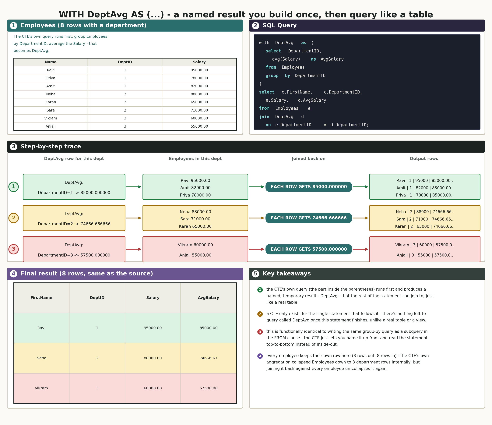
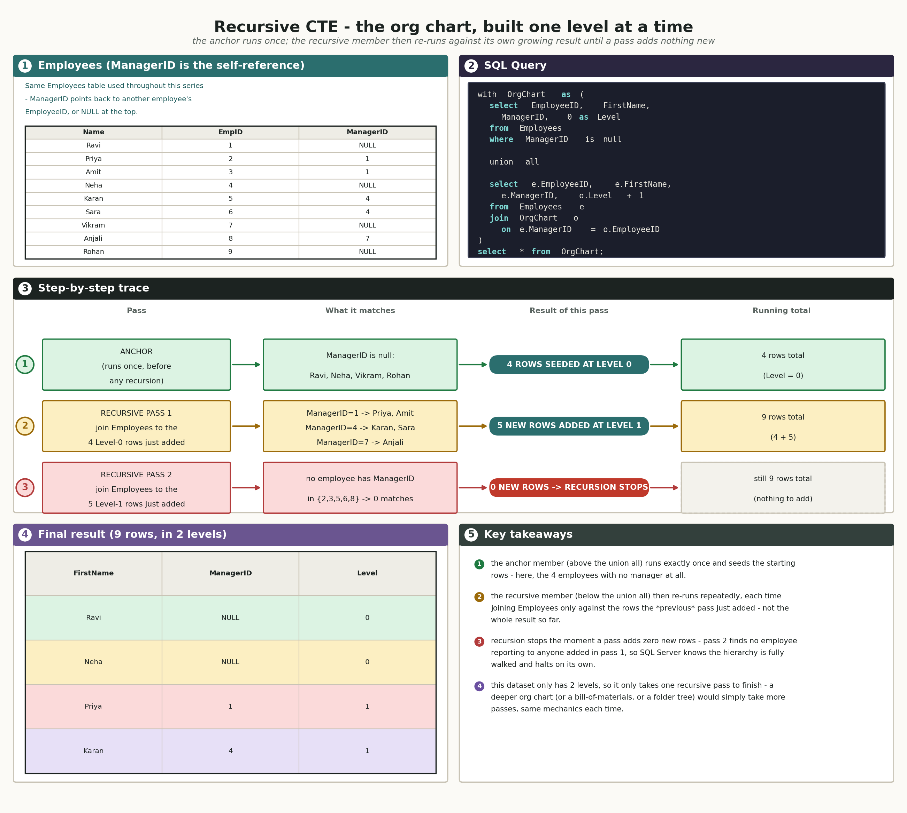
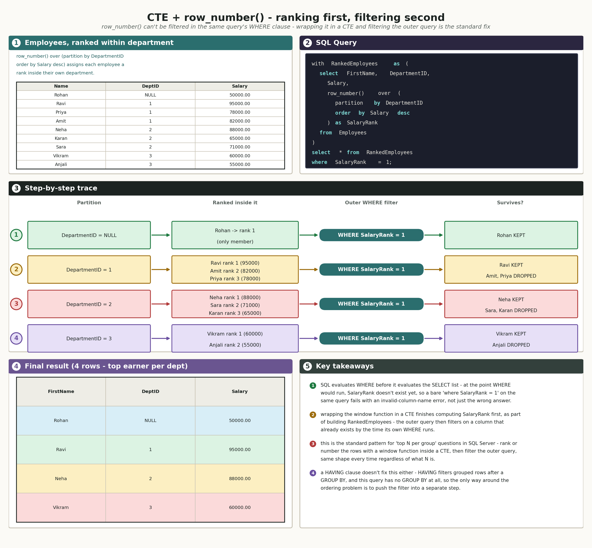

# 05 · SQL Common Table Expressions (SQL Server / T-SQL)

## The schema we're using

No new setup for this doc - CTEs get layered on top of tables that already exist. One table does all the work below:

`InterviewPrepSQLPractice.Employees` (same table from docs 01, 02, and 04, including the `DepartmentID` and `ManagerID` gaps):

| EmployeeID | FirstName | LastName | DepartmentID | ManagerID | Salary | HireDate |
|---|---|---|---|---|---|---|
| 1 | Ravi | Kumar | 1 | NULL | 95000.00 | 2019-03-01 |
| 2 | Priya | Shah | 1 | 1 | 78000.00 | 2020-07-15 |
| 3 | Amit | Verma | 1 | 1 | 82000.00 | 2021-01-10 |
| 4 | Neha | Singh | 2 | NULL | 88000.00 | 2018-11-20 |
| 5 | Karan | Mehta | 2 | 4 | 65000.00 | 2022-05-05 |
| 6 | Sara | Iyer | 2 | 4 | 71000.00 | 2023-09-12 |
| 7 | Vikram | Rao | 3 | NULL | 60000.00 | 2017-02-14 |
| 8 | Anjali | Nair | 3 | 7 | 55000.00 | 2023-12-01 |
| 9 | Rohan | Gupta | NULL | NULL | 50000.00 | 2024-03-18 |

`InterviewPrepSQLPractice.Departments`:

| DepartmentID | DepartmentName |
|---|---|
| 1 | Engineering |
| 2 | Sales |
| 3 | HR |
| 4 | Finance |

`ManagerID` is the self-reference used in the recursive CTE example below - Ravi, Neha, and Vikram have `ManagerID NULL` (they're each the top of their own chain), Rohan also has `ManagerID NULL` (he just has no manager assigned, same gap used elsewhere in this series), and everyone else points back to one of those three.

---

## How the diagrams in this doc work

Same five-panel layout as doc 04's window-function diagrams (`build_concept_infographic` in `make_concept_diagrams.py`) - one source table, no second table to match against, so no Venn-shaped kept/dropped region. Row 1 is the source table plus the SQL; row 2 is the step-by-step trace; row 3 is the real output plus key takeaways.

The recursive CTE diagram bends this slightly: instead of each step being a static bucket of the source table (like a `partition by` group), each step is a full *pass* of the recursion - the anchor runs once, then the recursive member re-runs against whatever the previous pass just added, until a pass adds nothing new. The "running total" column tracks how the result set grows pass by pass, since that's the part worth watching for a recursive CTE.

---

## 1. What is a CTE - the `with` clause

In plain language: a CTE (common table expression) is a named, temporary result you define right at the top of a statement, using `with <name> as (...)`, so you can refer to it later in that same statement the way you'd refer to a real table. It's a label for a query, not a container for data.

Real-life example: writing "let X = the total of my grocery receipt" at the top of a worksheet before using X in three later calculations - X isn't a separate document, it's just a name you gave an earlier piece of work so you don't have to rewrite it inline every time you need it.

Real-world use case: any query that would otherwise need the same grouped or filtered subquery repeated more than once, or one that's cleaner to read top-to-bottom - "first compute each department's average salary, then compare every employee against it" reads naturally as a CTE followed by a join, instead of a subquery buried inside a `join` clause.

Technical deep dive: `with DeptAvg as (...)` runs the query inside the parentheses first, producing a named, in-memory result set that the rest of the statement - and only that statement - can reference like a table. A CTE isn't materialized or cached the way a view or a temp table is; SQL Server is free to inline it into the surrounding query's execution plan, and it goes out of scope the instant the statement it belongs to finishes.

Connecting back: "a label for a query, used right after it's defined" is the plain version of "a named result set scoped to one statement, built by the query inside the parentheses."

Here's the basic shape, worked through for real - attaching each department's average salary onto every employee in it.

**Show every employee's name, department, and salary, next to their own department's average salary.**  
so this question is asking us to compute one number per department (the average) and then attach it onto every individual employee row in that department, not collapse the employees down to one row per department.

```sql
with DeptAvg as (
    select DepartmentID, avg(Salary) as AvgSalary
    from Employees
    group by DepartmentID
)
select e.FirstName, e.DepartmentID, e.Salary, d.AvgSalary
from Employees e
join DeptAvg d on e.DepartmentID = d.DepartmentID
order by e.DepartmentID, e.Salary desc;
```

Real output:

| FirstName | DepartmentID | Salary | AvgSalary |
|---|---|---|---|
| Ravi | 1 | 95000.00 | 85000.000000 |
| Amit | 1 | 82000.00 | 85000.000000 |
| Priya | 1 | 78000.00 | 85000.000000 |
| Neha | 2 | 88000.00 | 74666.666666 |
| Sara | 2 | 71000.00 | 74666.666666 |
| Karan | 2 | 65000.00 | 74666.666666 |
| Vikram | 3 | 60000.00 | 57500.000000 |
| Anjali | 3 | 55000.00 | 57500.000000 |

(8 rows affected)



A CTE vs a subquery, side by side: `DeptAvg` here is functionally identical to writing `join (select DepartmentID, avg(Salary) as AvgSalary from Employees group by DepartmentID) as d on e.DepartmentID = d.DepartmentID` directly inside the `from` clause - same query, same result, same execution plan. The only thing the CTE actually changes is where the query is written: up front, with a name, instead of nested inline where it's used. That difference stops being cosmetic the moment you need to reference the same derived result more than once in a statement - which is exactly what the next section does.

---

## 2. Chaining multiple CTEs together

In plain language: one `with` clause can define more than one named result, one after another, separated by commas - and each later CTE is allowed to reference the ones defined before it, building a short pipeline instead of one single step.

Real-life example: a recipe with numbered prep steps - "step 1: dice the onions," "step 2: caramelize the onions from step 1" - step 2 doesn't redo step 1's work, it just builds on the named result that's already sitting there.

Real-world use case: any multi-stage calculation where each stage is a genuinely separate idea - "first compute department averages, then find who's above their own department's average" is naturally two steps, and forcing it into one giant nested subquery would be harder to read than two small, named pieces.

Technical deep dive: `with A as (...), B as (...) select ...` defines `A` and `B` in the same `with` clause (one `with` keyword, comma-separated), and `B`'s own query is allowed to reference `A` by name, exactly like referencing a real table - but `A` can't reference `B` back, since SQL Server builds them in the order they're written. The final `select` can then reference `A`, `B`, or both.

Connecting back: "numbered prep steps that can use earlier steps" is the plain version of "multiple CTEs in one `with` clause, each one allowed to build on the ones defined before it, read and evaluated top to bottom."

**Find every employee who earns more than their own department's average salary.**  
so this question is asking us to compare each employee's own salary against a number that's specific to their own department, not the company-wide average - someone earning 80000 might be above average in one department and below it in another.

```sql
with DeptAvg as (
    select DepartmentID, avg(Salary) as AvgSalary
    from Employees
    group by DepartmentID
),
AboveAvg as (
    select e.EmployeeID, e.FirstName, e.DepartmentID, e.Salary
    from Employees e
    join DeptAvg d on e.DepartmentID = d.DepartmentID
    where e.Salary > d.AvgSalary
)
select * from AboveAvg
order by DepartmentID;
```

Real output:

| EmployeeID | FirstName | DepartmentID | Salary |
|---|---|---|---|
| 1 | Ravi | 1 | 95000.00 |
| 4 | Neha | 2 | 88000.00 |
| 7 | Vikram | 3 | 60000.00 |

(3 rows affected)

Exactly one employee survives per department - the highest earner in each one. That's not a coincidence specific to this data; with only two or three salaries per department here, the single highest earner is always going to be the one furthest above that department's own average, so this particular dataset can't show a department where two people both clear the bar. Worth keeping in mind as a limit of this practice schema, not a rule about CTEs.

---

## 3. Recursive CTEs - building hierarchies

In plain language: a recursive CTE is a CTE that's allowed to refer to itself. It starts with a base case (the "anchor") that seeds the first batch of rows, then repeatedly runs a second query (the "recursive member") that joins the source table back onto whatever the *previous* run just produced - adding one more layer each time - until a run adds nothing new, at which point it stops on its own.

Real-life example: a Russian nesting doll, opened one layer at a time - you don't know in advance how many dolls are inside, you just keep opening whatever's in front of you until you open one that has nothing inside it, and that's your stopping signal.

Real-world use case: any parent-child structure of unknown depth - an org chart (who reports to whom, however many levels deep), a bill-of-materials (a part made of parts, some of which are themselves made of parts), a folder tree, a category tree with subcategories. Anything where "how many levels are there?" isn't a fixed, known number ahead of time.

Technical deep dive: the syntax is `with CTE_Name as ( <anchor query> union all <recursive query referencing CTE_Name> )`. It must be `union all`, not `union` - `union`'s implicit duplicate-removal would force SQL Server to compare the entire accumulated result against itself on every single pass, which defeats the performance reason recursion is written this way, and in most cases isn't even needed since a correctly-built recursive member can't actually produce duplicate rows. Each pass, SQL Server joins the source table only against the rows the *immediately preceding* pass added - not the whole result so far - which is what makes the recursion advance one level at a time instead of looping forever. SQL Server also has a built-in safety net: `MAXRECURSION` defaults to 100, and the query is automatically aborted with an error if a genuinely circular reference (or a mistake in the recursive member) would otherwise recurse forever; that limit can be raised or lowered with `option (maxrecursion n)` on the outer statement if 100 levels is genuinely too few (or you want a tighter limit as a safety net of your own).

Connecting back: "keep opening dolls until one is empty" is the plain version of "the recursive member re-runs against the previous pass's new rows only, and recursion stops automatically the moment a pass returns zero rows - with `MAXRECURSION 100` as a hard backstop if it never would."

**Build the full management chain, starting from the top, with a number showing how many levels down each person is.**  
so this question is asking us to walk the `ManagerID` self-reference outward from the top of each chain, one level at a time, and label every employee with how far they are from the top - not just look up each person's single direct manager.

```sql
with OrgChart as (
    select EmployeeID, FirstName, ManagerID, 0 as Level
    from Employees
    where ManagerID is null

    union all

    select e.EmployeeID, e.FirstName, e.ManagerID, o.Level + 1
    from Employees e
    join OrgChart o on e.ManagerID = o.EmployeeID
)
select * from OrgChart
order by Level, EmployeeID;
```

Real output:

| EmployeeID | FirstName | ManagerID | Level |
|---|---|---|---|
| 1 | Ravi | NULL | 0 |
| 4 | Neha | NULL | 0 |
| 7 | Vikram | NULL | 0 |
| 9 | Rohan | NULL | 0 |
| 2 | Priya | 1 | 1 |
| 3 | Amit | 1 | 1 |
| 5 | Karan | 4 | 1 |
| 6 | Sara | 4 | 1 |
| 8 | Anjali | 7 | 1 |

(9 rows affected)



Worth noticing: Rohan ends up at Level 0 right alongside Ravi, Neha, and Vikram, even though he's not really "the top of a chain" the way they are - he just happens to also have `ManagerID is null`, the same condition the anchor uses to mean "top of the hierarchy." The anchor's `where ManagerID is null` can't tell the difference between "a genuine top-level manager" and "an employee whose manager was simply never assigned" - both produce the same NULL. That's the same ambiguity this series has run into before with Rohan's missing `DepartmentID`, just showing up in a different column this time.

This dataset only has two levels, so the recursion only needs one pass after the anchor to finish - a real org chart with five or six layers of management would recurse five or six times, same mechanics, just more passes before a pass finally adds zero rows.

---

## 4. CTEs with window functions - ranking first, filtering second

In plain language: a window function's result (like a rank from `row_number()`) can't be filtered in a `where` clause on the same query it was computed in - SQL evaluates `where` before it works out the `select` list, so at the moment `where` runs, that ranking column doesn't exist yet. Wrapping the window function in a CTE finishes computing it first; the outer query then filters on a column that's already there by the time its own `where` runs.

Real-life example: you can't cross names off a leaderboard before the leaderboard has been drawn up - ranking has to finish before any "keep only the top 3" step can happen, even though both feel like they're part of "the same task."

Real-world use case: "the top N per group" is one of the most common interview questions in SQL - highest-paid employee per department, most recent order per customer, best-selling product per category. The CTE-plus-window-function pattern is the standard way to answer all of them, regardless of what N is or what "best" means.

Technical deep dive: SQL's logical query processing order evaluates `from`/`join`, then `where`, then `group by`, then `having`, and only then the `select` list (which is where a window function's `over()` clause gets evaluated) - `where` has already run by the time a window-function alias would exist, so referencing it there fails with an invalid-column-name error, not a wrong answer. Pushing the window function into a CTE's own `select` list finishes that computation as part of building the CTE; the CTE is then a plain table as far as the outer query is concerned, and the outer query's `where` clause runs against a result that already has the ranking column sitting in it.

Connecting back: "can't filter the leaderboard before it's drawn up" is the plain version of "a window function is computed in the `select` step, which runs after `where` - so filtering on it has to happen one statement later, which is exactly what the CTE gives you room to do."

**Find the highest-paid employee in each department.**  
so this question is asking us to rank every employee against only the other employees in their own department, then keep just the single top-ranked person per department - not the single highest salary company-wide.

```sql
with RankedEmployees as (
    select FirstName, DepartmentID, Salary,
           row_number() over (partition by DepartmentID order by Salary desc) as SalaryRank
    from Employees
)
select * from RankedEmployees
where SalaryRank = 1;
```

Real output:

| FirstName | DepartmentID | Salary | SalaryRank |
|---|---|---|---|
| Rohan | NULL | 50000.00 | 1 |
| Ravi | 1 | 95000.00 | 1 |
| Neha | 2 | 88000.00 | 1 |
| Vikram | 3 | 60000.00 | 1 |

(4 rows affected)



Same NULL-as-its-own-group rule from `group by`/`partition by` shows up here too: Rohan's `DepartmentID NULL` gets treated as its own single-member partition, so he trivially ranks 1st in a "department" of one and survives the filter right alongside the three real department winners.

---

## Quick reference: CTE vs. subquery vs. temp table vs. view

| | CTE | Subquery | Temp table (`#Table`) | View |
|---|---|---|---|---|
| Lifespan | one statement only | one statement only | session (until dropped or session ends) | permanent, until explicitly dropped |
| Can reference itself (recursive)? | yes | no | no (not directly) | no (not directly) |
| Reusable within the same statement? | yes, by name, as many times as needed | no - has to be rewritten/repeated inline | yes, across multiple statements | yes, across multiple statements |
| Actually stores data? | no - inlined into the surrounding query | no - inlined into the surrounding query | yes - real rows on disk/in tempdb, can be indexed | no - just a saved query definition, re-run every time it's queried |
| Best fit | readability, one-off pipelines, recursion | a quick one-time filter or lookup | a multi-step batch process that reuses the same intermediate result several times | a stable, reusable "shape" of a query other code/reports query like a table |

---

## Interview questions

1. What does `with <name> as (...)` actually create - is it a table, a view, or something else?
2. How long does a CTE live? What happens if you try to query it from a second, separate statement?
3. Is a CTE ever faster than the equivalent subquery, or are they the same thing under the hood?
4. Can one CTE in a `with` clause reference another CTE defined earlier in the same `with` clause? Can it reference one defined later?
5. What two parts does a recursive CTE need, and what does each one do?
6. Why must a recursive CTE use `union all` instead of `union`?
7. What stops a recursive CTE from running forever? Name both the natural stopping condition and the built-in safety net.
8. In the recursive org-chart example, what does the `Level` column actually represent, and how does it get computed?
9. Why can't a window function's alias be used directly in that same query's `where` clause?
10. What's the standard pattern for answering a "top N per group" question in SQL Server?
11. What's the real difference between a CTE and a temp table, in terms of what each one actually stores?
12. If you needed the same derived result reused across three completely separate statements (not just within one), would a CTE still be the right tool? Why or why not?

---

## Practice database

Same table as the examples above - `InterviewPrepSQLPractice.Employees` (and `Departments` for question 1 below). No new setup needed; both already exist from earlier docs.

## Practice questions

Write each of these yourself in SSMS - type it, run it, and paste back both your query and the real output.

1. Using `InterviewPrepSQLPractice`, write a CTE that computes each department's total salary cost (the sum of `Salary`, grouped by `DepartmentID`), then write an outer query that returns only the departments whose total salary cost exceeds 200000.
2. Using `InterviewPrepSQLPractice`, write a CTE with `row_number()` (partitioned by `DepartmentID`, ordered by `Salary desc`) that ranks employees within their department, then write an outer query that returns only the *second*-highest-paid employee in each department.
3. Using `InterviewPrepSQLPractice`, write a recursive CTE that finds, for every employee, the person at the very top of their own management chain (not just their direct manager - the root of the whole chain). You'll need to carry that top-of-chain person's ID and name forward through each recursive pass, rather than a level counter.
4. Using `InterviewPrepSQLPractice`, answer "what's the maximum salary in each employee's own department, shown next to every employee" using a CTE joined back onto `Employees` by `DepartmentID` - the same question doc 01's Q7 answered with a correlated subquery. Once you've got real output, compare Rohan's row here against what doc 01's Q7 answer key gave him, and see if the two approaches actually agree.

Once you've run all four and have real output, paste it back and I'll grade it against a hand-verified answer key.
