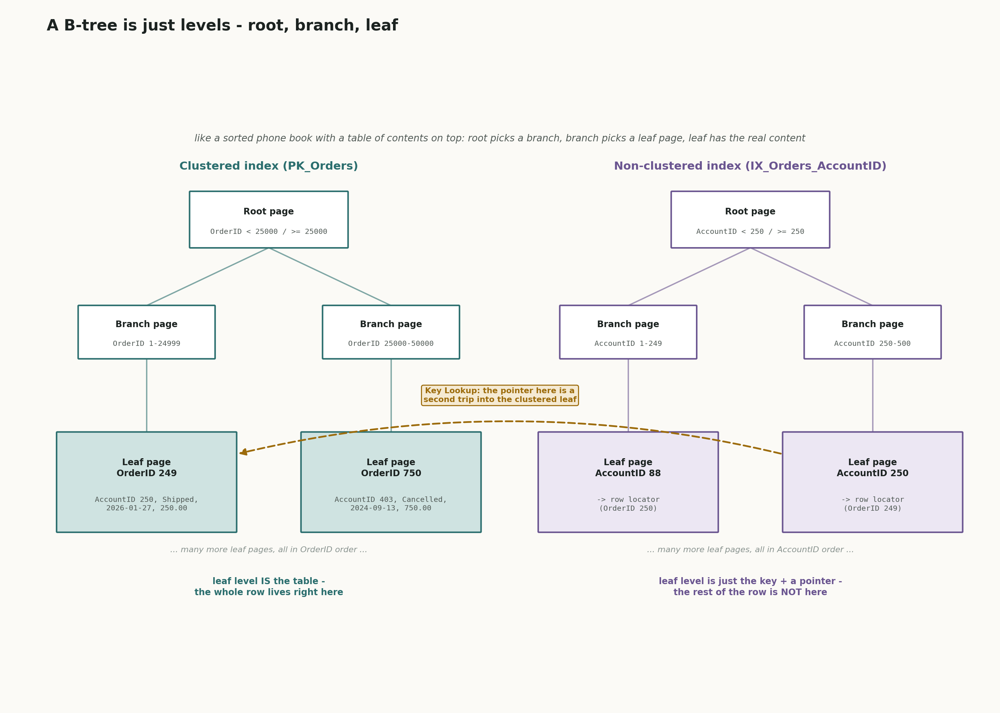
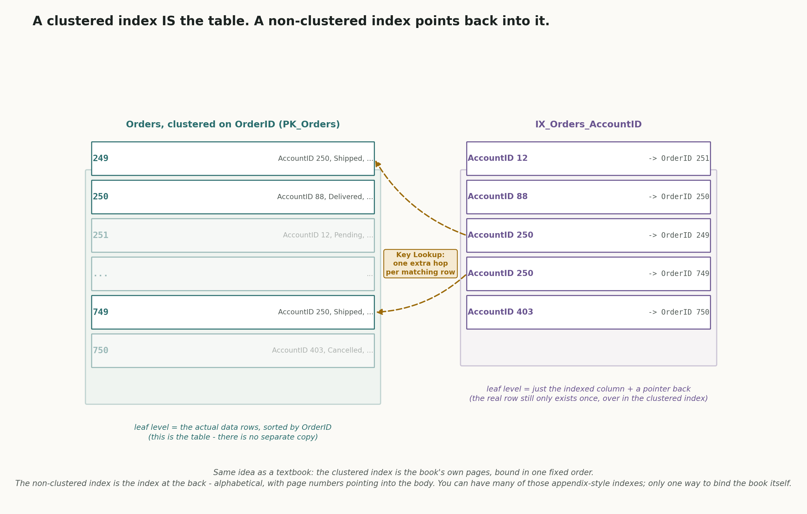
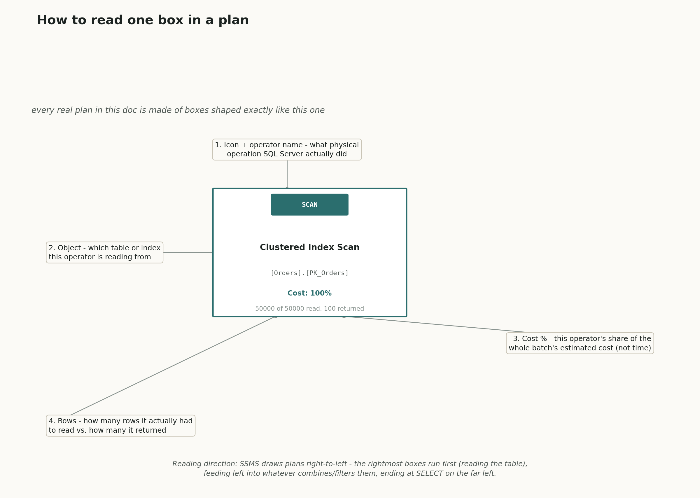
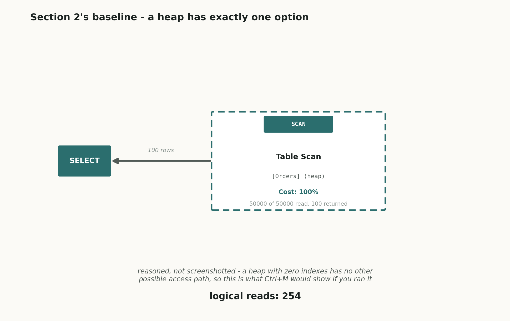
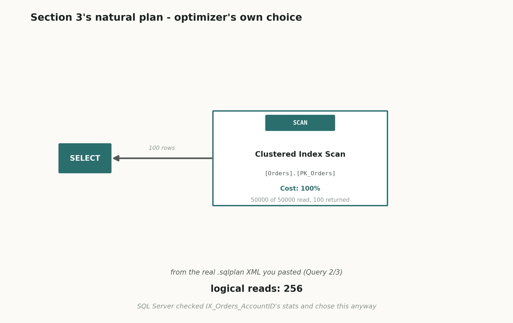
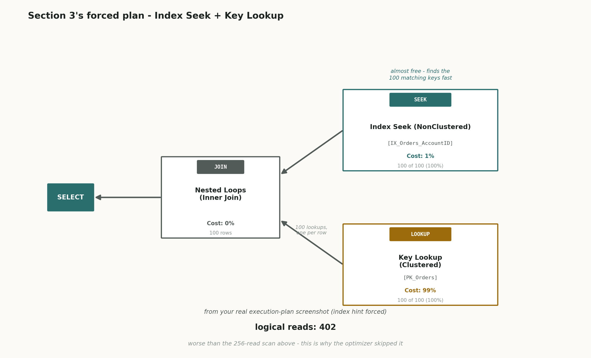
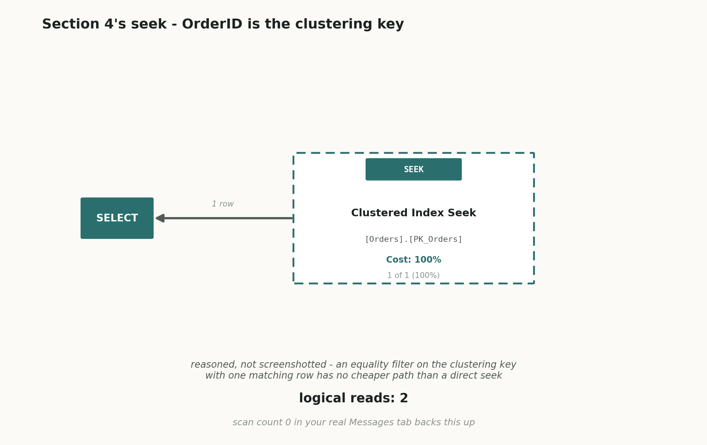
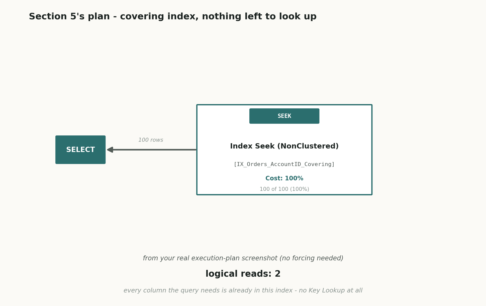
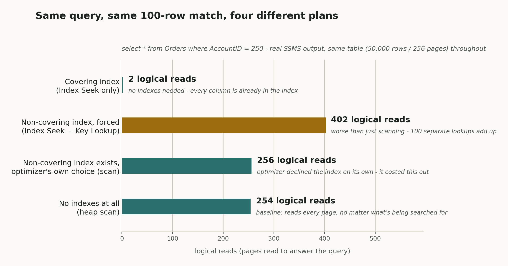

# 06 · SQL Indexes & Execution Plans (SQL Server / T-SQL)

## The schema we're using

`Employees`/`Departments` (the tables every other doc in this series uses) are only 9 rows total. SQL Server will always just read the whole table for a table that small, no matter what indexes exist on it - there's nothing for an index to actually save. So this doc needed a bigger, dedicated table: `InterviewPrepSQLPractice.Orders`, 50,000 rows, built specifically to make scan-vs-seek actually visible and measurable.

```sql
create table Orders (
    OrderID     int identity(1,1) not null,
    AccountID   int not null,
    OrderStatus varchar(20) not null,
    OrderDate   date not null,
    Amount      decimal(10,2) not null
)

;with Nums as (
    select top (50000) row_number() over (order by (select null)) as n
    from sys.all_objects a cross join sys.all_objects b
)
insert into Orders (AccountID, OrderStatus, OrderDate, Amount)
select
    (n % 500) + 1,
    case (n % 4)
        when 0 then 'Pending'
        when 1 then 'Shipped'
        when 2 then 'Delivered'
        else 'Cancelled'
    end,
    dateadd(day, -(n % 1000), '2026-10-03'),
    cast((n % 2000) + 1 as decimal(10,2))
from Nums;
```

500 distinct `AccountID` values, each matching exactly 100 of the 50,000 rows (50000 / 500) - that's the "0.2% selective" filter used throughout this doc. The table starts life as a **heap** (no clustered index - just a pile of rows with no enforced physical order), then picks up a clustered primary key and a couple of non-clustered indexes over the course of the doc, one at a time, so each one's actual effect can be measured in isolation.

---

## How the diagrams in this doc work

Every other doc in this series traces rows through a query, step by step. This one is different - the point here isn't what rows come out, it's how much *work* SQL Server did to get them. So this doc uses four kinds of diagram:

- **One structural diagram** in section 1, showing what a clustered index and a non-clustered index actually look like as sorted structures, plus a second one showing the same idea broken into B-tree levels (root/branch/leaf).
- **One "how to read a plan" guide**, right after section 1 - a single labelled execution-plan box explaining what each piece of text in a plan operator actually means, before any real plans show up.
- **One recreated execution-plan tree per scenario**, inline in each section - redrawn from the real plan each query actually produced, in the same box-and-arrow shape SSMS itself uses (read right-to-left, exactly like a real plan).
- **One bar chart** near the end, comparing the real, measured **logical reads** number across all four plans side by side.

Two of those recreated plans - the Table Scan in section 2 and the Clustered Index Seek in section 4 - are drawn with a **dashed border** and labelled "reasoned, not screenshotted." Those two specific plans were never actually captured with Ctrl+M during this exercise; the queries were only run with `SET STATISTICS IO ON`, and the plan shape was inferred afterward from the IO numbers plus a structural fact about SQL Server (a heap with zero indexes has exactly one possible access path; an equality filter on a unique clustering key with one matching row has no cheaper path than a direct seek). The inference is about as safe as inferences get, but it's not the same thing as watching the real graphical plan, so it's marked differently on purpose rather than presented as identical to the three plans (sections 3's two plans and section 5's) that were actually screenshotted from real `.sqlplan` output.

---

## 1. Clustered vs. non-clustered indexes - what they actually are

In plain language: a **clustered index** isn't a separate thing sitting next to your table - it *is* your table, with its rows physically stored on disk in sorted order by whichever column(s) you chose. A table can have at most one of these, because rows can only be physically sorted one way at a time. A **non-clustered index** is a genuinely separate, smaller structure: just the indexed column's values, sorted, each one carrying a pointer back to where the real row actually lives. A table can have many non-clustered indexes.

Real-life example: think of a textbook. The clustered index is the book's own pages - the content itself, bound in one fixed order (say, chapter order). You can only bind the physical pages one way. The index at the back of the book is a non-clustered index: an alphabetical list of terms, each with a page number pointing back into the body of the book. You can have as many of those appendix-style indexes as you want (an index by topic, another by author name) without rebinding the book itself.

Real-world use case: you make the column you search on *most often, most selectively* (one unique row, or a handful) the clustered key - commonly the primary key, like `OrderID` here. Everything else you search on sometimes - like `AccountID` - gets a non-clustered index instead, since you can't have more than one clustered index to cover every search pattern.

Technical deep dive: a clustered index is a B-tree where the **leaf level is the actual data rows**, in key order. A non-clustered index is a separate B-tree whose leaf level holds just the indexed column(s) plus a *row locator* back to the real row - if the table is a heap (no clustered index), that locator is a physical Row ID (RID); if the table has a clustered index, the locator is the clustering key's value instead, and fetching the rest of the row means a second trip through the clustered index, which the execution plan calls a **Key Lookup**.

"B-tree" is the one word in that paragraph that's hardest to picture from text alone, so here it is drawn out as actual levels, right where it's being explained:



In the simplest possible terms: think of a sorted phone book so big you'd never find a name by flipping page by page. So someone adds a table of contents on top of it. The very first page says "A-M in this half, N-Z in that half" - that's the **root page**. Flip to the N-Z half, and there's another, smaller table of contents inside it, narrowing things down further - that's a **branch page** (there can be several branch levels stacked for a really big index, but one is enough to show the idea). Finally you land on the actual page with the actual name and phone number printed on it - that's the **leaf page**, the bottom level, where the real content lives.

Both trees in the picture have that exact same root -> branch -> leaf shape - the only difference is *what sits at the leaf level*, which is the one fact this whole doc keeps coming back to:

- **Clustered index (left, teal):** the leaf page **is** the row. Land on the leaf for `OrderID 249` and you already have everything - `AccountID`, `OrderStatus`, `OrderDate`, `Amount`, all of it. Nothing more to fetch. This is exactly what "the leaf level is the actual data rows" means in the paragraph above.
- **Non-clustered index (right, violet):** the leaf page only holds the key you searched on (`AccountID`) plus a little arrow (`-> OrderID 249`) pointing at where the real row lives - this arrow is the "row locator" the paragraph above mentions. Landing on this leaf does *not* give you the row - it gives you directions to the row. Following that arrow back into the clustered tree's own leaf level is exactly what the paragraph above calls a **Key Lookup**, shown as the dashed amber arrow connecting the two trees.

Connecting back: "the book itself vs. an appendix pointing into it" is the plain version of "the clustered index physically stores the row; a non-clustered index stores a value plus a pointer back to that row."



The picture above is the same two paragraphs as a structure, not prose, just drawn as flat sorted panels instead of tree levels: the left panel is the clustered index - sorted row cards, each one holding the *entire* row, because the index *is* the table. The right panel is a non-clustered index - sorted entries that only hold the indexed column plus a thin pointer. The dashed amber arrows are the same "Key Lookup" trip as above: a non-clustered entry matching `AccountID = 250` found its key fast, but then has to jump back into the clustered panel to fetch the rest of the row - the exact extra hop that drives section 3's surprise below.

### What does "indexed column" actually mean?

This phrase trips a lot of people up at first, so in the simplest terms possible: the **indexed column** is just the column you told SQL Server to build the index on - the column whose values get copied out, sorted, and stored inside the index.

Look back at `create nonclustered index IX_Orders_AccountID on Orders(AccountID)` from section 3 below. The column sitting inside the parentheses - `AccountID` - is the indexed column. That means a separate, sorted mini-copy of just the `AccountID` values (plus a pointer back to each real row) gets built and stored as this index. Any column *not* listed there - `OrderStatus`, `OrderDate`, `Amount` - is **not** indexed by this particular index. Those values don't exist anywhere inside this index's own pages at all, which is exactly why fetching them for a matching row needs that extra Key Lookup trip back into the real table - the index genuinely doesn't have them.

---

## How to read an execution plan

Before the real plans below, here's what every box in one of these diagrams is actually saying, using a real operator from this doc as the example:



Four things to check on every operator box, in the order that actually matters when you're staring at a real plan in SSMS:

1. **Icon + operator name** - what kind of work this step did (a Scan, a Seek, a Lookup, a Join). This is the single fastest thing to scan for, because a plan full of Scans and Lookups on a large table is usually the first sign something's wrong.
2. **Object** - which table or index this operator actually touched, in brackets. This is what tells you *which* index SQL Server used (or didn't).
3. **Cost %** - SQL Server's own estimate of what share of the whole query's total cost this one operator accounted for. It's an estimate, not a measured fact, but it's the number that tells you where to look first - a box reading 99% is where almost all the work happened.
4. **Rows** - how many rows this operator actually read vs. how many it returned. A big gap between "read" and "returned" (like 50,000 read to return 100) is the plan telling you it did far more work than the row count you actually wanted.

And the one orientation rule that trips people up the most: SQL Server execution plans read **right to left** - the rightmost box is where data access starts (a table or index), and each arrow flows left into the next operator, until it reaches `SELECT` on the far left, the final output. The diagrams in this doc all follow that same right-to-left layout.

---

## 2. The baseline - no indexes at all

With `Orders` as a plain heap (nothing built on it yet), here's the simplest possible query: find every order for one account.

**Find every order placed on account 250.**  
so this question is asking SQL Server to check all 50,000 rows and keep the ones where `AccountID` matches, with nothing yet to help it skip the ones that don't.

```sql
set statistics io on

select * from Orders where AccountID = 250

set statistics io off
```

Real output (first and last few of 100 rows):

| OrderID | AccountID | OrderStatus | OrderDate  | Amount  |
|---|---|---|---|---|
| 249 | 250 | Shipped | 2026-01-27 | 250.00 |
| 749 | 250 | Shipped | 2024-09-14 | 750.00 |
| 1249 | 250 | Shipped | 2026-01-27 | 1250.00 |
| ... | ... | ... | ... | ... |
| 49249 | 250 | Shipped | 2026-01-27 | 1250.00 |
| 49749 | 250 | Shipped | 2024-09-14 | 1750.00 |

(100 rows affected)

`Table 'Orders'. Scan count 1, logical reads 254.`

Here's how to actually read that Messages-tab line, since it's the single most useful real-world debugging number in this whole doc: **`logical reads`** is how many 8KB data pages SQL Server had to pull out of memory (or disk) to answer the query - it's a direct, repeatable measure of *work done*, unaffected by how fast your machine happens to be that day, which is exactly why it's more trustworthy than "it took 40ms" (that number jumps around with server load; logical reads doesn't). `Scan count 1` means it approached the table as one single continuous scan.



This query was run with `SET STATISTICS IO ON` only, not with Ctrl+M, so the plan picture above wasn't actually screenshotted - it's redrawn with a dashed border to be honest about that. It's still a safe conclusion, not a guess: a heap with zero indexes has exactly one possible way to find rows, a **Table Scan** reading every page start to finish, so the `Scan count 1, logical reads 254` line it actually produced is only consistent with that one plan shape. If you want the real picture instead of the reasoned one, turning on Ctrl+M before re-running this exact query would show it directly.

---

## 3. Adding a non-clustered index - and watching SQL Server ignore it

The obvious next move: index the column you're filtering on.

```sql
create nonclustered index IX_Orders_AccountID on Orders(AccountID)
```

In the simplest terms, reading this line left to right, piece by piece:

- `create nonclustered index` - the actual command. It tells SQL Server "build me a brand new non-clustered index" (as opposed to `create clustered index`, or a plain `create table`).
- `IX_Orders_AccountID` - just a name you're picking for this index, the same way you'd name a file. It can technically be called anything, but there's a common habit: `IX_` (short for "index") + the table name + the column name, so anyone reading it later instantly knows what it's for without opening it up and looking.
- `on Orders` - which table to build it on.
- `(AccountID)` - which column, inside parentheses, to actually build the index on. This is the **indexed column** explained in section 1 above.

Put together in plain words: "create a non-clustered index, call it `IX_Orders_AccountID`, on the `Orders` table, built on the `AccountID` column."

Re-run the exact same query. You'd expect this to get much cheaper now - and here's the real, confirmed surprise: it doesn't.

**Find every order placed on account 250, now that `AccountID` is indexed.**  
so this is the same question as before, but this time there's an index SQL Server could use to jump straight to the matching rows instead of checking all 50,000.

```sql
select * from Orders where AccountID = 250
```

Real output: identical 100 rows to section 2. Real Messages-tab line: **`Table 'Orders'. Scan count 1, logical reads 256.`** (256, not 254 - the table now has a clustered primary key too, built in section 4 below before this was re-tested; a couple of extra pages come from the clustered index's own B-tree structure, not from anything going wrong.)

The real execution plan's XML confirms it directly: `PhysicalOp="Clustered Index Scan"`, `EstimatedRowsRead="50000"`, `ActualRowsRead="50000"` - SQL Server scanned the *entire* table again, exactly like before, and the plan's own `OptimizerStatsUsage` section proves it actually looked at the new index's statistics (freshly updated, not stale) before deciding against using it. This wasn't a bug or a missed index - it was a real, deliberate cost-based decision.



This one's real - recreated directly from the `.sqlplan` XML you pasted. One operator, `Clustered Index Scan` on `[PK_Orders]`, cost 100%, 50,000 of 50,000 rows read to return 100.

To see *why*, the new index was forced on with a hint, overriding the optimizer's own choice:

```sql
set statistics io on

select * from Orders with (index(IX_Orders_AccountID)) where AccountID = 250

set statistics io off
```

This is a completely normal `select *` query with one unusual piece bolted into the middle: `with (index(IX_Orders_AccountID))`. That's called an **index hint**. Normally you never write this - SQL Server's own optimizer decides on its own, every time, which index (if any) is actually worth using, based on cost. This phrase is a direct override that says "don't think about it, don't pick for yourself - use this exact index, whether you believe it's a good idea or not."

It was used here on purpose, only as a one-time experiment, to force SQL Server down the path it had already turned down - specifically so its own natural choice (`256` reads, the scan above) could be compared against "what happens if I make you use the index anyway" (`402` reads, below). You'd basically never write an index hint in real production code unless you had strong, specific proof the optimizer was making a mistake - and as this very comparison shows, most of the time it isn't.

The real plan this time: **Index Seek** on `IX_Orders_AccountID` (cost 1%) feeding into a **Key Lookup** on the clustered index `PK_Orders` (cost 99%), joined by **Nested Loops**. Real Messages-tab line: **`Table 'Orders'. Scan count 1, logical reads 402, physical reads 3, read-ahead reads 100.`**



In the simplest possible terms, picture trying to find every book by one author in a huge library:

- **Index Seek (top right, cost 1%):** this is walking up to a card catalog drawer that's already sorted by author name. You flip straight to the author, and in seconds you have a stack of 100 little index cards, each one just saying "shelf 42, slot 7" - a pointer to where the real book is. Fast, almost free, because the catalog drawer itself is small and already sorted.
- **Key Lookup (bottom right, cost 99%):** now you actually need the books, not just the cards. So for every single one of those 100 cards, you personally walk across the library, find the shelf, pull the book, and walk back. That's 100 separate walking trips. Each individual trip isn't expensive on its own, but doing it 100 times adds up to almost all of the total effort in this entire plan - which is exactly why this one box shows 99% of the cost even though the catalog lookup felt instant.
- **Nested Loops (middle box):** this is the "for each card, go do one walk-to-the-shelf trip, then glue the card and the book together" step. It takes the 100 cards one at a time, triggers the matching Key Lookup trip for each one, and pairs them up into a complete result row.
- **SELECT (far left):** once every card has been paired with its book, this is just "hand me everything you collected" - the final output the query returns.

So reading the picture right to left, the same direction every plan in this doc reads: `Index Seek` finds the 100 matching cards cheaply -> `Nested Loops` takes them one at a time and asks `Key Lookup` to fetch the full row for each -> `Key Lookup` does that fetching, 100 separate times, which is the expensive part -> the paired-up results flow out through `SELECT`. That's why 1% and 99% roughly add up to the whole cost - almost all the real work is in the 100 individual fetch trips, not in finding which 100 rows to fetch in the first place.

**402 is worse than 256.** That's the whole lesson, with real numbers behind it: the Index Seek part is nearly free - finding the 100 matching `AccountID` entries in the index's own small B-tree costs almost nothing. But a non-clustered index on its own only has the column(s) it was built on; to get the other four columns (`OrderStatus`, `OrderDate`, `Amount`, etc.) for each matching row, SQL Server has to do a separate **Key Lookup** - a whole extra trip back into the clustered index - *once per matching row*. 100 individual lookups, each costing a handful of page reads to walk the clustered B-tree, adds up to more total reads than one sequential scan of the entire (small, 256-page) table. The optimizer knew this and scanned instead - a real example of the exact interview question "why would SQL Server ignore an index that exists?"

### Then why build this index at all, if forcing it just makes things worse?

Fair question to stop and ask here, since on the surface it looks like 20 minutes were spent building something useless. Worth answering directly: this index was built to test an idea, not because it was already known to help. In real life, you usually don't know ahead of time whether an index will actually help one specific query - you build it because "this column gets searched a lot" is a reasonable-sounding reason, and then you check whether it was actually a good call.

When this one was checked, SQL Server itself quietly said "no thanks" and used the scan instead (256 reads) - it never, on its own, chose the slow 402-read path. That 402 number only exists because it was forced with a hint, on purpose, as a deliberate experiment: "what if you were made to use the index anyway - would it really be worse?" And yes, it really was worse, which is the actual proof that SQL Server's own decision to skip the index was the right call for this specific query.

So the index wasn't a mistake - it was a controlled experiment that taught an important, very real lesson: adding an index does not automatically make a query faster. SQL Server checks the real cost at query time and only uses an index when it's genuinely cheaper. Here, with `select *` pulling back all 5 columns for 100 out of 50,000 rows, the index alone wasn't enough on its own - it only held `AccountID`, so every match still needed a separate trip back to fetch the rest of the row.

And the fix, shown in section 5 below, wasn't to throw the index away - it was to make it carry a few more columns (turning it into a covering index), which then won big (2 reads). So this plain non-clustered index wasn't useless in general either - it just needed one more ingredient to pay off for *this particular* query shape. The same index, even without those extra columns, could still be exactly the right choice for a different query - one that only asks for `AccountID` itself with nothing else, or one where the filter matches far fewer rows (say 2 or 3 out of 50,000 instead of 100), where the Key Lookup overhead would be tiny instead of adding up to 99% of the cost. Whether an index helps always depends on the exact query asking for it, not just which column is being filtered on.

---

## 4. Clustered index seek - the dramatic win

Now give `Orders` what it was missing: a clustered primary key, on the column it's most commonly looked up by one at a time.

```sql
alter table Orders add constraint PK_Orders primary key clustered (OrderID)
```

**Find the order with ID 12345.**  
so this is asking for exactly one row, looked up by the column the table is now physically sorted by.

```sql
set statistics io on

select * from Orders where OrderID = 12345

set statistics io off
```

Real output:

| OrderID | AccountID | OrderStatus | OrderDate  | Amount |
|---|---|---|---|---|
| 12345 | 346 | Shipped | 2025-10-23 | 346.00 |

(1 row affected)

`Table 'Orders'. Scan count 0, logical reads 2.`

**2 logical reads.** Compare that to section 2's 254 and section 3's 256/402 - this is the payoff clustered indexes exist for. Because the table's rows are physically sorted by `OrderID`, SQL Server can navigate straight to row 12345 the same way you'd jump straight to page 400 in a sorted phone book instead of reading every page from the start: a couple of B-tree levels down, and the row is right there - no scan, no lookup, nothing wasted.



Same honesty note as section 2's diagram: this query was only run with `SET STATISTICS IO ON`, not Ctrl+M, so this plan picture is reasoned, not screenshotted - dashed border again. But `Scan count 0, logical reads 2` on an equality filter against a unique clustering key with exactly one matching row has no cheaper explanation than a direct `Clustered Index Seek`, cost 100% - there's no other plan shape that number is consistent with. `Scan count 0` specifically is a strong tell: SQL Server didn't even register this as a "scan" of anything, which is what a seek that goes straight to one row looks like in the Messages tab.

---

## 5. Covering indexes - eliminating the lookup entirely

Section 3's problem was the Key Lookup: the index had the column being filtered on, but not the other columns the query actually wanted back. Fix that directly - build the same index again, but this time tell it to carry the extra columns along for the ride with `include`:

```sql
create nonclustered index IX_Orders_AccountID_Covering
    on Orders(AccountID)
    include (OrderStatus, OrderDate, Amount)
```

Before even running a `select`, the `create index` statement's own execution plan is worth a look - it's a real, visible instance of the *other* half of the index trade-off, the one that doesn't show up when you're only looking at read performance: **`Index Insert`** (cost 31%) and **`Sort`** (cost 64%) on top of a full **`Clustered Index Scan`** (cost 4%) of the existing 50,000 rows - SQL Server had to read the entire table once and sort it by `AccountID` just to build this index. That's the real cost side of "index design trade-offs: write cost vs. read speed" - every index you add makes every future `insert`/`update`/`delete` on that table do a little more work too, to keep the index in sync. It's never free; you're trading write cost for read speed, and that trade only pays off if the index actually gets used the way section 3 shows it might not.

**Find every order placed on account 250, using the covering index.**  
so this is the exact same question as sections 2 and 3, but this time with no forcing - just letting the optimizer choose on its own again.

```sql
set statistics io on

select * from Orders where AccountID = 250

set statistics io off
```

Real output: the same 100 rows as every earlier version of this query. Real Messages-tab line: **`Table 'Orders'. Scan count 1, logical reads 2.`**

The real plan this time is just one operator: **Index Seek** on `IX_Orders_AccountID_Covering`, cost 100% - no Key Lookup at all, because every single column the query needs (`AccountID`, `OrderStatus`, `OrderDate`, `Amount` - `OrderID` comes along automatically since it's the clustering key) is already sitting right there in the index's own leaf pages. This is what "covering index" means: an index that covers everything a specific query needs, so the clustered index never has to be touched a second time.



One box, no second trip anywhere: compare this directly against section 3's two-box plan above - the `Key Lookup` box is just gone, because there's nothing left for it to fetch.

---

## The full comparison, one query, four real plans



Same filter (`AccountID = 250`, 100 of 50,000 rows), same table, four different real, measured outcomes: a plain scan costs about the same whether the table is a heap or has a clustered index (254 vs. 256 - a scan is a scan either way); forcing an unhelpful index makes things *worse* (402); and a covering index makes things dramatically *better* (2) - 127 times fewer reads than the scan, 201 times fewer than the badly-targeted forced index.

---

## Quick reference: index types and plan operators

| Term | What it means |
|---|---|
| Indexed column | The column you named inside the parentheses when creating the index - its values get copied, sorted, and stored in the index; columns left out aren't in the index at all |
| Index hint (`with (index(...))`) | A direct override forcing SQL Server to use a specific index, bypassing its own cost-based choice - rare in real code, mainly a debugging/testing tool |
| Heap | A table with no clustered index - rows have no enforced physical order |
| Clustered index | The table's own data, physically sorted by the chosen key; at most one per table |
| Non-clustered index | A separate, smaller sorted structure of key values + pointers back to the real row; many allowed per table |
| Covering index | A non-clustered index whose columns (key + `include`d columns) satisfy an entire query, with nothing left to look up |
| Table Scan | Reads every page of a heap, in physical/no particular order |
| Clustered Index Scan | Reads every page of a clustered index, in key order - same cost as a Table Scan, different structure |
| Index Seek | Navigates a B-tree directly to the matching rows, without reading unrelated pages |
| Key Lookup | A second trip into the clustered index to fetch columns a non-clustered index doesn't carry - one per matching row |
| RID Lookup | Same idea as a Key Lookup, but against a heap (using a physical Row ID instead of a clustering key) |
| Logical reads | Pages read to answer a query - a consistent, repeatable cost measure, independent of server load |
| Clustered Index Seek | Navigates a clustered index's B-tree directly to matching row(s), without reading the rest of the table |
| Nested Loops | A join that, for each row from one input, probes the other input once per row - cheap per probe, but the cost multiplies by row count |

---

## Interview questions

1. What's the actual difference between a clustered and a non-clustered index - not just "one is faster," but structurally?
2. Why can a table have only one clustered index but many non-clustered indexes?
3. What is a heap, and what changes about row lookups once a clustered index is added to one?
4. What does a "Key Lookup" mean in an execution plan, and why can it make a plan more expensive than just scanning?
5. Give a real scenario where SQL Server would choose to ignore an index that exists on the exact column being filtered.
6. What is a covering index, and what does the `include` clause actually do?
7. What's the practical difference between an Index Seek and an Index Scan in a plan?
8. Why is "logical reads" usually a more trustworthy number than query duration when comparing two plans?
9. What's the cost side of adding an index - what gets slower, and why?
10. If a column is filtered on in only 1% of your queries, is it automatically worth indexing? What else matters?
11. Walk through, step by step, how you'd investigate "why is this specific query slow" in SSMS.
12. What's the difference between a RID Lookup and a Key Lookup, and when would you see each?

---

## Practice database

Same `Orders` table built in this doc - 50,000 rows, `AccountID`/`OrderStatus`/`OrderDate`/`Amount`, now with `PK_Orders` (clustered, on `OrderID`), `IX_Orders_AccountID` (non-clustered, on `AccountID`), and `IX_Orders_AccountID_Covering` (non-clustered, on `AccountID`, including `OrderStatus`/`OrderDate`/`Amount`) all already built on your machine.

## Practice questions

For each of these: predict what you think the plan will show *before* running it, then run it for real with Ctrl+M on and `set statistics io on`, and check your prediction against the real operator names and logical-reads number.

1. `OrderStatus` only has 4 distinct values, so each one matches roughly 12,500 of the 50,000 rows (25% - much less selective than `AccountID`'s 0.2%). Create a non-clustered index on `OrderStatus`, then query `where OrderStatus = 'Cancelled'`. Do you expect SQL Server to use your new index, or scan past it? Why?
2. Build a covering index for this exact query: `select OrderID, Amount from Orders where OrderStatus = 'Pending'`. What columns does the index need, and what plan/logical-reads number do you get once it exists?
3. Pick any single `OrderID` and query `where OrderID = <your number>`, same as section 4 - confirm for yourself that it's still a cheap Clustered Index Seek no matter which non-clustered indexes also exist on the table.
4. Using an index hint like section 3's, force `IX_Orders_AccountID` (the non-covering one) on a query that also needs `OrderDate` and `Amount` - the exact same Key Lookup pattern as section 3, just so you can see it happen a second time on your own, unguided.
