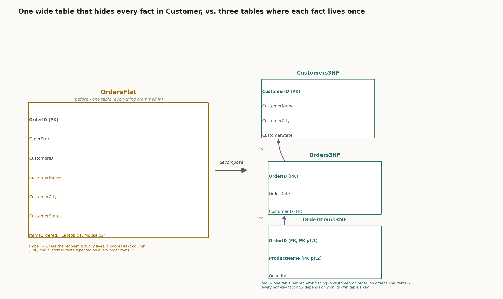
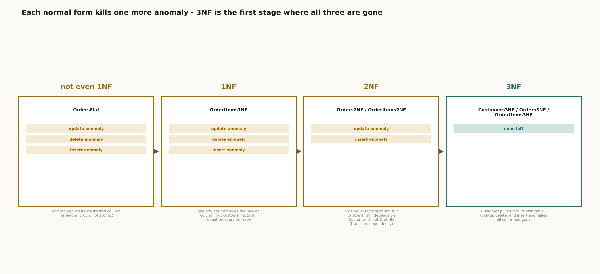
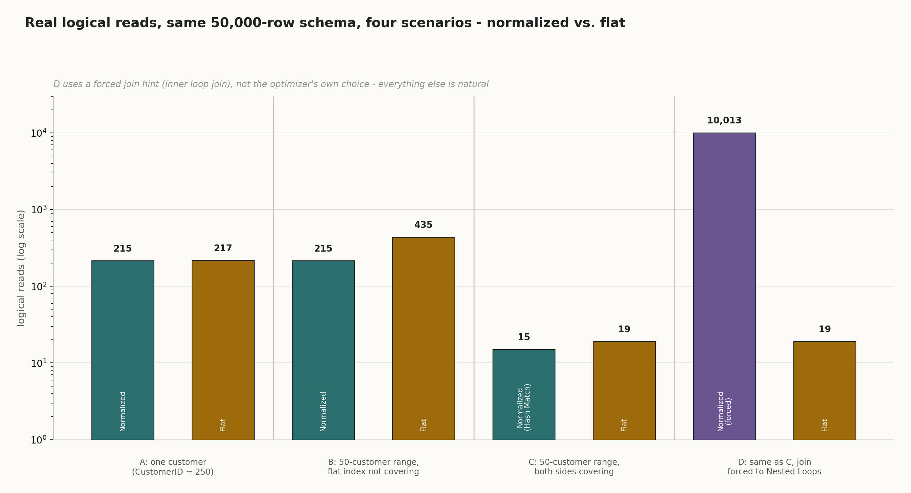

# 07 · SQL Normalization & Schema Design (SQL Server / T-SQL)

## The schema we're using

Every table built so far in this series is already clean. `Employees`/`Departments` and doc 06's `Orders` were all designed with one fact living in exactly one place - which is exactly what normalization asks for. That's great for a real project, but useless for *teaching* normalization, because there's no actual problem left to fix. You can't watch a table get decomposed to solve an anomaly if it never had the anomaly in the first place.

So this doc needed one deliberately bad table, built on purpose to break the rules normalization exists to enforce - a single wide table called `OrdersFlat`, in `InterviewPrepSQLPractice`, that crams order facts and customer facts together in one place and repeats an item list as packed text inside one column:

```sql
create table OrdersFlat (
    OrderID       int identity(1,1) primary key,
    OrderDate     date not null,
    CustomerID    int not null,
    CustomerName  varchar(100) not null,
    CustomerCity  varchar(50) not null,
    CustomerState varchar(50) not null,
    ItemsOrdered  varchar(200) not null   -- e.g. 'Laptop x1, Mouse x2' - packed, not atomic
)
```

Six rows went in, across four customers, with one customer (`Ravi Kumar`, `CustomerID 101`) deliberately given more than one order, so an update to his details could be shown going *out of sync with itself* later on.

| OrderID | OrderDate | CustomerID | CustomerName | CustomerCity | CustomerState | ItemsOrdered |
|---|---|---|---|---|---|---|
| 1 | 2026-01-05 | 101 | Ravi Kumar | Pune | Maharashtra | Laptop x1, Mouse x2 |
| 2 | 2026-01-07 | 102 | Priya Shah | Mumbai | Maharashtra | Keyboard x1 |
| 3 | 2026-01-10 | 101 | Ravi Kumar | Pune | Maharashtra | Monitor x2, Mouse x1 |
| 4 | 2026-01-12 | 103 | Amit Verma | Delhi | Delhi | Laptop x1 |
| 5 | 2026-01-15 | 102 | Priya Shah | Mumbai | Maharashtra | Keyboard x2, Mouse x3 |
| 6 | 2026-01-18 | 101 | Ravi Kumar | Pune | Maharashtra | Laptop x2 |

*(This is the state before any of the anomaly demos below ran. By the time this doc was being written, `OrdersFlat` had already been through the update and delete demos in section 3 - OrderID 1's city overwritten to `Nagpur`, OrderID 4 gone entirely - so this "before" snapshot is reconstructed from what survived untouched in `OrderItems1NF` and `Orders2NF` (same data, just split across different columns and never hit by either demo), not a literal screenshot of this exact table at this exact moment. Section 3 shows the real, actually-pasted output of the demos themselves.)*

This one table breaks normalization in two different ways at once, and the whole doc is built around fixing both:

- **`ItemsOrdered` is not atomic.** `'Laptop x1, Mouse x2'` is two facts jammed into one text field. SQL can't filter, sum, or join on "just the Laptop part" without string-parsing a sentence - that's a **1NF violation**, the most basic rule of all.
- **Customer facts are repeated on every order row.** `CustomerName`, `CustomerCity`, `CustomerState` all depend on `CustomerID`, not on `OrderID` - but `OrderID` is the table's key. Every column should describe *the order*; these three describe *the customer who placed it*, copied onto every single one of that customer's orders. That's a deeper problem than 1NF, and it's what sections 6-7 below exist to fix.

---

## How the diagrams in this doc work

This doc isn't measuring cost the way doc 06 did - there's no execution plan or logical-reads number to chase. The thing being measured here is **correctness**: does a single update, delete, or insert ever produce a contradiction or lose information it shouldn't? So this doc uses two diagrams instead:

- **One before/after structure diagram**, showing `OrdersFlat` next to the final three-table decomposition it gets split into, with the two actual problem columns called out directly.
- **One four-stage ladder diagram**, showing exactly which anomalies survive at each stage - `OrdersFlat` → 1NF → 2NF → 3NF - so it's visible on one picture that 3NF is the first point where all three are actually gone, not just some of them.

Every anomaly shown in this doc was triggered for real, on your own machine, with real `update`/`delete`/`insert` statements run against real data - not reasoned about in the abstract the way two of doc 06's plans had to be. Normalization is a place where that's actually easy to do: you don't need a 50,000-row table to see an update anomaly, you just need two rows that are supposed to agree and then watch them stop agreeing.

---

## 1. What normalization actually is

In plain language: normalization is the rule "every fact should live in exactly one place." If Ravi Kumar's city is stored on every row that mentions one of his orders, that's the same fact copied N times - and copies can disagree with each other the moment only one of them gets updated.

Real-life example: think of a school where every teacher keeps their own paper roster with each student's home address written on it. If a student moves, someone has to find and correct *every single teacher's* copy by hand. Miss even one, and the school now has two different addresses on file for the same kid, with no way to tell which one is current just by looking. A normalized school keeps the address in exactly one place - the registrar's office - and every teacher's roster just points to the student by ID.

Real-world use case: any schema where the same real-world entity (a customer, a product, an employee) has to show up next to multiple other things - a customer with multiple orders, a product across multiple line items - needs this. The moment "one thing, mentioned in many places" exists in a schema, normalization is the discipline that decides whether that thing's own details get copied everywhere it's mentioned, or stored once and referenced.

Technical deep dive: normalization is formalized through **functional dependencies**, written `A → B` ("A determines B" - given a value of A, B's value is fixed). A table is well-designed when every non-key column depends on **the whole primary key, and nothing but the primary key** - the classic shorthand interview phrase is *"the key, the whole key, and nothing but the key."* Each normal form (1NF, 2NF, 3NF) is just a progressively stricter version of that same rule, and each one is motivated by a specific kind of bug - covered next.

Connecting back: "copies of the same fact can disagree" is the plain version of "a column depends on something other than the whole primary key."



---

## 2. The three anomalies - normalization's actual motivation

Normal forms can feel like arbitrary rules memorized for an exam. They aren't - each one exists to kill one specific, concrete bug. These three are the entire reason normalization exists:

- **Update anomaly.** The same fact is stored in more than one row, so updating it in one place leaves the others stale and now *wrong*, not just old. Fixing Ravi Kumar's city on one of his orders and not his others means his own customer record now contradicts itself.
- **Delete anomaly.** Deleting one piece of information accidentally deletes a *different, unrelated* piece of information that happened to be riding along in the same row. Deleting someone's only order shouldn't delete all evidence that they're a customer at all - but in a table where "customer" only exists as a column on "order," it does.
- **Insert anomaly.** Some fact can't be recorded at all unless an unrelated fact is also present. A new customer with no orders yet can't be stored in a table whose every row requires an `OrderID` - so the schema itself is blocking a perfectly valid real-world fact from being recorded.

Real-life example for all three at once: imagine a single sign-up sheet that mixes "who's coming to the party" with "what dessert they're bringing." Change your mind about dessert without crossing out your name too? The sheet technically has two entries for you now. Decide not to come but someone else already wrote your name down as "bringing the cake"? Erasing the one line erases both facts, cake and attendance, together. And you can't add yourself to the list at all until you've also picked a dessert - even if you just want to RSVP for now. One sheet, three different ways the mixed-together design breaks.

Real-world use case: these three are exactly what interviewers are checking for when they ask "why does this table design matter" - they're not asking for the definitions of 1NF/2NF/3NF in the abstract, they're asking whether the candidate can point at a schema and predict which of these three bugs it's going to produce in production.

Technical deep dive: all three anomalies share one root cause - a non-key column whose value is **determined by something other than the whole primary key**. `CustomerName` doesn't depend on `OrderID`; it depends on `CustomerID`, which just happens to be sitting in the same row. Every fix in this doc - 1NF, 2NF, 3NF - is the same move applied at a different depth: find the column that depends on the wrong thing, and give it its own table keyed by the thing it actually depends on.

---

## 3. Proving the anomalies are real, on OrdersFlat itself

Before fixing anything, the bugs above needed to actually happen - not be taken on faith.

**Update anomaly - change one of Ravi Kumar's orders, see if the others still agree with it.**  
so this is asking SQL Server to update the city on exactly one row and nothing else, then checking whether every row that's still supposed to be "about Ravi Kumar" tells the same story.

```sql
update OrdersFlat set CustomerCity = 'Nagpur' where OrderID = 1

select * from OrdersFlat where CustomerID = 101
```

| OrderID | OrderDate | CustomerID | CustomerName | CustomerCity | CustomerState | ItemsOrdered |
|---|---|---|---|---|---|---|
| 1 | 2026-01-05 | 101 | Ravi Kumar | Nagpur | Maharashtra | Laptop x1, Mouse x2 |
| 3 | 2026-01-10 | 101 | Ravi Kumar | Pune | Maharashtra | Monitor x2, Mouse x1 |
| 6 | 2026-01-18 | 101 | Ravi Kumar | Pune | Maharashtra | Laptop x2 |

Real, confirmed, right there in three rows: OrderID 1 says Ravi Kumar lives in Nagpur. OrderID 3 and OrderID 6, same customer, say Pune. All three rows claim to describe the same person's city, and they don't agree with each other.

This is the update anomaly, caught in the act: one real `update` statement, touching one row, and the customer it describes now contradicts himself depending on which of his orders you happen to query.

**Delete anomaly - delete a customer's only order, see what else disappears with it.**  
so this is asking whether removing one order record can accidentally erase a person's entire existence as a customer, if that person only had the one order.

```sql
delete from OrdersFlat where OrderID = 4

select * from OrdersFlat where CustomerID = 103
```

```
(0 rows affected)
```

Zero rows back. Amit Verma didn't just lose an order - as far as this table is concerned, he never existed as a customer at all, because "customer" was never actually stored as its own thing. That's the delete anomaly: deleting a fact you meant to delete (one order) silently deletes a fact you didn't (a whole customer's identity).

The insert anomaly doesn't need its own demo here - it's the mirror image of the delete anomaly, and it's structurally obvious from the table definition alone: `OrdersFlat` requires an `OrderID`, `OrderDate`, and all four item/customer fields on every row. There is no way to record "Neha Singh is a customer" with zero orders yet, because the only place a customer can exist in this schema is riding along inside a row that's fundamentally about something else. Section 7 proves this gets fixed for real, by doing the thing that's currently impossible.

---

## 4. Fixing 1NF - make `ItemsOrdered` atomic

**1NF, plainly:** every column holds one indivisible value - no comma-packed lists, no repeating groups stuffed into a single field.

Real-life example: a single sticky note that says "milk, eggs, bread" is not three grocery items, it's one piece of paper that happens to have three words on it - you can't circle just "eggs" without circling all of it. Three separate index cards, one item each, is what 1NF actually looks like.

Real-world use case: any time a column is storing something you'll eventually want to filter, count, or join on *part* of - tags, line items, phone numbers - and it's been stuffed into one delimited string instead of its own row, that column is failing 1NF, usually silently, until someone needs to query "just the Laptop orders" and discovers they have to parse a sentence to do it.

Technical deep dive: formally, 1NF requires that every attribute hold a single value from its domain - no repeating groups, no multi-valued columns. The fix is always the same shape: pull the repeating part into its own row, with the original key carried along so each new row still knows which order it belongs to.

```sql
create table OrderItems1NF (
    OrderID       int not null,
    OrderDate     date not null,
    CustomerID    int not null,
    CustomerName  varchar(100) not null,
    CustomerCity  varchar(50) not null,
    CustomerState varchar(50) not null,
    ProductName   varchar(50) not null,
    Quantity      int not null,
    primary key (OrderID, ProductName)
)
```

`ItemsOrdered`'s packed text is gone - `'Laptop x1, Mouse x2'` on one `OrdersFlat` row becomes two separate rows here, one per product, each with its own `Quantity`. That's 1NF satisfied: nine rows total across the six original orders.

| OrderID | OrderDate | CustomerID | CustomerName | CustomerCity | CustomerState | ProductName | Quantity |
|---|---|---|---|---|---|---|---|
| 1 | 2026-01-05 | 101 | Ravi Kumar | Pune | Maharashtra | Laptop | 1 |
| 1 | 2026-01-05 | 101 | Ravi Kumar | Pune | Maharashtra | Mouse | 2 |
| 2 | 2026-01-07 | 102 | Priya Shah | Mumbai | Maharashtra | Keyboard | 1 |
| 3 | 2026-01-10 | 101 | Ravi Kumar | Pune | Maharashtra | Monitor | 2 |
| 3 | 2026-01-10 | 101 | Ravi Kumar | Pune | Maharashtra | Mouse | 1 |
| 4 | 2026-01-12 | 103 | Amit Verma | Delhi | Delhi | Laptop | 1 |
| 5 | 2026-01-15 | 102 | Priya Shah | Mumbai | Maharashtra | Keyboard | 2 |
| 5 | 2026-01-15 | 102 | Priya Shah | Mumbai | Maharashtra | Mouse | 3 |
| 6 | 2026-01-18 | 101 | Ravi Kumar | Pune | Maharashtra | Laptop | 2 |

*(Shown here at its own starting point, before the update demo right below ran against it - each of Ravi Kumar's rows still agrees on Pune.)*

**But re-run the same update anomaly test - does it still happen?**  
so this is checking whether fixing the *item list* problem also accidentally fixed the *customer* problem, or whether they're genuinely two separate bugs.

```sql
update OrderItems1NF set CustomerCity = 'Nagpur' where OrderID = 1 and ProductName = 'Laptop'

select * from OrderItems1NF where OrderID = 1
```

| OrderID | OrderDate | CustomerID | CustomerName | CustomerCity | CustomerState | ProductName | Quantity |
|---|---|---|---|---|---|---|---|
| 1 | 2026-01-05 | 101 | Ravi Kumar | Nagpur | Maharashtra | Laptop | 1 |
| 1 | 2026-01-05 | 101 | Ravi Kumar | Pune | Maharashtra | Mouse | 2 |

Real and confirmed: same `OrderID`, same customer, and the two item rows now disagree with each other - Laptop says Nagpur, Mouse says Pune.

Still broken - just at a smaller scale now. The update anomaly used to show up *across different orders* by the same customer; now it shows up *within a single order*, between its own item rows, because `CustomerCity` is still sitting on every item row that happens to belong to that customer. 1NF fixed the repeating-group problem; it was never going to fix a column depending on the wrong key, because that's a different rule entirely.



---

## 5. Fixing 2NF - split order-level facts from item-level facts

**2NF, plainly:** on top of 1NF, every non-key column must depend on the *whole* key, not just part of it. This only matters when the primary key is made of more than one column.

Real-life example: imagine a single index card per (student, class) pair, and someone also writes the teacher's room number on that same card. The room number doesn't depend on *which student* - it depends only on *which class*. Write it on every student's card for that class, and moving the class to a new room means hunting down and fixing one card per student instead of one fact in one place.

Real-world use case: this is exactly `OrderItems1NF`'s situation. Its key is `(OrderID, ProductName)` - two columns together. `Quantity` genuinely depends on both (how many of *this* product on *this* order). But `OrderDate`, `CustomerID`, `CustomerName`, `CustomerCity`, `CustomerState` only depend on `OrderID` - half the key - not on `ProductName` at all. That's a **partial dependency**, and it's what 2NF outlaws.

Technical deep dive: the fix is to split the table along the dependency, not along the data. Anything depending on the whole composite key stays where it is; anything depending on only part of the key moves to its own table, keyed by just that part:

```sql
create table Orders2NF (
    OrderID       int primary key,
    OrderDate     date not null,
    CustomerID    int not null,
    CustomerName  varchar(100) not null,
    CustomerCity  varchar(50) not null,
    CustomerState varchar(50) not null
)

create table OrderItems2NF (
    OrderID     int not null,
    ProductName varchar(50) not null,
    Quantity    int not null,
    primary key (OrderID, ProductName)
)
```

`Orders2NF`, at its own starting point (before the demo right below touches it):

| OrderID | OrderDate | CustomerID | CustomerName | CustomerCity | CustomerState |
|---|---|---|---|---|---|
| 1 | 2026-01-05 | 101 | Ravi Kumar | Pune | Maharashtra |
| 2 | 2026-01-07 | 102 | Priya Shah | Mumbai | Maharashtra |
| 3 | 2026-01-10 | 101 | Ravi Kumar | Pune | Maharashtra |
| 4 | 2026-01-12 | 103 | Amit Verma | Delhi | Delhi |
| 5 | 2026-01-15 | 102 | Priya Shah | Mumbai | Maharashtra |
| 6 | 2026-01-18 | 101 | Ravi Kumar | Pune | Maharashtra |

`OrderItems2NF` held the same nine item rows shown under `OrderItems3NF` in section 6 below - it's the identical data, the table just hadn't been renamed yet at this point in the walkthrough, so there's no separate select to paste for it under this name.

**Re-run the update anomaly a third time - across a customer's different orders again, now that order-level and item-level facts are split apart.**  
so this is checking whether splitting out the *item* dependency also happened to fix the *customer* dependency, or whether that's still a third, separate bug.

```sql
update Orders2NF set CustomerCity = 'Nagpur' where OrderID = 1

select * from Orders2NF where CustomerID = 101
```

| OrderID | OrderDate | CustomerID | CustomerName | CustomerCity | CustomerState |
|---|---|---|---|---|---|
| 1 | 2026-01-05 | 101 | Ravi Kumar | Nagpur | Maharashtra |
| 3 | 2026-01-10 | 101 | Ravi Kumar | Pune | Maharashtra |
| 6 | 2026-01-18 | 101 | Ravi Kumar | Pune | Maharashtra |

Same shape as the very first demo in section 3, just on the cleaned-up table: OrderID 1 says Nagpur, OrderID 3 and 6 say Pune.

Still broken, for the third time, and that's the actual point of this section: 2NF only ever looked at the relationship between non-key columns and *the key*. It has nothing to say about `CustomerCity` depending on `CustomerID`, because `CustomerID` isn't part of `Orders2NF`'s key at all - `OrderID` is. `CustomerCity` depends on a column that is itself just an ordinary, non-key column sitting in the same row. That's a different, deeper problem than anything 1NF or 2NF are built to catch - which is exactly what 3NF exists for.

---

## 6. Fixing 3NF - pull Customer out into its own table

**3NF, plainly:** on top of 2NF, no non-key column may depend on *another non-key column* - every non-key column has to depend on the key directly, and only the key.

Real-life example: a company directory where every employee's row also lists their department's floor number. The floor number doesn't actually describe the employee - it describes their department, which happens to be mentioned on the employee's row. Move the department to a new floor, and now every employee in it needs their row corrected individually, even though exactly one fact actually changed.

Real-world use case: this is `Orders2NF`'s remaining problem exactly. `CustomerCity` doesn't depend on `OrderID` (the key) - it depends on `CustomerID`, which is itself just an ordinary column on the same row. `OrderID → CustomerID → CustomerCity` is a chain, not a direct dependency - that chain is called a **transitive dependency**, and it's precisely what 3NF forbids.

Technical deep dive: the fix is the same move as 2NF, one level further out - pull the transitively-dependent column (and everything that travels with it) into its own table, keyed by the thing it actually depends on:

```sql
create table Customers3NF (
    CustomerID    int primary key,
    CustomerName  varchar(100) not null,
    CustomerCity  varchar(50) not null,
    CustomerState varchar(50) not null
)

create table Orders3NF (
    OrderID    int primary key,
    OrderDate  date not null,
    CustomerID int not null references Customers3NF(CustomerID)
)

exec sp_rename 'OrderItems2NF', 'OrderItems3NF'
```

`OrderItems2NF` didn't need to change shape at all to reach 3NF - it only got renamed, because `Quantity` already depended on nothing but its own whole key. Only the `Orders2NF` side had a transitive dependency to remove. `OrderItems3NF`, under its new name:

| OrderID | ProductName | Quantity |
|---|---|---|
| 1 | Laptop | 1 |
| 1 | Mouse | 2 |
| 2 | Keyboard | 1 |
| 3 | Monitor | 2 |
| 3 | Mouse | 1 |
| 4 | Laptop | 1 |
| 5 | Keyboard | 2 |
| 5 | Mouse | 3 |
| 6 | Laptop | 2 |

Right after creation, before any of the three final demos below touch them:

`Customers3NF`:

| CustomerID | CustomerName | CustomerCity | CustomerState |
|---|---|---|---|
| 101 | Ravi Kumar | Pune | Maharashtra |
| 102 | Priya Shah | Mumbai | Maharashtra |
| 103 | Amit Verma | Delhi | Delhi |

`Orders3NF`:

| OrderID | OrderDate | CustomerID |
|---|---|---|
| 1 | 2026-01-05 | 101 |
| 2 | 2026-01-07 | 102 |
| 3 | 2026-01-10 | 101 |
| 4 | 2026-01-12 | 103 |
| 5 | 2026-01-15 | 102 |
| 6 | 2026-01-18 | 101 |

**Now run all three anomaly tests one final time - for real, against the finished schema.**

**Update: fix Ravi Kumar's city once, in the one place it now lives.**  
so this is checking whether a single update now shows up consistently everywhere that customer is referenced, instead of needing to be repeated per order.

```sql
update Customers3NF set CustomerCity = 'Nagpur' where CustomerID = 101

select o.OrderID, c.CustomerName, c.CustomerCity
from Orders3NF o
join Customers3NF c on o.CustomerID = c.CustomerID
where c.CustomerID = 101
```

| OrderID | CustomerName | CustomerCity |
|---|---|---|
| 1 | Ravi Kumar | Nagpur |
| 3 | Ravi Kumar | Nagpur |
| 6 | Ravi Kumar | Nagpur |

All three of Ravi Kumar's orders, joined fresh through `CustomerID`, and all three agree - Nagpur, Nagpur, Nagpur.

One update, one row changed, and every one of Ravi Kumar's orders now shows the same city when joined back through `CustomerID` - because there's only one row that could have the wrong answer, and it just got fixed. The update anomaly, which survived three previous redesigns, is actually gone.

**Delete: remove an order, check the customer survives.**  
so this is checking whether deleting an order can still accidentally erase the person who placed it, now that "customer" and "order" are no longer the same row.

```sql
delete from Orders3NF where OrderID = 4

select * from Customers3NF where CustomerID = 103
```

| CustomerID | CustomerName | CustomerCity | CustomerState |
|---|---|---|---|
| 103 | Amit Verma | Delhi | Delhi |

One row back. His order is gone from `Orders3NF`; he is not gone from `Customers3NF`.

Amit Verma's order is gone; Amit Verma isn't. His row in `Customers3NF` was never dependent on any particular order existing - it's a row about him, not about an order that happens to mention him. The delete anomaly is gone.

**Insert: add a brand-new customer with zero orders - the thing `OrdersFlat` could never do.**  
so this is directly testing the exact gap called out at the end of section 3: can a customer now be recorded before, or even without, any order ever existing for them?

```sql
insert into Customers3NF (CustomerID, CustomerName, CustomerCity, CustomerState)
values (104, 'Neha Singh', 'Nagpur', 'Maharashtra')

select * from Customers3NF
```

| CustomerID | CustomerName | CustomerCity | CustomerState |
|---|---|---|---|
| 101 | Ravi Kumar | Nagpur | Maharashtra |
| 102 | Priya Shah | Mumbai | Maharashtra |
| 103 | Amit Verma | Delhi | Delhi |
| 104 | Neha Singh | Nagpur | Maharashtra |

Four customers now, and `104` has no matching row anywhere in `Orders3NF` at all - no order required.

Neha Singh now exists in the database with zero orders - structurally impossible in every earlier version of this schema, where a customer could only exist by riding along inside a row that was fundamentally about something else. The insert anomaly is gone.

All three, confirmed fixed, in the same schema, with real statements:


### One loose end worth noticing

`OrderItems3NF` was never touched by the `delete from Orders3NF where OrderID = 4` statement above, because nothing in the schema actually links the two tables together:

| OrderID | ProductName | Quantity |
|---|---|---|
| 4 | Laptop | 1 |

That row is still sitting in `OrderItems3NF` right now, pointing at an `OrderID` that no longer exists in `Orders3NF`. This isn't a normalization problem - `OrderItems3NF` is perfectly normalized, every column in it depends on exactly its own key. It's a **referential integrity** problem: `Orders3NF.CustomerID` was declared `references Customers3NF(CustomerID)` back in the `create table` statement above, so SQL Server would have *refused* to delete a customer that still had orders - but `OrderItems3NF.OrderID` was never given a matching `foreign key references Orders3NF(OrderID)`, so nothing stopped the order itself from being deleted out from under its own item rows. Normalization decides *where* a fact should live; a foreign key constraint is a separate, deliberate decision about which of those links SQL Server should actively enforce. Worth fixing before this schema gets queried with a real join across all three tables - flagged here rather than quietly patched, since that's exactly the kind of gap worth being able to spot out loud in an interview.

---

## 7. When denormalizing is actually the right call

The folk wisdom going into this section was simple: a normalized schema needs a join to get `CustomerCity` that a flat table never did, so flattening should read cheaper. Four real tests later, on a scaled-up version of this exact schema (`CustomersBig`, 500 rows; `OrdersBig3NF`/`OrdersBigFlat`, 50,000 rows each - same scale as doc 06's `Orders`, built specifically so the numbers would be big enough to actually measure), that folk wisdom turned out to be wrong three times out of four - and the one time it held, it held for a reason worth understanding precisely, not just "joins are slow."



**Test A - one customer, equality filter.**  
so this is the simplest possible case: fetch one customer's own order history, the kind of query an application runs constantly.

```sql
select o.OrderID, o.OrderDate, c.CustomerCity
from OrdersBig3NF o join CustomersBig c on o.CustomerID = c.CustomerID
where o.CustomerID = 250

select OrderID, OrderDate, CustomerCity from OrdersBigFlat where CustomerID = 250
```

Real result: normalized **215** logical reads (213 on `OrdersBig3NF` + 2 on `CustomersBig`), flat **217**. Essentially tied. `OrdersBig3NF` didn't even use its own `CustomerID` index - it fell back to a Clustered Index Scan, exactly like doc 06 section 3's lesson about a non-covering index, while `OrdersBigFlat` paid for an Index Seek + Key Lookup instead. The one-time join cost here was 2 logical reads - a single cheap probe into a small, mostly-cached table. Nowhere near enough to matter.

**Test B - 50 customers, flat table's index not covering.**  
so this is the same idea at a bigger fan-out: 50 distinct customers, ~5,000 matching orders, and the flat table's existing index only holds `CustomerID`.

```sql
select o.OrderID, o.OrderDate, c.CustomerCity
from OrdersBig3NF o join CustomersBig c on o.CustomerID = c.CustomerID
where o.CustomerID between 1 and 50

select OrderID, OrderDate, CustomerCity from OrdersBigFlat where CustomerID between 1 and 50
```

Real result: normalized **215**, flat **435** - normalized wins by 2x here. `OrdersBigFlat`'s index doesn't include `OrderDate` or `CustomerCity`, so it paid a Key Lookup *per matching row* - 5,000 separate trips back into its own clustered index. That's the exact same tax doc 06 warned about, just showing up on the "simpler" flat table this time instead of the normalized one. Flattening the customer data didn't fix an unrelated indexing gap on the order data.

**Test C - 50 customers, both sides given their best possible index.**  
so this is the fair fight: give the flat table a genuinely covering index (`CustomerID`, include `OrderDate, CustomerCity` - zero Key Lookups possible) and give the normalized table the best index it can have for its own columns, then compare the optimizer's own natural choice on both.

```sql
create nonclustered index IX_OrdersBigFlat_Covering on OrdersBigFlat(CustomerID) include (OrderDate, CustomerCity)
create nonclustered index IX_OrdersBig3NF_Covering on OrdersBig3NF(CustomerID) include (OrderDate)
```

Real result: normalized **15** (13 + 2), flat **19**. Normalized *still* wins, even with zero Key Lookups on either side and zero excuses left for the flat table. The reason is visible right in the plan: the normalized query used a **Hash Match**, reading `OrdersBig3NF` and `CustomersBig` each exactly once, while the flat table's covering index rows are physically wider - every single index entry carries a full copy of `CustomerCity` - so fewer rows fit per 8KB page, meaning more pages, meaning more reads, even with no join at all. Denormalizing traded "avoid a join" for "store more bytes per row," and here the bytes cost more than the join did.

**Test D - same query, join deliberately forced to Nested Loops.**  
so this is the one experiment designed to fail on purpose, the same move as doc 06's index hint: take the choice away from the optimizer and force the worst plan shape, to see what it would cost if something other than SQL Server's own judgment picked the join strategy.

```sql
select o.OrderID, o.OrderDate, c.CustomerCity
from OrdersBig3NF o
inner loop join CustomersBig c on o.CustomerID = c.CustomerID
where o.CustomerID between 1 and 50
```

Real result: **10,013** logical reads (13 on `OrdersBig3NF` + **10,000** on `CustomersBig`) against the flat table's unchanged **19**. `inner loop join` forced SQL Server to seek into `CustomersBig` separately for *every one of the 5,000 matching rows* instead of hashing it once - `CustomersBig`'s own stats line shows `Scan count 0`, confirming it never scanned, only seeked, 5,000 times over. This is the real, measured version of the Key-Lookup tax - 527x worse than the flat table, and 667x worse than the normalized schema's own natural plan from Test C.

**What this actually proves.** Normalizing isn't expensive at read time just because it needs a join - SQL Server's optimizer is genuinely good at making a join against a small, well-indexed table cheap, sometimes cheaper than the redundant storage denormalizing requires (Test C). The real risk denormalizing protects against is Test D: a join that *doesn't* get a cheap plan - forced by a bad hint, bad or stale statistics leading to a wrong cardinality estimate, a query against a linked server or a different database that can't be hashed the same way, or an application issuing the join as thousands of separate per-row queries instead of one batched SQL join (the classic "N+1 query" bug in an ORM). Denormalizing removes that entire risk by removing the join - trading update anomalies and extra storage for a guarantee that the expensive plan in Test D can never happen, because there's nothing left to join. That trade is worth making for a query that's extremely hot, sits downstream of a join target the optimizer can't reliably hash (cross-database, linked server), or lives in a reporting/analytics workload that's read far more often than it's written and already tolerates some staleness. For an ordinary, well-indexed, single-database join against a modest dimension table - which covers most real schemas - normalizing isn't just the safer design for anomalies, it's frequently the cheaper one to read from too, which is the opposite of the answer most people walk into an interview ready to give.

---

## Quick reference

| Term | Plain meaning |
|---|---|
| Normalization | Every fact lives in exactly one place; no non-key column depends on anything other than the whole key. |
| Functional dependency (`A → B`) | Given a value of A, B's value is fixed - "A determines B." |
| 1NF | Every column holds one atomic value - no comma-packed lists, no repeating groups. |
| 2NF | 1NF, plus every non-key column depends on the *whole* primary key, not just part of a composite key (no partial dependency). |
| 3NF | 2NF, plus no non-key column depends on another non-key column (no transitive dependency). |
| Update anomaly | The same fact, stored more than once, can be updated in one place and left stale/wrong in another. |
| Delete anomaly | Deleting one fact accidentally deletes a different, unrelated fact riding along in the same row. |
| Insert anomaly | A valid fact can't be recorded at all until an unrelated fact is also present. |
| Transitive dependency | A non-key column depends on another non-key column, which depends on the key - a two-hop chain instead of a direct dependency. |

---

## 8. From-scratch schema design: a gym class-booking system

Everything so far started from a bad table and fixed it. This is the opposite exercise - go straight to a normalized design from a plain-English requirement, the way a real schema actually gets built the first time.

**The requirement.** A gym wants a database for its class-booking system. Members sign up and can book into classes - a member can book many classes, and a class session can have many members booked into it. Each class (like "Yoga" or "Spin") is taught by one instructor per session, happens in one room, and has a specific date and time. Instructors can teach more than one class. Rooms have a name and a maximum capacity. The gym also wants to track each member's membership payments - the date they paid, the amount, and which membership plan ("Monthly" or "Annual") it was for.

**The design decision that matters most here:** split "Yoga" (the *idea* of a class) from "Yoga, taught by Priya, in Room 2, Monday 6pm" (one specific *occurrence* of it). Conflating those two is the exact same mistake `OrdersFlat` made with Customer and Order - if `InstructorName` and `RoomName` were baked directly onto a single "Classes" row, updating Monday's instructor would leave Wednesday's Yoga row stale (update anomaly), deleting the only scheduled Yoga session would delete "Yoga" as a concept entirely (delete anomaly), and a brand-new class type couldn't exist until it already had a session scheduled (insert anomaly) - the identical three bugs from section 3, just in a new domain. So `Classes` (the name, nothing else) and `Sessions` (one scheduled occurrence, referencing a class, an instructor, a room, a date, and a time) are two separate tables from the start, not something to discover later by fixing anomalies.

Seven tables, each one real-world thing, each with its own key:

```sql
create table Instructors (
    InstructorID   int identity(1,1) primary key,
    InstructorName varchar(100) not null
)

create table Rooms (
    RoomID      int identity(1,1) primary key,
    RoomName    varchar(50) not null,
    MaxCapacity int not null
)

create table Classes (
    ClassID   int identity(1,1) primary key,
    ClassName varchar(50) not null
)

create table Sessions (
    SessionID    int identity(1,1) primary key,
    ClassID      int not null references Classes(ClassID),
    InstructorID int not null references Instructors(InstructorID),
    RoomID       int not null references Rooms(RoomID),
    SessionDate  date not null,
    SessionTime  time not null
)

create table Members (
    MemberID   int identity(1,1) primary key,
    MemberName varchar(100) not null,
    Email      varchar(100) not null,
    JoinDate   date not null
)

create table Bookings (
    SessionID   int not null references Sessions(SessionID),
    MemberID    int not null references Members(MemberID),
    BookingDate date not null,
    primary key (SessionID, MemberID)
)

create table MembershipPlans (
    PlanID    int identity(1,1) primary key,
    PlanName  varchar(50) not null,
    PlanPrice decimal(10,2) not null
)

create table Payments (
    PaymentID   int identity(1,1) primary key,
    MemberID    int not null references Members(MemberID),
    PlanID      int not null references MembershipPlans(PlanID),
    AmountPaid  decimal(10,2) not null,
    PaymentDate date not null
)
```

**Why each table is 3NF, checked one at a time:**

- `Instructors`, `Rooms`, `Classes`, `Members`, `MembershipPlans` - single-fact lookup tables. Every column depends only on that table's own single-column key, nothing to check beyond that.
- `Sessions` - key is `SessionID`. `ClassID`, `InstructorID`, `RoomID`, `SessionDate`, `SessionTime` all describe *this specific scheduled occurrence* directly - none of them depend on each other (knowing the room doesn't tell you the instructor), so there's no transitive chain here, just four honest foreign keys plus two facts of its own.
- `Bookings` - the many-to-many junction, composite key `(SessionID, MemberID)`. `BookingDate` depends on the *whole* key (when did *this* member book *this* session) - not on either half alone, so no partial dependency, which is exactly the 2NF rule from section 5 applied correctly this time instead of violated.
- `Payments` - key is `PaymentID`. `AmountPaid` might look like it duplicates `MembershipPlans.PlanPrice`, but it isn't a normalization violation: `AmountPaid` is a fact about *this specific payment event* (what was actually charged, which can differ from the plan's list price - a discount, a proration, a price change after the member originally signed up), not a value that's always functionally determined by `PlanID`. Storing it separately is correct, not redundant - the test is "does this column's value always follow automatically from the key," not "does this column look similar to one somewhere else."

**An honest limitation, flagged rather than hidden:** this schema does not prevent a room from being double-booked. A `unique` constraint on `Sessions(RoomID, SessionDate, SessionTime)` would catch two sessions scheduled for the *exact same* date and start time in the same room, but it would *not* catch a genuinely overlapping pair - say a 6:00-7:00 session and a 6:30-7:30 session in the same room, which have different `SessionTime` values and would both insert without complaint. Catching real time-range overlaps needs either a `datetime2` range check enforced in application logic, a trigger, or (in newer SQL Server versions) a temporal/period-based constraint - none of which this doc has built or tested for real, so none of it is claimed here as done. Worth saying out loud in an interview if asked "does your schema prevent double-booking" - the honest answer is "partially, and here's exactly where it stops."

**What's left to actually verify, for real.** Build this schema, put a handful of real rows into it - including two sessions of the same class (so "Yoga" exists more than once with a different instructor/room/time on each), one member booked into more than one session, and at least one payment - then run the same kind of proof this whole doc has run on everything else: update one instructor's name once and confirm every one of their sessions shows the new name through a join; delete a session and confirm the instructor/room/class rows it referenced all survive; try to insert a brand-new class with zero sessions scheduled yet and confirm that works (the thing `OrdersFlat`'s equivalent couldn't do). Here's the build-and-test script:

```sql
create table Instructors (InstructorID int identity(1,1) primary key, InstructorName varchar(100) not null)
create table Rooms (RoomID int identity(1,1) primary key, RoomName varchar(50) not null, MaxCapacity int not null)
create table Classes (ClassID int identity(1,1) primary key, ClassName varchar(50) not null)
create table Sessions (
    SessionID int identity(1,1) primary key,
    ClassID int not null references Classes(ClassID),
    InstructorID int not null references Instructors(InstructorID),
    RoomID int not null references Rooms(RoomID),
    SessionDate date not null,
    SessionTime time not null
)
create table Members (MemberID int identity(1,1) primary key, MemberName varchar(100) not null, Email varchar(100) not null, JoinDate date not null)
create table Bookings (
    SessionID int not null references Sessions(SessionID),
    MemberID int not null references Members(MemberID),
    BookingDate date not null,
    primary key (SessionID, MemberID)
)
create table MembershipPlans (PlanID int identity(1,1) primary key, PlanName varchar(50) not null, PlanPrice decimal(10,2) not null)
create table Payments (
    PaymentID int identity(1,1) primary key,
    MemberID int not null references Members(MemberID),
    PlanID int not null references MembershipPlans(PlanID),
    AmountPaid decimal(10,2) not null,
    PaymentDate date not null
)

insert into Instructors (InstructorName) values ('Priya Nair'), ('Arjun Mehta')
insert into Rooms (RoomName, MaxCapacity) values ('Room 1', 20), ('Room 2', 15)
insert into Classes (ClassName) values ('Yoga'), ('Spin')
insert into Sessions (ClassID, InstructorID, RoomID, SessionDate, SessionTime) values
    (1, 1, 2, '2026-10-12', '18:00'),  -- Yoga, Priya, Room 2, Monday 6pm
    (1, 2, 1, '2026-10-14', '19:00'),  -- Yoga, Arjun, Room 1, Wednesday 7pm
    (2, 2, 1, '2026-10-13', '07:00')   -- Spin, Arjun, Room 1, Tuesday 7am
insert into Members (MemberName, Email, JoinDate) values
    ('Kavya Reddy', 'kavya@example.com', '2026-09-01'),
    ('Rohan Das', 'rohan@example.com', '2026-09-15')
insert into Bookings (SessionID, MemberID, BookingDate) values
    (1, 1, '2026-10-05'),  -- Kavya into Monday Yoga
    (2, 1, '2026-10-05'),  -- Kavya into Wednesday Yoga too
    (1, 2, '2026-10-06')   -- Rohan into Monday Yoga
insert into MembershipPlans (PlanName, PlanPrice) values ('Monthly', 1500.00), ('Annual', 15000.00)
insert into Payments (MemberID, PlanID, AmountPaid, PaymentDate) values
    (1, 1, 1500.00, '2026-10-01'),
    (2, 2, 14000.00, '2026-09-15')  -- Rohan got a discount off the 15000 list price

-- Test 1: update anomaly - fix an instructor's name once, see it everywhere via join
update Instructors set InstructorName = 'Arjun Mehta-Shah' where InstructorID = 2
select s.SessionID, c.ClassName, i.InstructorName, s.SessionDate
from Sessions s
join Classes c on s.ClassID = c.ClassID
join Instructors i on s.InstructorID = i.InstructorID
where i.InstructorID = 2

-- Test 2: delete anomaly - delete a session, confirm Class/Instructor/Room survive
delete from Bookings where SessionID = 3
delete from Sessions where SessionID = 3
select * from Classes where ClassID = 2
select * from Instructors where InstructorID = 2
select * from Rooms where RoomID = 1

-- Test 3: insert anomaly - add a class with zero sessions scheduled
insert into Classes (ClassName) values ('Pilates')
select * from Classes
select s.* from Sessions s join Classes c on s.ClassID = c.ClassID where c.ClassName = 'Pilates'
```

**Test 1, real result - update one instructor's name once, see it everywhere via the join:**

| SessionID | ClassName | InstructorName | SessionDate |
|---|---|---|---|
| 2 | Yoga | Arjun Mehta-Shah | 2026-10-14 |
| 3 | Spin | Arjun Mehta-Shah | 2026-10-13 |

One `update`, touching exactly one row in `Instructors`, and both of Arjun's sessions - a Yoga class on one day and a completely different Spin class on another - agree on his name through the join. No per-session copy to chase down, because there never was one.

**Test 2, real result - delete a session, confirm the things it referenced survive:**

`delete from Bookings where SessionID = 3` affected 0 rows, for a real reason worth noting rather than skating past: the sample data never actually booked any member into the Spin session (`SessionID 3`) - only into the two Yoga sessions. So that cleanup delete had nothing to do here, which is a fine, boring, correct outcome, not a bug.

| ClassID | ClassName |
|---|---|
| 2 | Spin |

| InstructorID | InstructorName |
|---|---|
| 2 | Arjun Mehta-Shah |

| RoomID | RoomName | MaxCapacity |
|---|---|---|
| 1 | Room 1 | 20 |

The Spin session itself is gone, but `Spin` the class, `Arjun Mehta-Shah` the instructor, and `Room 1` all survived the delete - exactly the point. Deleting one scheduled occurrence doesn't erase the class it was an occurrence of, the person who was going to teach it, or the room it was going to happen in - because none of those three facts ever lived inside the `Sessions` row in the first place.

**Test 3, real result - add a class with zero sessions scheduled:**

| ClassID | ClassName |
|---|---|
| 1 | Yoga |
| 2 | Spin |
| 3 | Pilates |

```
SessionID   ClassID   InstructorID   RoomID   SessionDate   SessionTime
(0 rows affected)
```

`Pilates` now exists as a class with zero matching rows in `Sessions` - structurally impossible in a design where "class" only existed as a column baked onto a scheduled row, same as `Neha Singh` existing in `Customers3NF` with zero orders back in section 6. All three anomalies, checked against a schema that was designed normalized from the start rather than fixed into that shape afterward - and all three come back clean.
