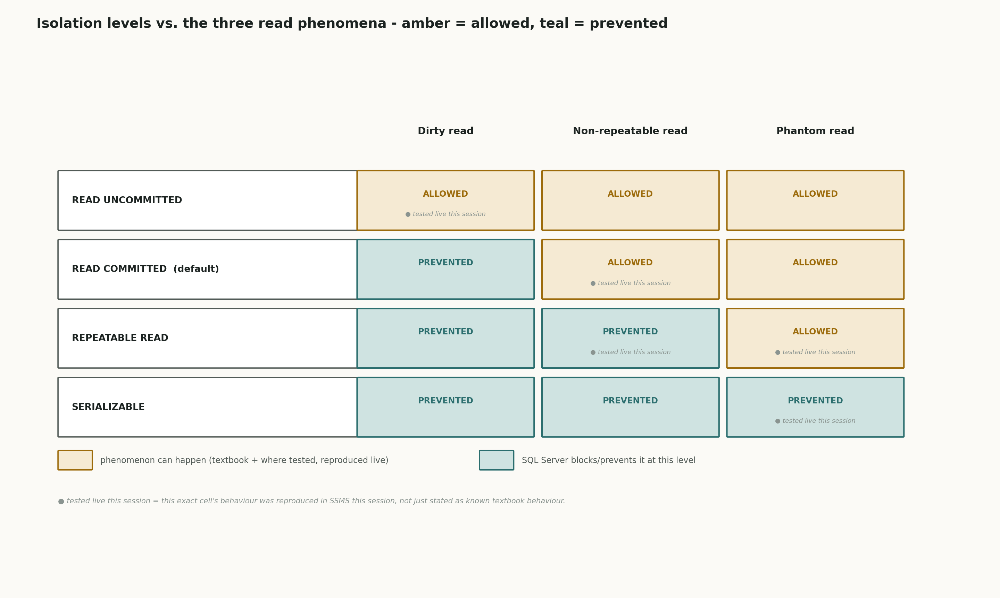
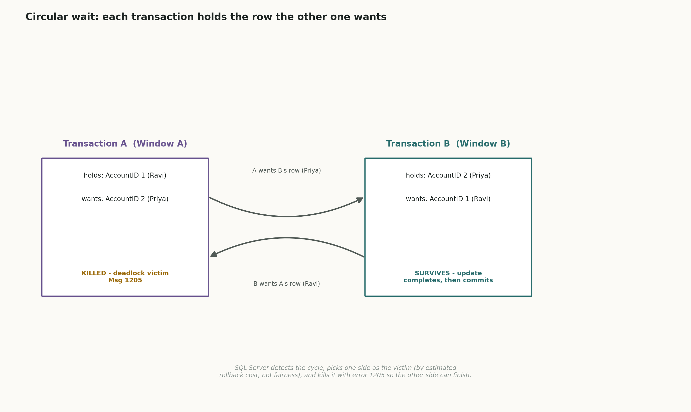

# 08 · SQL Transactions & ACID, Isolation Levels, Deadlocks, Stored Procedures & Views (SQL Server / T-SQL)

## The schema we're using

Every doc so far has been about getting data *out* efficiently and correctly - indexes find it fast, normalization keeps it honest. This doc is about something different: what happens when more than one person is changing the same data **at the same time**. That's a problem no single-user query can ever show you, so it needed its own table, built on purpose to be the kind of thing two people fight over - money.

```sql
create table BankAccounts (
    AccountID     int identity(1,1) primary key,
    AccountHolder varchar(100) not null,
    Balance       decimal(10,2) not null check (Balance >= 0)
)
```

Three rows went in - one real `check` constraint already doing real work (`Balance >= 0`, which becomes the whole engine behind the Consistency section below), and three account holders deliberately picked so every later demo has names to point at instead of "Account 1, Account 2, Account 3":

| AccountID | AccountHolder | Balance |
|---|---|---|
| 1 | Ravi Kumar | 5000.00 |
| 2 | Priya Shah | 3000.00 |
| 3 | Amit Verma | 1000.00 |

*(3 rows affected, confirmed in SSMS.)*

This doc doesn't touch normalization or indexing at all - `BankAccounts` is already in 3NF and doesn't need an index to prove a point. What it needs is **concurrency**: two SSMS query windows open against the same database at the same time, so the effect of one window's statement on the other's can be watched directly, not just described.

---

## How the demos in this doc work

Every section below follows the same real pattern: two (sometimes three) SSMS windows, each one a separate connection/session, run against the live `BankAccounts` table on your machine. "Window A" and "Window B" below are literally two different query tabs, run in a specific order, with the real result of each statement pasted back exactly as SSMS returned it - same unbreakable rule as every other doc in this series: nothing in this doc's SQL *results* is invented. Where a step's own resulting balance wasn't independently re-pasted (mainly the one noted in section 4's REPEATABLE READ demo), that's called out explicitly rather than presented as if it were.

One exception, flagged up front rather than buried: **Durability** doesn't get a real demo in this doc, for the same honest reason two of doc 06's execution plans had to be reasoned about instead of screenshotted - proving durability for real means actually crashing SQL Server mid-write and confirming the data survives the crash, and deliberately crashing your machine isn't a reasonable thing to ask for a demo. Section 5 covers it the "reasoned, not screenshotted" way: explained precisely, with the real mechanism named, but without a fake screenshot pretending it was tested.

---

## 1. What ACID actually is

In plain language: ACID is four separate promises a database makes about every transaction - a group of one or more statements treated as a single unit. **Atomicity** means the whole group either happens completely or not at all, never half. **Consistency** means the database never ends up in a state that breaks its own rules, even mid-transaction. **Isolation** means two transactions running at the same time don't see each other's unfinished work. **Durability** means once a transaction says "done," that result survives even if the power goes out one second later.

Real-life example: think of moving money between two pockets of your own wallet. Atomicity is "I either move the full ₹500 or none of it - I never end up having taken it out of one pocket and then gotten distracted before putting it in the other." Consistency is "my wallet's total never implies I have -₹200 in a pocket, because a pocket can't hold negative money." Isolation is "if my friend looks in my wallet while I'm mid-transfer, they shouldn't see an impossible in-between state, like money gone from both pockets at once." Durability is "once I've actually put the money in the pocket and zipped it shut, a sudden distraction a second later doesn't un-move it."

Real-world use case: anything where money, inventory, or any other quantity has to move between two places as one logical action - bank transfers, order checkout decrementing stock, seat bookings - needs all four of these simultaneously. Drop any one of them and the system can silently lose or duplicate value under real-world conditions like crashes, errors, or two users acting at once.

Technical deep dive: in SQL Server, a transaction is opened with `begin transaction`, ended successfully with `commit transaction`, or undone with `rollback transaction`. Atomicity and Consistency are mostly about what happens *inside* one transaction (sections 2-3 below). Isolation is about what happens when *multiple* transactions overlap in time (section 4). Durability is about what happens *after* a transaction commits, even across a crash (section 5). The next four sections take these one at a time, each with a real broken-then-fixed demo except Durability.

---

## 2. Atomicity - broken, then fixed

**Broken, real result.** The bug: two independent `update` statements, run back to back with no transaction wrapping them together at all - so SQL Server has no idea they're supposed to be "one logical transfer." A transfer of ₹1500 from Amit to Ravi, written as two separate statements:

```sql
update BankAccounts set Balance = Balance + 1500 where AccountID = 1; -- credit Ravi
update BankAccounts set Balance = Balance - 1500 where AccountID = 3; -- debit Amit
```

The first statement has nothing stopping it from succeeding on its own. The second one hits the `check (Balance >= 0)` constraint head-on, because Amit only had ₹1000 - taking ₹1500 off him would leave -₹500, and SQL Server's own consistency rule refuses that outright:

```
(1 row affected)
Msg 547, Level 16, State 0, Line 2
The UPDATE statement conflicted with the CHECK constraint "CK__BankAccou__Balan__...".
The conflict occurred in database "InterviewPrepSQLPractice", table "dbo.BankAccounts", column 'Balance'.
```

Real pasted result afterward:

| AccountID | AccountHolder | Balance |
|---|---|---|
| 1 | Ravi Kumar | 6500.00 |
| 2 | Priya Shah | 3000.00 |
| 3 | Amit Verma | 1000.00 |

Ravi really did end up with ₹6500 - the credit executed and stuck, permanently, even though the transfer it was supposedly half of never completed. That's atomicity failing in the most direct way possible: money appeared from nowhere, because "credit" and "debit" were never actually one indivisible thing to SQL Server, just two unrelated statements that happened to run next to each other.

**Fixed, real result.** Same transfer, this time wrapped in `begin transaction` / `commit transaction`, with a `try`/`catch` so a failure triggers an explicit `rollback`:

```sql
begin try
    begin transaction;
        update BankAccounts set Balance = Balance + 1500 where AccountID = 1; -- credit Ravi
        update BankAccounts set Balance = Balance - 1500 where AccountID = 3; -- debit Amit
    commit transaction;
end try
begin catch
    rollback transaction;
    print 'Transfer failed and was rolled back: ' + error_message();
end catch
```

(Ravi's balance was first manually restored to 5000.00 to reset the scenario before re-running the fixed version.) Real result - the exact same `check` constraint failure happens on the debit, caught this time instead of escaping the batch:

```
Msg 547, Level 16, State 0, Line 5
The UPDATE statement conflicted with the CHECK constraint "CK__BankAccou__Balan__...".
Transfer failed and was rolled back: The UPDATE statement conflicted with the CHECK constraint "CK__BankAccou__Balan__...".
```

| AccountID | AccountHolder | Balance |
|---|---|---|
| 1 | Ravi Kumar | 5000.00 |
| 2 | Priya Shah | 3000.00 |
| 3 | Amit Verma | 1000.00 |

All three balances confirmed back to their original values - the credit to Ravi, which had already executed successfully inside the transaction, got undone the instant the debit failed, because `rollback transaction` doesn't care which individual statements succeeded; it undoes everything since `begin transaction`, as one unit. That's the whole of atomicity in one real before/after: identical bug, identical failure, completely different outcome, purely because of whether the two statements were ever actually tied together.

---

## 3. Consistency - tied into the same test

Consistency doesn't get its own separate demo, because it was never absent from section 2 - it's the reason the debit failed both times. In plain language: consistency means the database enforces its own rules (`Balance >= 0`, here) on every single statement, with no exceptions for "it's just mid-transaction" or "I'll fix it in the next statement." Real-life example: a parking garage that physically cannot issue a 151st ticket once all 150 spots are full, no matter how politely you ask - the rule is enforced at the gate, not hoped for afterward. Real-world use case: any invariant that must never be violated even for an instant - account balances that can't go negative, seat counts that can't go below zero, stock that can't be oversold.

Technical deep dive: in SQL Server, `check` constraints (like `Balance >= 0` here), `foreign key` constraints, `not null`, and `unique`/primary key constraints are all consistency rules, enforced on every statement regardless of whether it's inside a transaction. The Msg 547 in section 2 fired at the exact moment the debit statement tried to violate `Balance >= 0` - not at commit time, not retroactively, immediately. Atomicity and consistency work together: consistency is what *catches* an invalid state, atomicity is what *undoes everything* once one's been caught. Neither one alone would have been enough in section 2's broken version - the check constraint still fired correctly (Amit's debit was correctly refused), but with no transaction wrapping, there was nothing to undo Ravi's already-applied credit.

---

## 4. Isolation levels - the three read phenomena

Isolation is about what one transaction is allowed to *see* of another transaction's in-progress work. SQL Server has four isolation levels, each permitting or blocking three specific phenomena, and this doc demonstrated all three phenomena for real - both the phenomenon happening, and the fix that stops it.



### 4a. Dirty read - `READ UNCOMMITTED`

Plain language: a dirty read is seeing someone else's change before they've even decided to keep it. Real-life example: reading a number scribbled in pencil on someone else's notepad while they're still mid-calculation, then acting on it before they erase it and write the real answer. Real-world use case: any report or balance check that must never show money or inventory that might vanish a second later.

**Real demo.** Window A opens a transaction and debits Ravi, but doesn't commit yet - the money is "in limbo," neither confirmed nor undone:

```sql
-- WINDOW A
begin transaction;
update BankAccounts set Balance = Balance - 1000 where AccountID = 1;
-- (no commit yet - transaction left open on purpose)
```

While Window A is still sitting open, Window B reads Ravi's balance under `READ UNCOMMITTED`:

```sql
-- WINDOW B
set transaction isolation level read uncommitted;
select Balance from BankAccounts where AccountID = 1;
```

Real result: **4000.00** - Window B saw the debit Window A hadn't even committed yet. Then Window A rolled back instead of committing:

```sql
-- WINDOW A
rollback transaction;
```

Window B re-selected the same row. Real result: **5000.00** again - the exact value Window B had just "seen" a moment earlier (4000.00) never actually existed as far as the database is concerned; it was data from a transaction that got thrown away. That's the real risk `READ UNCOMMITTED` carries: you can read, and act on, a number that turns out to have never happened.

### 4b. Non-repeatable read - `READ COMMITTED` (the default) allows it, `REPEATABLE READ` blocks it

Plain language: a non-repeatable read is asking the same question twice in one breath and getting two different honest answers, because someone else's finished change slipped in between your two questions. Real-life example: checking the clock, looking away for a second, checking it again, and it jumped by more than a second because someone adjusted it in between - each reading was accurate at the moment you took it, but they don't agree with each other.

**Real demo, phenomenon happening (`READ COMMITTED`, the default).** Window A opens a transaction and reads Ravi's balance once:

```sql
-- WINDOW A
begin transaction;
select Balance from BankAccounts where AccountID = 1; -- first read
```

Real result: **5000.00**. While Window A's transaction is still open, Window B commits a completely separate, finished update:

```sql
-- WINDOW B
update BankAccounts set Balance = Balance - 200 where AccountID = 1;
```

*(1 row affected, committed immediately - no explicit `begin transaction` needed for a single auto-committing statement.)* Window A, still inside its original open transaction, reads the exact same row again with the exact same query:

```sql
-- WINDOW A (same open transaction)
select Balance from BankAccounts where AccountID = 1; -- second read
```

Real result: **4800.00** - a different answer than five seconds ago, from a query that never changed, inside a transaction that never committed. Window A then committed, and a manual `+200` restore brought Ravi back to 5000.00, with all three balances confirmed back to original.

**Real demo, fix (`REPEATABLE READ`).** Same setup, but Window A opens its transaction under `REPEATABLE READ` this time:

```sql
-- WINDOW A
set transaction isolation level repeatable read;
begin transaction;
select Balance from BankAccounts where AccountID = 1; -- first read
```

Real result: **5000.00** (the just-restored baseline). This time, when Window B tried the identical `-200` update, it didn't complete - SSMS showed Window B's query tab stuck on "executing query" indefinitely, confirmed live ("yes it is continously showing exeuting query"). `REPEATABLE READ` takes a lock on every row it reads and holds that lock until its own transaction ends, so Window B's update was blocked from touching that same row at all, not just blocked from being *seen*. Only once Window A ran `commit transaction` - releasing the lock - did Window B's blocked update finally go through, confirmed with a real `(1 row affected)`. *(That resulting balance itself wasn't independently re-pasted after the unblock, so rather than invent a fresh number here: it's the same `-200` statement from the phenomenon demo above, now simply delayed instead of refused - the point this demo exists to prove is the blocking itself, not a new number.)*

That's the trade `REPEATABLE READ` makes: Window A now gets the same answer both times, guaranteed - at the literal cost of making Window B wait.

### 4c. Phantom read - `REPEATABLE READ` still allows it, `SERIALIZABLE` blocks it

Plain language: a phantom read is asking "how many rows match X?" twice in one transaction and getting a different *count*, because someone else inserted a brand-new row that happens to match your condition. It's the same family of bug as 4b, but about rows *appearing*, not an existing row's value *changing* - and critically, `REPEATABLE READ`'s row-locks don't stop it, because a lock on existing rows can't block a row that doesn't exist yet.

**Real demo, phenomenon happening.** Window A opens a transaction and reads every account over a balance threshold:

```sql
-- WINDOW A
begin transaction;
select AccountID, AccountHolder, Balance from BankAccounts where Balance >= 2000; -- first read
```

Real result: **2 rows** (Ravi and Priya qualified; Amit, at 1000.00, didn't). While Window A's transaction is still open, Window B inserts a brand-new account that also meets the condition:

```sql
-- WINDOW B
insert into BankAccounts (AccountHolder, Balance) values ('Neha Singh', 2500.00);
```

Real result: **1 row affected.** Window A, still inside the same open transaction, re-runs the identical query:

```sql
-- WINDOW A (same open transaction)
select AccountID, AccountHolder, Balance from BankAccounts where Balance >= 2000; -- second read
```

Real result: **3 rows** - Neha Singh, a row that didn't exist a moment ago, now showing up inside a transaction that was already running before she was inserted. `REPEATABLE READ` would have locked the two rows Window A's first read actually touched, but it has no way to lock rows that don't exist yet - there's nothing to put a lock on.

**Real demo, fix (`SERIALIZABLE`).** Window A commits the phantom-read transaction above, then opens a new one under `SERIALIZABLE`:

```sql
-- WINDOW A
set transaction isolation level serializable;
begin transaction;
select AccountID, AccountHolder, Balance from BankAccounts where Balance >= 2000; -- first read
```

Real result: **3 rows** (Ravi, Priya, and Neha Singh - not yet cleaned up from the demo above). Window B then tried to insert another new qualifying row - this time it didn't complete, SSMS showing the same "executing query" hang as the `REPEATABLE READ` block earlier. `SERIALIZABLE` takes a **range lock**, not just a row lock - it locks the entire range of possible rows matching the query's condition, so nothing can be inserted into that range until the transaction holding it finishes. Window A committed; Window B's blocked insert then completed. Afterward, the test rows (Neha Singh and the second inserted row) were deleted, real result confirming the table back down to **3 rows** - Ravi, Priya, and Amit, the genuine baseline accounts.

That's the real cost ladder across all four levels, left to right in the diagram above: `READ UNCOMMITTED` allows all three phenomena, `READ COMMITTED` (the default) blocks dirty reads but allows the other two, `REPEATABLE READ` blocks dirty and non-repeatable reads but still allows phantoms, and `SERIALIZABLE` blocks all three - at the cost of real, measured blocking at every step up that ladder, not a free win.

---

## 5. Durability - reasoned, not screenshotted

This is the one ACID property this doc can't show with a real demo, for the same reason flagged up front: proving it for real means crashing SQL Server mid-transaction and confirming the committed data survived the crash, and deliberately crashing your machine isn't a reasonable ask just to produce a screenshot.

In plain language: durability is the promise that once SQL Server says "committed," that result is permanent - not "permanent until the next reboot," actually permanent, survivable through a power cut the very next instant. Real-life example: once you've signed and mailed a letter, a power outage in your house that same night doesn't un-send it - the letter's already independently out in the world, not sitting in a draft that depended on your lights staying on.

Real-world use case: this is the property that makes "the system said my payment went through" actually mean something. Without durability, a confirmed transaction could silently evaporate on a crash, and a user would have no way to know whether to trust what they were told.

Technical deep dive: SQL Server achieves durability through **write-ahead logging** (the transaction log, physically a separate `.ldf` file from the data file). Before any change is applied to the actual data pages on disk, the change is first written to the transaction log and confirmed flushed to physical disk. `commit transaction` doesn't return control to the caller until that log write is confirmed - so by the time SSMS shows "commit successful," the change is already durably recorded, even if the in-memory data pages haven't been written back to the data file yet. If the server crashes immediately after, SQL Server's **recovery process** on restart replays the transaction log: any committed transaction found in the log but not yet reflected in the data file gets **rolled forward** (reapplied), and any transaction that was still open (never committed) at crash time gets **rolled back** - which is exactly the same rollback mechanism section 2's `catch` block used on purpose, just triggered automatically by a crash instead of deliberately by code. That's the connecting thread across this whole doc: atomicity, consistency, and durability all lean on the same underlying machinery - the transaction log and the engine's ability to undo anything that isn't fully finished.

---

## 6. Deadlocks



Plain language: a deadlock is two transactions each waiting for something only the other one can give up, forever - unless something outside both of them breaks the tie. Real-life example: two people trying to pass through a single-file doorway from opposite sides, each one refusing to back up because they're sure the other will yield first - nobody's wrong about wanting to get through, but neither side moving means nobody gets through, ever, unless one of them is forced to step back.

Real-world use case: any system where two transactions can lock resources in opposite orders - exactly what's about to happen below, where Window A locks Ravi's row and wants Priya's, while Window B locks Priya's row and wants Ravi's.

**Real demo.** Window A begins a transaction and updates Ravi's row (AccountID 1), without committing:

```sql
-- WINDOW A
begin transaction;
update BankAccounts set Balance = Balance - 50 where AccountID = 1; -- holds row 1, uncommitted
```

Window B begins a transaction and updates Priya's row (AccountID 2), without committing:

```sql
-- WINDOW B
begin transaction;
update BankAccounts set Balance = Balance - 100 where AccountID = 2; -- holds row 2, uncommitted
```

Window A now tries to touch the row Window B is holding:

```sql
-- WINDOW A (same open transaction)
update BankAccounts set Balance = Balance + 50 where AccountID = 2; -- wants row 2, blocked
```

This sat on "executing query" - correct and expected, since Window B still holds row 2. Then Window B tried to touch the row Window A is holding:

```sql
-- WINDOW B (same open transaction)
update BankAccounts set Balance = Balance - 50 where AccountID = 1; -- wants row 1, triggers the cycle
```

The instant this statement ran, SQL Server had a real circular wait on its hands - A waiting on B's row, B waiting on A's row, each unable to finish without the other giving something up - and its deadlock monitor detected it and picked a victim automatically, by estimated rollback cost rather than fairness. Window A's session got the real error:

```
Msg 1205, Level 13, State 51, Line 1
Transaction (Process ID 57) was deadlocked on lock resources with another process and has been chosen as the deadlock victim. Rerun the transaction.
```

Window A's entire transaction - including its own update to row 1 - was automatically rolled back as part of being killed. Window B's update, no longer blocked, completed and was committed.

**A real discrepancy worth flagging, not smoothing over:** Window B's row-1 update line shows `(1 row affected)` pasted back twice, at two different timestamps a minute apart - a real accidental duplicate run, not a second deliberate test. The statement itself was only ever meant to run once, debiting Ravi by 50. Run twice, it debited him by 100 instead - Ravi's balance going into this demo was 4800.00 (carried over from section 4b's `REPEATABLE READ` fix), and the real final value came back as 4700.00, a -100 delta where -50 was intended. Everything about the deadlock mechanics itself - the real circular wait, the real automatic victim selection, the real Msg 1205, Window A's rollback, Window B's survival - is exactly as expected and not in question; only the final dollar amount carries this one extra, accidental -50 on top of the intended change, and it's called out here rather than quietly folded into the numbers as if it were always the plan.

Real final state, confirmed from a third, uninvolved query window:

| AccountID | AccountHolder | Balance |
|---|---|---|
| 1 | Ravi Kumar | 4700.00 |
| 2 | Priya Shah | 2900.00 |
| 3 | Amit Verma | 1000.00 |

Window A: killed, rolled back, real Msg 1205. Window B: blocked exactly once, then survived and committed once the cycle broke. One session always has to lose a deadlock - the only thing SQL Server guarantees is that it picks one automatically and lets the other finish, rather than leaving both stuck forever.

---

## 7. Stored procedures

Plain language: a stored procedure is a saved, named block of SQL - parameters in, logic runs on the server, done - so the caller doesn't have to re-send (or re-get-right) the same multi-statement logic every single time. Real-life example: a restaurant's standing recipe card versus re-explaining the whole recipe to the kitchen from scratch on every single order - the card already encodes every step, including what to do if an ingredient's missing.

Real-world use case: exactly section 2's atomicity fix, promoted from "something a careful caller has to remember to wrap in `begin tran`/`try`/`catch` every time" into "something the database itself guarantees happens correctly, no matter who calls it or how."

```sql
create procedure TransferFunds
    @FromAccountID int,
    @ToAccountID   int,
    @Amount        decimal(10,2)
as
begin
    begin try
        begin transaction;
            update BankAccounts set Balance = Balance - @Amount where AccountID = @FromAccountID;
            update BankAccounts set Balance = Balance + @Amount where AccountID = @ToAccountID;
        commit transaction;
        print 'Transfer successful';
    end try
    begin catch
        rollback transaction;
        print 'Transfer failed: ' + error_message();
    end catch
end
```

**Test 1, real result - a transfer that should succeed:**

```sql
exec TransferFunds @FromAccountID = 2, @ToAccountID = 3, @Amount = 500;
```

```
Transfer successful
```

| AccountID | AccountHolder | Balance |
|---|---|---|
| 1 | Ravi Kumar | 4700.00 |
| 2 | Priya Shah | 2400.00 |
| 3 | Amit Verma | 1500.00 |

₹500 really moved from Priya to Amit, Ravi untouched, exactly as called.

**Test 2, real result - a transfer that should fail cleanly:**

```sql
exec TransferFunds @FromAccountID = 2, @ToAccountID = 1, @Amount = 5000;
```

```
Msg 547, Level 16, State 0, Procedure TransferFunds
Transfer failed: The UPDATE statement conflicted with the CHECK constraint "CK__BankAccou__Balan__...".
```

| AccountID | AccountHolder | Balance |
|---|---|---|
| 1 | Ravi Kumar | 4700.00 |
| 2 | Priya Shah | 2400.00 |
| 3 | Amit Verma | 1500.00 |

Every balance unchanged - the attempted ₹5000 debit from Priya (who only had ₹2400) hit the exact same `check` constraint from section 2, and the procedure's own `try`/`catch` caught it and rolled back automatically, with no caller-side transaction management needed at all. That's the real payoff of wrapping section 2's lesson in a stored procedure: the correctness doesn't depend on whoever's calling it remembering to do it right.

---

## 8. Views

Plain language: a view is a saved, named query that looks like a table to anything querying it - a window onto the real data, not a copy of it. Real-life example: a company directory's "Current Employees" filtered list versus the full HR database behind it - the filtered list isn't a separate, out-of-sync copy, it's just a live, narrower look at the same underlying records.

Real-world use case: giving a simpler, pre-filtered shape of a table to whoever doesn't need (or shouldn't see) every column or every row - here, an "accounts worth paying attention to" view.

```sql
create view HighValueAccounts as
    select AccountID, AccountHolder, Balance
    from BankAccounts
    where Balance > 2000;
```

**Read-through, real result:**

```sql
select * from HighValueAccounts;
```

| AccountID | AccountHolder | Balance |
|---|---|---|
| 1 | Ravi Kumar | 4700.00 |
| 2 | Priya Shah | 2400.00 |

Amit, at 1500.00, correctly filtered out by the view's own `where` clause - the view reads live off `BankAccounts`, so this reflects whatever's really in the table at query time, not a stale snapshot.

**Write-through, real result.** `HighValueAccounts` is a simple single-table view (no joins, no aggregates, no `distinct`), which is exactly the condition that makes a view updatable in SQL Server - writes through it land on the real base table:

```sql
update HighValueAccounts set Balance = Balance + 100 where AccountID = 2;
```

Real result, confirmed against `BankAccounts` directly afterward, not just the view:

| AccountID | AccountHolder | Balance |
|---|---|---|
| 1 | Ravi Kumar | 4700.00 |
| 2 | Priya Shah | 2500.00 |
| 3 | Amit Verma | 1500.00 |

Priya really did end up at 2500.00 in the real `BankAccounts` table, not just inside the view - proof the view isn't a copy. (One T-SQL batch rule that actually bit this build: `create procedure` and `create view` each have to be the *only* statement in their batch - combining the procedure, its test calls, and the view into one script without `go` separators between them produced a real `Msg 156: Incorrect syntax near the keyword 'view'`, fixed by splitting the script into separate batches with `go`.)

---

## Quick reference

| Term | Plain meaning |
|---|---|
| Atomicity | A transaction's statements succeed completely together, or are undone completely together - never half. |
| Consistency | The database refuses to enter a state that breaks its own rules (`check`, `foreign key`, `not null`, `unique`), on every statement, not just at commit. |
| Isolation | What one transaction can see of another transaction's not-yet-committed work; controlled by isolation level. |
| Durability | Once committed, a transaction's result survives a crash, via the transaction log being flushed to disk before `commit` returns. |
| Dirty read | Seeing another transaction's uncommitted change - only possible under `READ UNCOMMITTED`. |
| Non-repeatable read | Re-reading the same row twice in one transaction and getting a different value, because another transaction committed a change in between - blocked by `REPEATABLE READ` and up. |
| Phantom read | Re-running the same filtered query twice in one transaction and getting a different *row count*, because another transaction inserted a new matching row - blocked only by `SERIALIZABLE`. |
| Deadlock | Two transactions each waiting on a lock the other holds, forming a cycle with no way out - SQL Server detects it and kills one side (error 1205) automatically. |
| Stored procedure | A saved, named, parameterized block of T-SQL, run on the server with `exec` - lets correctness (like a transaction's `try`/`catch`) live in one place instead of every caller. |
| View | A saved, named query that behaves like a table; a simple single-table view is both readable and writable, with writes passing through to the real base table. |

## Interview questions

1. Name all four ACID properties and explain each one without using the word it's abbreviating.
2. Why can a broken, unwrapped two-statement "transfer" leave money duplicated or destroyed, when each individual `update` statement is itself perfectly valid SQL?
3. What's the actual difference between a dirty read and a non-repeatable read?
4. Why does `REPEATABLE READ` stop a non-repeatable read but not a phantom read?
5. What kind of lock does `SERIALIZABLE` take that `REPEATABLE READ` doesn't, and why does that specific kind of lock stop phantoms?
6. What causes a deadlock, structurally - not "two transactions conflicting," but the actual cyclic condition?
7. How does SQL Server decide which transaction becomes the deadlock victim?
8. What happens automatically to a deadlock victim's transaction?
9. What does a `check` constraint have to do with Consistency, specifically - walk through what it's actually enforcing and when?
10. Why is wrapping transfer logic in a stored procedure safer than trusting every caller to write `begin tran`/`try`/`catch` correctly themselves?
11. Why does durability depend on the transaction log being flushed to disk *before* `commit` returns control to the caller, rather than after?
12. Under what exact condition is a SQL Server view updatable, and what breaks that?

---

## Practice database

Same `BankAccounts` table built in this doc, already on your machine - `AccountID`/`AccountHolder`/`Balance`, with the `check (Balance >= 0)` constraint, the `TransferFunds` stored procedure, and the `HighValueAccounts` view all already built and tested for real against it. No separate practice table needed this time; the real demos above already exercised every piece.
